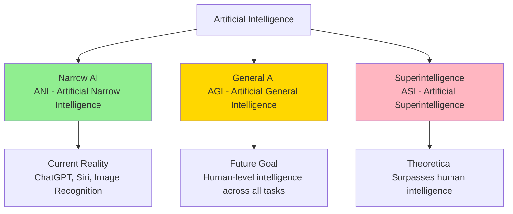
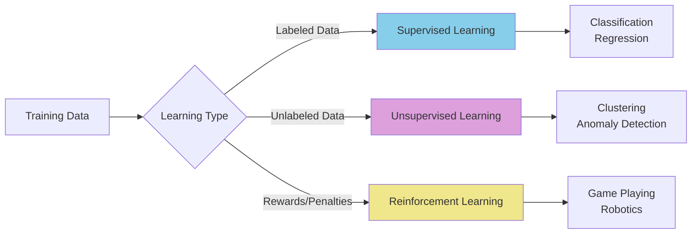

# What is AI?

**Title:** What is AI?  
**Audience:** All (Engineering, QA, Product, HR, Finance, Sales, Support, Leadership)  
**Duration:** 45-60 minutes  
**Prerequisites:** None

---

## Learning Objectives

By the end of this lesson, you will be able to:

- Define Artificial Intelligence (AI) in plain language
- Distinguish AI from traditional software programming
- Identify three main types of AI: Narrow AI, General AI, and Superintelligence
- Explain how AI learns from data (supervised, unsupervised, reinforcement learning)
- Recognize common AI applications in business software
- Understand AI's role in Greenshades products

---

## Core Content

### Plain-Language Definition

**Artificial Intelligence (AI)** is the capability of machines to perform tasks that typically require human intelligence. These tasks include:

- **Understanding language** (reading, writing, conversation)
- **Recognizing patterns** (images, sounds, data trends)
- **Making decisions** (recommendations, classifications, predictions)
- **Learning from experience** (improving performance over time)

Unlike traditional software that follows explicit rules written by programmers, AI systems learn patterns from data and can handle situations they weren't explicitly programmed for.

### AI vs. Traditional Software

| Traditional Software | AI Systems |
|---------------------|------------|
| Follows explicit rules (if-then logic) | Learns patterns from data |
| Requires programmers to code every scenario | Handles new scenarios based on learned patterns |
| Predictable output for same input | May produce varied outputs (probabilistic) |
| Breaks when encountering unexpected input | Can generalize to similar but unseen inputs |
| Example: Calculator app | Example: Email spam filter |

**Example:** A traditional payroll system calculates `gross_pay = hours_worked × hourly_rate`. An AI system might predict "which employees are likely to leave" by learning patterns from historical data (tenure, performance reviews, salary changes, etc.).

### Three Types of AI



1. **Narrow AI (ANI)** - **Current Reality**
   - Excels at one specific task or domain
   - Examples: ChatGPT (conversation), facial recognition, recommendation engines
   - **Greenshades context:** Tax calculation engine, payroll anomaly detection

2. **General AI (AGI)** - **Future Goal**
   - Human-level intelligence across all cognitive tasks
   - Can transfer learning from one domain to another
   - Not yet achieved (estimated 10-50 years away)

3. **Superintelligence (ASI)** - **Theoretical**
   - Surpasses human intelligence in all domains
   - Currently speculative

**For Greenshades:** We work exclusively with Narrow AI today. Every AI tool we use (GitHub Copilot, Cursor, ChatGPT) is Narrow AI.

### How AI Learns: Three Learning Paradigms



1. **Supervised Learning**
   - **Input:** Labeled data (examples with correct answers)
   - **Output:** Model that predicts labels for new data
   - **Example:** Training on 10,000 payroll records labeled "correct" or "error" → model detects errors in new payroll runs

2. **Unsupervised Learning**
   - **Input:** Unlabeled data (no correct answers provided)
   - **Output:** Patterns, clusters, or anomalies discovered
   - **Example:** Analyzing 50,000 tax filings to find unusual patterns (potential fraud or errors)

3. **Reinforcement Learning**
   - **Input:** Agent interacts with environment, receives rewards/penalties
   - **Output:** Agent learns optimal actions through trial and error
   - **Example:** AI agent optimizing API rate limits by trying different strategies and measuring success

### Common AI Applications in Business Software

| Application | What It Does | Greenshades Example |
|------------|--------------|---------------------|
| **Natural Language Processing (NLP)** | Understands and generates human language | Chatbot for employee payroll questions |
| **Computer Vision** | Analyzes images and videos | Document scanning for tax forms (W-2, 1099) |
| **Predictive Analytics** | Forecasts future outcomes | Predicting payroll processing time based on employee count |
| **Anomaly Detection** | Identifies unusual patterns | Flagging suspicious tax calculations |
| **Recommendation Systems** | Suggests relevant items | Suggesting optimal payroll run times based on historical data |
| **Automated Code Generation** | Writes code from descriptions | GitHub Copilot generating test cases for payroll functions |

---

## Greenshades-Specific Examples

### Example 1: Payroll Anomaly Detection

**Problem:** Manually reviewing 5,000 payroll records for errors is time-consuming.

**AI Approach:** Train a model on historical payroll data (labeled "correct" vs "error") to automatically flag suspicious entries.

**Expected Impact:** Reduce review time by 70%, catch errors earlier.

**Example Prompt:**
```
Analyze this payroll batch for anomalies:
- Employee count: 5,000
- Expected gross pay range: $2,000-$15,000
- Flag any records with:
  * Gross pay > $20,000 (outlier)
  * Hours > 80 per pay period (unusual)
  * Negative deductions (data error)
```

### Example 2: Tax Code Classification

**Problem:** New tax regulations require categorizing transactions into tax codes. Manual classification is error-prone.

**AI Approach:** Use NLP to read transaction descriptions and classify them into tax codes based on learned patterns.

**Expected Impact:** 95% accuracy vs 80% manual accuracy, 10× faster processing.

---

## Try It: Exercise

**Scenario:** You're reviewing a payroll export file with 10,000 records. You need to identify records that might have calculation errors.

**Task:** List 5 patterns an AI system could learn to detect errors:
1. _________________________
2. _________________________
3. _________________________
4. _________________________
5. _________________________

**Solution:**
1. Gross pay exceeds 3 standard deviations from department average
2. Deductions total more than gross pay
3. Hours worked > 80 in a single pay period
4. Negative values in fields that should be positive
5. Employee ID doesn't match any record in employee master file

---

## Role-Based "How This Helps You"

### Developers
- Understand when to use AI tools (GitHub Copilot, Cursor) vs. writing code manually
- Recognize AI's strengths (pattern recognition) and limitations (deterministic calculations)

### QA Engineers
- Use AI for test case generation and anomaly detection in test results
- Understand probabilistic outputs (AI may give different answers for same input)

### Product Managers
- Identify features that benefit from AI (recommendations, predictions, automation)
- Set realistic expectations: AI improves over time but isn't perfect

### Support Staff
- Use AI chatbots to answer common employee questions about payroll
- Understand when to escalate to human agents (complex edge cases)

### Leadership
- Make informed decisions about AI investments
- Understand current AI capabilities (Narrow AI) vs. future possibilities (AGI)

---

## Key Takeaways

1. **AI = machines performing tasks requiring human intelligence** (understanding, pattern recognition, decision-making, learning)

2. **AI learns from data**, unlike traditional software that follows explicit rules

3. **We use Narrow AI today** (specialized tasks); General AI and Superintelligence are future concepts

4. **Three learning types:** Supervised (labeled data), Unsupervised (patterns), Reinforcement (trial and error)

5. **AI excels at pattern recognition** but may be probabilistic (not always deterministic)

6. **Greenshades applications:** Anomaly detection, classification, predictions, automation

---

## 5-Question Quiz

### Question 1 (True/False)
AI systems always produce the same output for the same input, just like traditional software.

**Answer:** False. AI systems are probabilistic and may produce varied outputs based on learned patterns.

---

### Question 2 (Multiple Choice)
Which type of AI is currently in use at Greenshades?

a) General AI (AGI)  
b) Narrow AI (ANI)  
c) Superintelligence (ASI)  
d) None of the above

**Answer:** b) Narrow AI (ANI)

---

### Question 3 (Short Answer)
Name one way AI differs from traditional software programming.

**Answer:** AI learns patterns from data rather than following explicit if-then rules written by programmers. (Accept similar answers)

---

### Question 4 (Multiple Choice)
If you train an AI model on 10,000 payroll records labeled "correct" or "error," what type of learning is this?

a) Supervised Learning  
b) Unsupervised Learning  
c) Reinforcement Learning  
d) None of the above

**Answer:** a) Supervised Learning

---

### Question 5 (Short Answer)
Give one example of how AI could be used in Greenshades payroll processing.

**Answer:** Examples: Anomaly detection (flagging unusual payroll entries), predictive analytics (forecasting processing time), automated classification (tax code assignment), chatbot for employee questions. (Accept any realistic example)

---

## One-Page Cheat Sheet

### AI Definition
- **AI = Machines performing human-like tasks** (understanding, pattern recognition, decision-making, learning)

### AI vs. Traditional Software
| Traditional | AI |
|------------|-----|
| Explicit rules | Learns from data |
| Predictable | Probabilistic |
| Breaks on unexpected input | Generalizes to new inputs |

### Types of AI
- **Narrow AI (ANI):** Current reality (ChatGPT, Siri, image recognition)
- **General AI (AGI):** Future goal (human-level intelligence)
- **Superintelligence (ASI):** Theoretical (surpasses humans)

### Learning Types
- **Supervised:** Labeled data → predictions
- **Unsupervised:** Unlabeled data → patterns
- **Reinforcement:** Rewards/penalties → optimal actions

### Common AI Applications
- NLP (language understanding)
- Computer Vision (image analysis)
- Predictive Analytics (forecasts)
- Anomaly Detection (unusual patterns)
- Recommendation Systems (suggestions)
- Code Generation (automated coding)

### Greenshades Use Cases
- Payroll anomaly detection
- Tax code classification
- Employee question chatbots
- Processing time predictions

---

## Phrases & Prompts That Work

**When explaining AI to non-technical colleagues:**
- "AI learns patterns from data, like how a child learns to recognize cats by seeing many cat pictures."
- "Traditional software follows rules we write. AI discovers rules from examples."

**When discussing AI capabilities:**
- "AI excels at pattern recognition and handling variability, but may not be 100% deterministic."
- "We use Narrow AI today—specialized tools for specific tasks, not general intelligence."

**When identifying AI opportunities:**
- "If a task involves recognizing patterns in data, AI might help."
- "If humans spend hours on repetitive classification or detection, consider AI automation."

---

## Security & Compliance Note

⚠️ **Red Flags Checklist:**
- [ ] Never paste real employee data, SSNs, or payroll amounts into public AI tools
- [ ] Use placeholders: `<EXAMPLE_ONLY>` for sensitive data
- [ ] Verify AI outputs before using in production (AI can hallucinate)
- [ ] Review AI-generated code for security vulnerabilities
- [ ] Ensure AI tools comply with data privacy regulations (GDPR, CCPA)

**Reference:** See `04_ai_ethics_and_security_basics/` for detailed security guidelines.

---

**Next Lesson:** `01_history_and_evolution_of_ai.md`

