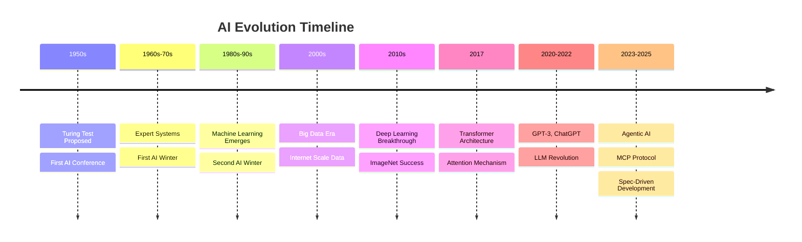
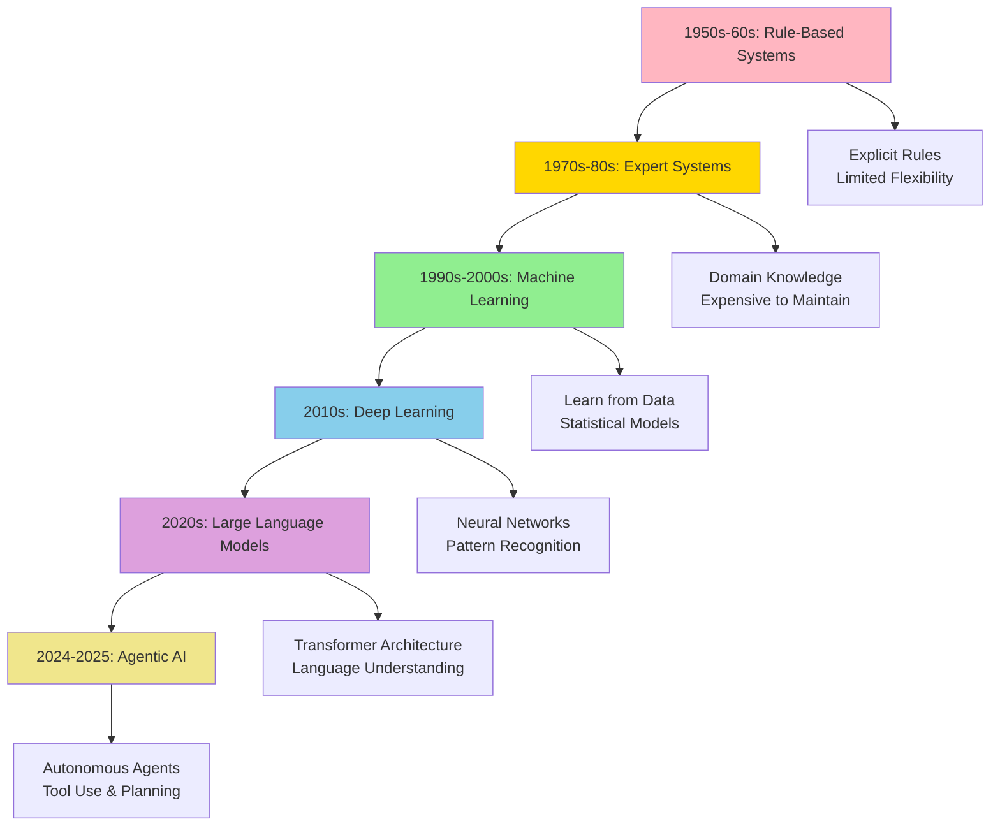

# History and Evolution of AI

**Title:** History and Evolution of AI  
**Audience:** All (Engineering, QA, Product, HR, Finance, Sales, Support, Leadership)  
**Duration:** 45-60 minutes  
**Prerequisites:** `00_what_is_ai.md` (recommended)

---

## Learning Objectives

By the end of this lesson, you will be able to:

- Identify key milestones in AI history (1950s to present)
- Explain the "AI winters" and what caused them
- Understand the breakthrough of deep learning (2010s)
- Recognize the impact of transformer architecture (2017) and large language models (2020s)
- Trace the evolution from rule-based systems to modern neural networks
- Connect historical AI developments to current Greenshades tools

---

## Core Content

### The Timeline: AI from 1950s to 2025



### Phase 1: The Birth of AI (1950s-1960s)

**Key Events:**
- **1950:** Alan Turing proposes the "Turing Test" (can a machine convince a human it's human?)
- **1956:** Dartmouth Conference coins the term "Artificial Intelligence"
- **1960s:** Early programs play chess, solve algebra problems, translate languages

**Characteristics:**
- Rule-based systems (if-then logic)
- Limited by computing power and data availability
- Optimistic predictions ("AI will match human intelligence in 20 years")

**Greenshades Parallel:** Early payroll systems used similar rule-based logic (if hours > 40, then calculate overtime).

---

### Phase 2: Expert Systems and First AI Winter (1970s-1980s)

**Key Events:**
- **1970s:** Expert systems emerge (programs that mimic human experts in specific domains)
- **1980s:** Commercial AI applications (MYCIN for medical diagnosis, XCON for computer configuration)
- **Late 1980s:** First "AI Winter" — funding dries up, expectations not met

**What Caused the First AI Winter?**
- Expert systems were expensive to build and maintain
- They couldn't handle uncertainty or learn from new data
- Limited to narrow domains
- Computing power still insufficient

**Example Expert System:**
```
IF tax_filing_status = "Married Filing Jointly"
AND adjusted_gross_income > 25000
THEN apply_tax_bracket = "15%"
```

**Greenshades Context:** Early tax calculation engines used similar rule-based logic. Still effective for deterministic calculations, but inflexible.

---

### Phase 3: Machine Learning Emerges (1990s-2000s)

**Key Events:**
- **1990s:** Machine learning algorithms improve (support vector machines, decision trees)
- **1997:** IBM's Deep Blue defeats world chess champion Garry Kasparov
- **2000s:** Internet generates massive datasets (big data era)
- **2006:** "Deep learning" term popularized (neural networks with multiple layers)

**Breakthrough:** Instead of writing rules, algorithms learn patterns from data.

**Greenshades Parallel:** Payroll systems start using statistical models to predict processing times based on historical data.

---

### Phase 4: Deep Learning Revolution (2010s)

**Key Events:**
- **2012:** AlexNet wins ImageNet competition (image recognition breakthrough)
- **2014:** Generative Adversarial Networks (GANs) introduced
- **2016:** AlphaGo defeats world Go champion (reinforcement learning success)
- **2017:** Transformer architecture published ("Attention Is All You Need")

**Why Deep Learning Succeeded:**
1. **Big Data:** Internet-scale datasets available
2. **GPUs:** Graphics processing units accelerated training
3. **Better Algorithms:** Improved neural network architectures
4. **Cloud Computing:** Scalable infrastructure for training

**Impact:** AI moved from academic research to practical applications (speech recognition, image classification, language translation).

---

### Phase 5: Large Language Models and ChatGPT Era (2020-2023)

**Key Events:**
- **2020:** GPT-3 released (175 billion parameters)
- **2022:** ChatGPT launches (user-friendly interface to GPT)
- **2023:** GPT-4, Claude, and other LLMs compete
- **2023:** GitHub Copilot and Cursor become mainstream for developers

**Transformer Architecture Impact:**
- Enables models to process entire sequences (sentences, documents)
- "Attention mechanism" allows models to focus on relevant parts of input
- Pre-training on massive text corpora, then fine-tuning for specific tasks

**Greenshades Impact:**
- Developers use GitHub Copilot for code generation
- Support teams explore AI chatbots for employee questions
- Product teams use ChatGPT for documentation and requirements

---

### Phase 6: Agentic AI and MCP Era (2024-2025)

**Key Events:**
- **2024:** Model Context Protocol (MCP) standardizes AI agent communication
- **2024:** Spec-Driven Development emerges (AI generates code from specifications)
- **2025:** Agentic AI systems orchestrate multiple tools and workflows

**What is Agentic AI?**
- AI systems that can plan, execute, and adapt autonomously
- Use tools (APIs, databases, code execution) to accomplish goals
- Can break down complex tasks into steps

**Greenshades Vision:**
- AI agents that automate payroll processing workflows
- Agents that monitor Splunk logs and alert on anomalies
- Agents that generate test cases from product specifications

---

## Understanding AI Winters

**Definition:** Periods when AI funding and interest decline due to unmet expectations.

### First AI Winter (Late 1980s)
- **Cause:** Expert systems too expensive, limited capabilities
- **Recovery:** Machine learning algorithms improved, more data available

### Second AI Winter (Late 1990s)
- **Cause:** Overpromising on AI capabilities, limited practical applications
- **Recovery:** Internet provided big data, deep learning algorithms improved

**Lesson for Greenshades:** Set realistic expectations. AI is powerful but not magic. Focus on specific, measurable use cases.

---

## Evolution of AI Approaches



---

## Greenshades Tools Through the Lens of History

| AI Era | Technology | Greenshades Equivalent |
|--------|-----------|------------------------|
| **Rule-Based (1960s)** | If-then logic | Tax calculation rules, payroll formulas |
| **Expert Systems (1980s)** | Domain knowledge encoded | Business logic in Avocado platform |
| **Machine Learning (2000s)** | Statistical models | Predictive analytics for processing times |
| **Deep Learning (2010s)** | Neural networks | Image recognition for document scanning |
| **LLMs (2020s)** | GPT, Claude, Copilot | Code generation, documentation, chatbots |
| **Agentic AI (2025)** | MCP, Spec-Driven Dev | Autonomous workflow automation |

---

## Try It: Exercise

**Scenario:** You're explaining AI history to a new team member who asks: "Why did AI take so long to become useful?"

**Task:** Write a 3-sentence explanation that covers:
1. Early limitations (computing power, data)
2. The breakthrough that changed everything (deep learning + big data)
3. Why it's accelerating now (transformer architecture, cloud computing)

**Solution:**
1. Early AI was limited by insufficient computing power and small datasets, leading to "AI winters" when expectations weren't met.
2. The deep learning revolution (2010s) combined with big data from the internet enabled AI to learn from millions of examples, making it practical for real-world applications.
3. Today, transformer architecture and cloud computing allow us to train massive language models (like GPT) that can understand and generate human-like text, accelerating AI adoption across industries.

---

## Role-Based "How This Helps You"

### Developers
- Understand why modern AI tools (Copilot, Cursor) are more powerful than early rule-based systems
- Recognize that AI is still evolving—new architectures and protocols (MCP) are emerging

### QA Engineers
- Appreciate that AI testing tools evolved from simple rule-checkers to sophisticated pattern recognizers
- Understand probabilistic AI outputs require different testing strategies than deterministic code

### Product Managers
- Learn from AI history: set realistic expectations, focus on specific use cases
- Recognize that AI capabilities are accelerating—plan for rapid change

### Leadership
- Understand AI investment cycles (winters and springs) to make informed strategic decisions
- Recognize that current AI tools (LLMs, agentic systems) represent a significant leap from earlier generations

---

## Key Takeaways

1. **AI history spans 75+ years** (1950s to present), with periods of optimism and "AI winters"

2. **Early AI was rule-based** (explicit if-then logic); modern AI learns from data

3. **Deep learning (2010s) was a breakthrough** enabled by big data, GPUs, and better algorithms

4. **Transformer architecture (2017) enabled LLMs** (GPT, ChatGPT) that understand and generate language

5. **Agentic AI (2024-2025) is the current frontier** — AI systems that plan, execute, and use tools autonomously

6. **Greenshades uses tools from multiple AI eras** — from rule-based tax calculations to LLM-powered code generation

---

## 5-Question Quiz

### Question 1 (Multiple Choice)
What event is considered the "birth of AI" as a field?

a) The release of ChatGPT in 2022  
b) The Dartmouth Conference in 1956  
c) IBM's Deep Blue defeating Kasparov in 1997  
d) The invention of the transformer architecture in 2017

**Answer:** b) The Dartmouth Conference in 1956

---

### Question 2 (True/False)
The first "AI winter" occurred because expert systems were too successful and made AI obsolete.

**Answer:** False. The first AI winter occurred because expert systems were expensive, limited, and didn't meet expectations, causing funding to dry up.

---

### Question 3 (Short Answer)
Name one factor that enabled the deep learning revolution of the 2010s.

**Answer:** Big data (internet-scale datasets), GPUs (accelerated training), better algorithms (improved neural networks), or cloud computing (scalable infrastructure). (Accept any one)

---

### Question 4 (Multiple Choice)
Which architecture enabled large language models like GPT and ChatGPT?

a) Expert systems  
b) Decision trees  
c) Transformer architecture  
d) Support vector machines

**Answer:** c) Transformer architecture

---

### Question 5 (Short Answer)
What is the current frontier of AI development (2024-2025)?

**Answer:** Agentic AI — AI systems that can plan, execute, and use tools autonomously. (Accept similar answers mentioning agents, MCP, or autonomous AI)

---

## One-Page Cheat Sheet

### AI History Timeline
- **1950s:** Birth of AI (Turing Test, Dartmouth Conference)
- **1970s-80s:** Expert systems, first AI winter
- **1990s-2000s:** Machine learning, big data era
- **2010s:** Deep learning revolution (ImageNet, AlphaGo)
- **2017:** Transformer architecture
- **2020-2022:** GPT-3, ChatGPT launch
- **2024-2025:** Agentic AI, MCP protocol

### Key Breakthroughs
- **Deep Learning (2010s):** Neural networks + big data + GPUs
- **Transformer (2017):** Attention mechanism enables language understanding
- **LLMs (2020s):** Pre-trained models fine-tuned for tasks
- **Agentic AI (2025):** Autonomous agents with tool use

### AI Winters
- **First (1980s):** Expert systems too expensive/limited
- **Second (1990s):** Overpromising, limited applications
- **Recovery:** Better algorithms, more data, improved infrastructure

### Evolution of Approaches
1. Rule-based (1950s-60s)
2. Expert systems (1970s-80s)
3. Machine learning (1990s-2000s)
4. Deep learning (2010s)
5. Large language models (2020s)
6. Agentic AI (2024-2025)

### Greenshades Tools by Era
- Rule-based: Tax calculations, payroll formulas
- ML: Predictive analytics
- LLMs: GitHub Copilot, ChatGPT
- Agentic: Future workflow automation

---

## Phrases & Prompts That Work

**When explaining AI history:**
- "AI has been around since the 1950s, but it took big data and deep learning (2010s) to make it practical."
- "The transformer architecture (2017) enabled ChatGPT and modern language models."

**When discussing AI evolution:**
- "We've moved from writing explicit rules to letting AI learn patterns from data."
- "Agentic AI is the next step—AI that can plan and use tools autonomously."

**When setting expectations:**
- "AI has had 'winters' when expectations weren't met. We focus on specific, measurable use cases to avoid disappointment."

---

## Security & Compliance Note

⚠️ **Red Flags Checklist:**
- [ ] Historical AI systems had security vulnerabilities—modern tools are more secure but still require review
- [ ] Early expert systems couldn't explain decisions—modern AI should be auditable
- [ ] AI tools evolve rapidly—stay updated on security patches and best practices

**Reference:** See `04_ai_ethics_and_security_basics/` for detailed security guidelines.

---

**Next Lesson:** `02_ai_vs_agentic_ai.md`

