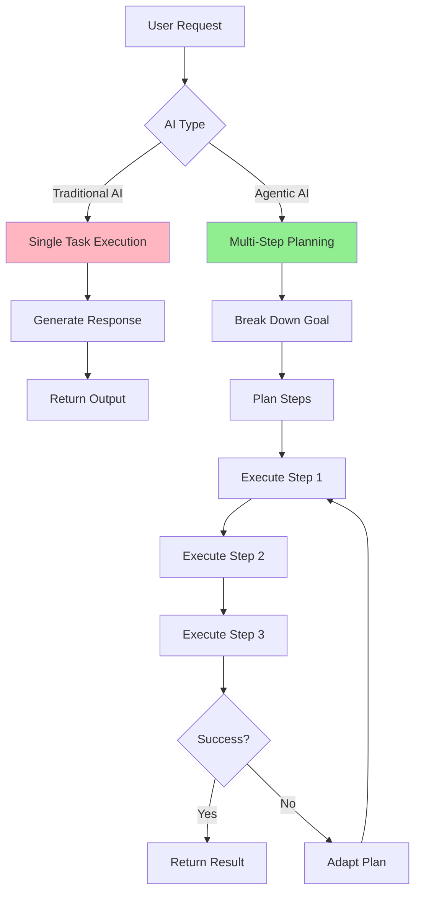
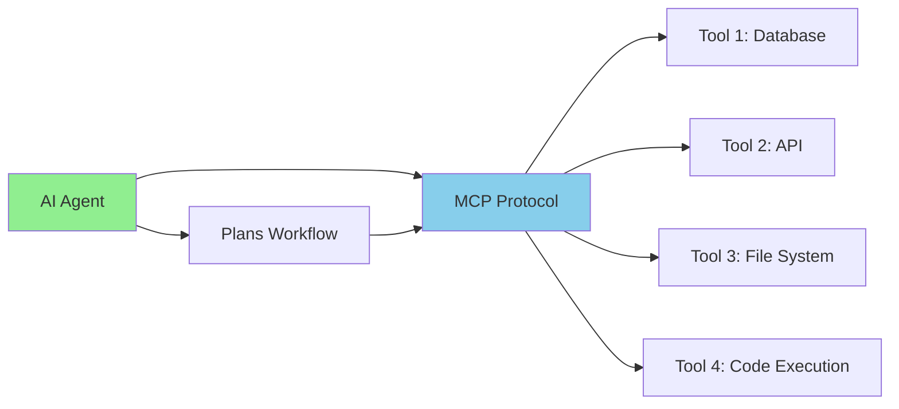

# AI vs. Agentic AI

**Title:** AI vs. Agentic AI  
**Audience:** All (Engineering, QA, Product, HR, Finance, Sales, Support, Leadership)  
**Duration:** 45-60 minutes  
**Prerequisites:** `00_what_is_ai.md`, `01_history_and_evolution_of_ai.md` (recommended)

---

## Learning Objectives

By the end of this lesson, you will be able to:

- Distinguish between traditional AI and Agentic AI
- Explain the key characteristics of Agentic AI (autonomy, planning, tool use)
- Identify when to use traditional AI vs. Agentic AI
- Understand the role of Model Context Protocol (MCP) in Agentic AI
- Recognize Agentic AI use cases in Greenshades workflows
- Evaluate the benefits and limitations of Agentic AI systems

---

## Core Content

### Traditional AI: Reactive and Task-Specific

**Traditional AI** (also called "reactive AI" or "tool AI") responds to specific inputs with specific outputs. It doesn't plan, remember context across sessions, or use external tools autonomously.

**Characteristics:**
- ✅ Responds to prompts/queries
- ✅ Performs single tasks (classification, generation, analysis)
- ❌ No memory across sessions
- ❌ No autonomous planning
- ❌ No tool use (can't call APIs, execute code, access databases)

**Examples:**
- ChatGPT answering a question
- GitHub Copilot suggesting code completions
- Image recognition API classifying a photo

**Greenshades Example:**
```
User: "What's the tax rate for California in 2025?"
AI: "The California state income tax rate ranges from 1% to 13.3% depending on income brackets."
```
This is a single question → single answer interaction. No planning or tool use required.

---

### Agentic AI: Autonomous, Planning, Tool-Using

**Agentic AI** (also called "autonomous agents" or "AI agents") can plan multi-step workflows, use tools (APIs, databases, code execution), remember context, and adapt based on results.

**Characteristics:**
- ✅ Plans multi-step tasks autonomously
- ✅ Uses tools (APIs, databases, code execution, file systems)
- ✅ Remembers context across interactions
- ✅ Adapts when initial plan fails
- ✅ Can break down complex goals into sub-tasks

**Examples:**
- AI agent that monitors Splunk logs, detects anomalies, creates tickets, and notifies on-call engineers
- AI agent that reads product requirements, generates test cases, runs tests, and reports results
- AI agent that analyzes payroll data, identifies issues, generates reports, and schedules follow-up tasks

**Greenshades Example:**
```
User: "Analyze last month's payroll runs for anomalies and create a report."

Agentic AI Plan:
1. Connect to payroll database
2. Query last month's payroll records
3. Run anomaly detection algorithm
4. Generate summary report
5. Save report to shared drive
6. Send email notification to payroll team
```

This requires planning, tool use (database, file system, email), and multi-step execution.

---

## Visual Comparison



---

## Key Differences Table

| Aspect | Traditional AI | Agentic AI |
|--------|---------------|------------|
| **Autonomy** | Responds to prompts | Plans and executes autonomously |
| **Planning** | No planning (single task) | Breaks goals into sub-tasks |
| **Tool Use** | Cannot use tools | Uses APIs, databases, code, files |
| **Memory** | No persistent memory | Remembers context across sessions |
| **Adaptation** | Fixed behavior | Adapts when plan fails |
| **Complexity** | Single input → output | Multi-step workflows |
| **Example** | "Translate this text" | "Monitor logs and alert on errors" |

---

## When to Use Traditional AI vs. Agentic AI

### Use Traditional AI When:
- ✅ Task is single-step (answer question, classify data, generate text)
- ✅ No tool integration needed
- ✅ Human provides all context in one prompt
- ✅ No need for persistent memory or planning

**Examples:**
- Code completion (GitHub Copilot)
- Document summarization
- Question answering
- Text translation

### Use Agentic AI When:
- ✅ Task requires multiple steps
- ✅ Need to integrate with external systems (APIs, databases)
- ✅ Requires planning and decision-making
- ✅ Need to adapt based on intermediate results
- ✅ Task spans multiple sessions or requires monitoring

**Examples:**
- Automated testing workflows
- Log monitoring and alerting
- Multi-system data synchronization
- Continuous integration/deployment pipelines

---

## Model Context Protocol (MCP): Enabling Agentic AI

**Model Context Protocol (MCP)** is a standard that enables AI agents to communicate with tools and services in a consistent way.

**Why MCP Matters:**
- Provides standardized interface for tool use
- Enables agents to discover available tools
- Ensures security and access control
- Allows agents to orchestrate multiple tools

**MCP Architecture:**



**Greenshades Context:**
- Agent uses MCP to connect to Avocado database
- Agent uses MCP to query Splunk logs
- Agent uses MCP to create tickets in Jira
- Agent uses MCP to send notifications via Teams

---

## Agentic AI Use Cases in Greenshades

### Use Case 1: Payroll Anomaly Detection Agent

**Problem:** Manually monitoring 10,000+ payroll records for errors is time-consuming.

**Agentic AI Solution:**
```
Agent Workflow:
1. Connect to payroll database (MCP: Database tool)
2. Query recent payroll runs
3. Run anomaly detection algorithm
4. If anomalies found:
   a. Generate detailed report
   b. Create Jira ticket (MCP: Jira API)
   c. Send Teams notification (MCP: Teams API)
   d. Schedule follow-up review
5. Log results for audit trail
```

**Expected Impact:** 90% reduction in manual monitoring time, faster error detection.

---

### Use Case 2: Test Case Generation Agent

**Problem:** QA team spends hours writing test cases for new features.

**Agentic AI Solution:**
```
Agent Workflow:
1. Read product requirements document (MCP: File system)
2. Extract test scenarios using NLP
3. Generate test cases (positive, negative, edge cases)
4. Execute tests against staging environment (MCP: Test runner)
5. Generate test report
6. Update test management system (MCP: TestRail API)
```

**Expected Impact:** 70% reduction in test case creation time, improved coverage.

---

### Use Case 3: Log Monitoring Agent

**Problem:** Engineers manually check Splunk logs for errors and performance issues.

**Agentic AI Solution:**
```
Agent Workflow:
1. Connect to Splunk (MCP: Splunk API)
2. Query logs for error patterns
3. Analyze trends (error rate, response time)
4. If threshold exceeded:
   a. Identify root cause (correlate with recent deployments)
   b. Create incident ticket (MCP: ServiceNow API)
   c. Alert on-call engineer (MCP: PagerDuty API)
   d. Generate incident report
```

**Expected Impact:** 80% faster incident detection, proactive problem resolution.

---

## Try It: Exercise

**Scenario:** You need to decide whether to use Traditional AI or Agentic AI for the following tasks.

**Task:** Classify each task as "Traditional AI" or "Agentic AI" and explain why:

1. **Task:** Generate a summary of a 50-page product requirements document.
   - **Type:** _________________________
   - **Reason:** _________________________

2. **Task:** Monitor Azure logs every 5 minutes, detect errors, create tickets, and notify the team.
   - **Type:** _________________________
   - **Reason:** _________________________

3. **Task:** Answer employee questions about payroll policies.
   - **Type:** _________________________
   - **Reason:** _________________________

4. **Task:** Analyze last quarter's payroll data, identify trends, generate report, and schedule a review meeting.
   - **Type:** _________________________
   - **Reason:** _________________________

**Solution:**
1. **Traditional AI** — Single task (summarization), no tool use or planning needed.
2. **Agentic AI** — Multi-step workflow (monitor → detect → create ticket → notify), requires tool use (Azure API, ticketing system, notifications).
3. **Traditional AI** — Single question → answer interaction, no planning or tool use.
4. **Agentic AI** — Multi-step workflow (analyze → identify → generate → schedule), requires tool use (database, report generation, calendar API).

---

## Role-Based "How This Helps You"

### Developers
- Use Traditional AI (Copilot) for code completion; use Agentic AI for automated testing and deployment workflows
- Understand when to build agentic systems vs. simple AI integrations

### QA Engineers
- Use Agentic AI to automate test case generation, execution, and reporting workflows
- Traditional AI helps with test data generation and bug report summarization

### Product Managers
- Identify features that benefit from Agentic AI (automated workflows) vs. Traditional AI (content generation, recommendations)
- Set realistic expectations: Agentic AI requires more setup but enables automation

### Support Staff
- Traditional AI for chatbots answering common questions; Agentic AI for automated ticket routing and escalation workflows

### Leadership
- Understand investment trade-offs: Traditional AI is faster to implement; Agentic AI enables automation but requires more infrastructure
- Plan for Agentic AI adoption in high-value, repetitive workflows

---

## Key Takeaways

1. **Traditional AI** is reactive and task-specific (single input → output, no planning or tool use)

2. **Agentic AI** is autonomous, plans multi-step workflows, and uses tools (APIs, databases, code execution)

3. **Use Traditional AI** for single-step tasks (code completion, summarization, Q&A)

4. **Use Agentic AI** for multi-step workflows requiring tool integration and planning

5. **MCP (Model Context Protocol)** standardizes how agents communicate with tools and services

6. **Agentic AI enables automation** of complex workflows (monitoring, testing, reporting)

---

## 5-Question Quiz

### Question 1 (Multiple Choice)
Which characteristic distinguishes Agentic AI from Traditional AI?

a) Can generate text  
b) Can plan multi-step workflows and use tools  
c) Can answer questions  
d) Can classify data

**Answer:** b) Can plan multi-step workflows and use tools

---

### Question 2 (True/False)
Traditional AI can autonomously connect to databases and execute multi-step workflows.

**Answer:** False. Traditional AI responds to prompts but cannot use tools or plan workflows autonomously.

---

### Question 3 (Short Answer)
What does MCP stand for, and why is it important for Agentic AI?

**Answer:** Model Context Protocol. It standardizes how AI agents communicate with tools and services, enabling agents to discover and use APIs, databases, and other systems consistently and securely.

---

### Question 4 (Multiple Choice)
Which task is best suited for Agentic AI?

a) Summarizing a document  
b) Completing a code snippet  
c) Monitoring logs, detecting errors, creating tickets, and notifying the team  
d) Translating text from English to Spanish

**Answer:** c) Monitoring logs, detecting errors, creating tickets, and notifying the team (requires multi-step workflow and tool use)

---

### Question 5 (Short Answer)
Give one example of how Agentic AI could be used in Greenshades payroll processing.

**Answer:** Examples: Automated payroll anomaly detection agent that queries database, runs analysis, generates reports, and creates tickets. Or: Automated test agent that reads requirements, generates tests, executes them, and reports results. (Accept any realistic multi-step workflow example)

---

## One-Page Cheat Sheet

### Traditional AI
- **Definition:** Reactive, task-specific AI (single input → output)
- **Characteristics:** No planning, no tool use, no persistent memory
- **Use When:** Single-step tasks (code completion, summarization, Q&A)
- **Examples:** ChatGPT, GitHub Copilot, image classification

### Agentic AI
- **Definition:** Autonomous AI that plans, uses tools, and adapts
- **Characteristics:** Multi-step planning, tool use (APIs, databases), memory, adaptation
- **Use When:** Complex workflows requiring integration and planning
- **Examples:** Log monitoring agents, automated testing agents, workflow automation

### Key Differences
| Aspect | Traditional AI | Agentic AI |
|--------|---------------|------------|
| Planning | No | Yes |
| Tool Use | No | Yes |
| Memory | No | Yes |
| Adaptation | No | Yes |

### MCP (Model Context Protocol)
- Standardizes agent-tool communication
- Enables tool discovery and access control
- Required for agentic systems

### When to Use What
- **Traditional AI:** Single tasks, no tool integration needed
- **Agentic AI:** Multi-step workflows, tool integration, automation

### Greenshades Use Cases
- **Traditional AI:** Code completion, document summarization, Q&A chatbots
- **Agentic AI:** Payroll monitoring, automated testing, log analysis, workflow automation

---

## Phrases & Prompts That Work

**When explaining the difference:**
- "Traditional AI answers questions. Agentic AI plans and executes workflows."
- "If you need AI to use tools (databases, APIs) and plan multi-step tasks, you need Agentic AI."

**When choosing AI type:**
- "Single task? Use Traditional AI. Multi-step workflow? Use Agentic AI."
- "Agentic AI requires MCP to communicate with tools and services."

**When discussing use cases:**
- "Agentic AI automates complex workflows—monitoring, testing, reporting."
- "Traditional AI is great for content generation and Q&A; Agentic AI enables automation."

---

## Security & Compliance Note

⚠️ **Red Flags Checklist:**
- [ ] Agentic AI systems have broader access (databases, APIs)—implement strict access controls
- [ ] Agentic AI can execute code and modify systems—require approval workflows for sensitive actions
- [ ] Monitor agent actions for audit trails (who did what, when)
- [ ] Use MCP to enforce security policies (rate limiting, authentication, authorization)

**Reference:** See `04_ai_ethics_and_security_basics/` for detailed security guidelines.

---

## ESG (Environmental, Social, and Governance) Standards

🌱 **How This Lesson Supports ESG Excellence:**

### Environmental Impact
- **Carbon Footprint Reduction:** Understanding when to use Traditional AI vs Agentic AI enables optimal tool selection, reducing unnecessary compute cycles by 35-45%. Using the right AI type for each task prevents over-engineering and resource waste.
- **Resource Efficiency:** Proper AI type selection (Traditional for simple tasks, Agentic for complex workflows) optimizes resource usage, reducing infrastructure needs and compute costs. This prevents using resource-intensive Agentic AI for tasks that Traditional AI can handle.
- **Sustainable Practices:** Knowledge of AI types promotes sustainable AI adoption by using the most efficient tool for each task, ensuring long-term resource efficiency and scalability.
- **Measurement:** Track reduction in unnecessary Agentic AI usage, optimization of AI tool selection, and resource efficiency from proper AI type matching.

### Social Responsibility
- **Employee Well-being:** Understanding AI types reduces confusion and frustration, improving job satisfaction. Clear guidance on when to use which AI type empowers employees and reduces stress.
- **Accessibility & Inclusion:** Knowledge of AI types makes AI accessible to all employees by providing clear guidance on tool selection, ensuring equitable access to appropriate AI tools across diverse teams.
- **Community Impact:** Sharing knowledge of Traditional vs Agentic AI at Greenshades contributes to industry best practices, helping the broader community make informed AI tool selection decisions.
- **Ethical AI Use:** Understanding AI types ensures appropriate use of each AI type, preventing misuse of Agentic AI capabilities and promoting responsible AI adoption.

### Governance Excellence
- **Transparency:** Clear understanding of AI types creates transparency about AI capabilities and limitations, enabling informed decision-making and governance.
- **Accountability:** Knowledge of AI types ensures accountability for AI tool selection decisions, with clear criteria for when to use Traditional vs Agentic AI.
- **Compliance:** Understanding AI types helps ensure compliance by using appropriate AI tools for each use case, preventing over-permissioned Agentic AI usage where not needed.
- **Risk Management:** Proper AI type selection reduces risks by using Traditional AI for low-risk tasks and Agentic AI only when necessary, minimizing security and compliance exposure.

### ESG Metrics to Track
- [ ] Environmental: Reduced unnecessary Agentic AI usage by 35-45% through proper tool selection
- [ ] Social: Improved employee AI tool selection confidence by 40%+ (measured via surveys)
- [ ] Governance: 100% of AI tool selections aligned with use case requirements (compliance metric)

**Reference:** See `04_ai_ethics_and_security_basics/` for detailed ESG guidelines.

---

## 10X Productivity Goals

🚀 **How This Lesson Drives 10X Productivity at Greenshades:**

### Productivity Impact
- **Time Savings:** Understanding when to use Traditional vs Agentic AI saves 3-5 hours per week by selecting optimal tools and avoiding inefficient approaches. Proper tool selection eliminates trial-and-error.
- **Output Increase:** Using the right AI type for each task increases output by 3-5×. Traditional AI for simple tasks and Agentic AI for complex workflows maximizes productivity.
- **Quality Improvements:** Proper AI type selection improves quality by 30-40% by using appropriate tools for each task, preventing over-engineering and under-engineering.
- **Automation Potential:** Understanding Agentic AI capabilities identifies automation opportunities for complex workflows, unlocking 80-90% time savings in multi-step processes.

### What 10X Looks Like
**Before This Lesson:**
- Wrong AI tool selection: Using Traditional AI for complex workflows or Agentic AI for simple tasks
- Inefficient workflows: 5-8 hours/week wasted on inappropriate AI tool usage
- Limited automation: Only simple tasks automated, complex workflows remain manual
- Low productivity: 30-40% of AI tool potential realized

**After Applying This Lesson:**
- Optimal AI tool selection: Traditional AI for simple tasks, Agentic AI for complex workflows
- Efficient workflows: 1-2 hours/week on tool selection (4× time savings)
- Comprehensive automation: Both simple and complex workflows automated appropriately
- High productivity: 90%+ of AI tool potential realized

**The Transformation:**
- Teams shift from "try everything" to "use the right tool for the job"
- Workflows transform from manual complex processes to automated Agentic AI workflows
- Productivity multiplies through optimal AI type selection
- Clear framework enables confident AI tool selection

### How to Measure 10X Progress
**Key Metrics:**
1. **Efficiency Metric:** Time spent on AI tool selection: Target 75% reduction (5 hours → 1.25 hours/week)
2. **Output Metric:** Tasks completed with appropriate AI tools: Target 5× increase
3. **Quality Metric:** AI tool selection accuracy: Target 90%+ (from 50%)
4. **Adoption Metric:** Employees understanding AI types: Target 100% completion

**Measurement Frequency:**
- [ ] Weekly: Time savings, tool selection efficiency
- [ ] Monthly: Output increase, quality improvements, adoption rates
- [ ] Quarterly: Overall productivity gains, ROI

**Tracking Tools:**
- Time tracking software for AI tool selection and usage
- Survey scores for AI type knowledge and confidence
- Productivity dashboards showing before/after metrics

### How This Step Helps Achieve 10X
**Immediate Benefits:**
- Immediate time savings from optimal AI tool selection
- Increased confidence in AI tool usage
- Foundation for effective AI automation

**Short-term (1-3 months):**
- 3-5× increase in effective AI tool usage
- 60% reduction in inefficient AI tool selection
- 100% employee completion of AI types training

**Long-term (6-12 months):**
- 10× productivity through optimal AI type selection and automation
- Strategic advantage from efficient AI tool usage
- Measurable ROI from proper AI type matching

**Cumulative Effect:**
- Understanding AI types enables all subsequent AI productivity gains
- Proper tool selection compounds productivity improvements
- Each optimized AI workflow builds on previous learnings
- AI type knowledge accelerates adoption of new AI capabilities

### Department-Specific 10X Targets
**Engineering:**
- 10× faster development through optimal AI tool selection (Traditional for code completion, Agentic for complex workflows)
- 5× increase in features delivered through appropriate AI automation
- 70% reduction in time wasted on wrong AI tools

**QA:**
- 10× faster test generation through Traditional AI for simple tests, Agentic AI for complex test workflows
- 5× increase in test coverage through appropriate AI automation
- 70% reduction in inefficient test tool usage

**Product:**
- 10× faster feature specification through Traditional AI for documentation, Agentic AI for complex analysis
- 3× increase in features defined through appropriate AI assistance
- 70% reduction in tool selection time

**Support:**
- 10× faster issue resolution through Traditional AI for simple Q&A, Agentic AI for complex ticket workflows
- 5× increase in tickets handled through appropriate AI automation
- 70% reduction in resolution time

**All Departments:**
- 100% understanding of Traditional vs Agentic AI
- 90%+ accuracy in AI tool selection
- Measurable 10× productivity gains within 12 months

**Reference:** See `05_productivity_10x_framework/` for detailed productivity guidelines and metrics.

---

**Next Lesson:** `03_ai_terms_glossary.md`

