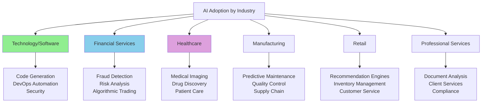
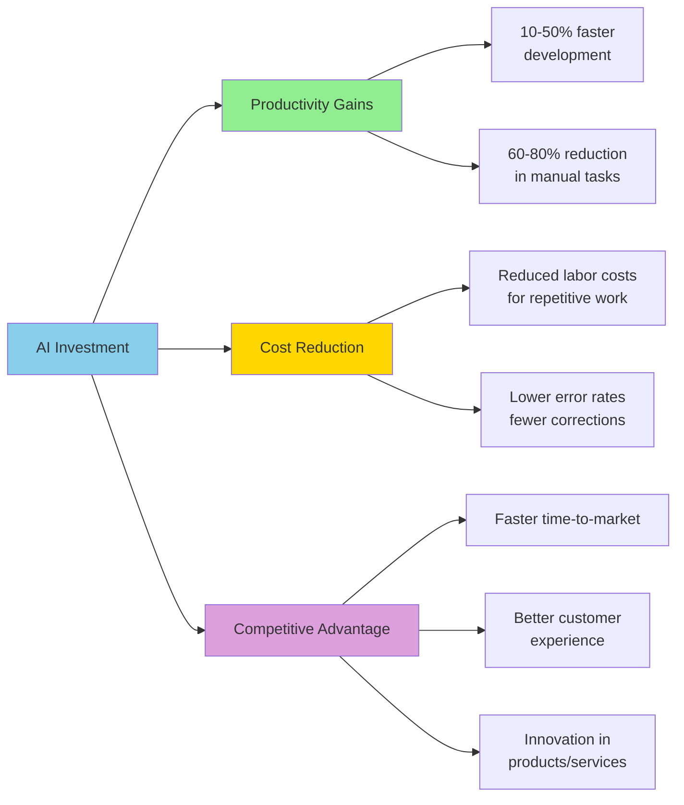

# AI in Business Landscape

**Title:** AI in Business Landscape  
**Audience:** All (Engineering, QA, Product, HR, Finance, Sales, Support, Leadership)  
**Duration:** 45-60 minutes  
**Prerequisites:** `00_what_is_ai.md`, `01_history_and_evolution_of_ai.md` (recommended)

---

## Learning Objectives

By the end of this lesson, you will be able to:

- Identify how AI is transforming business operations across industries
- Understand AI adoption trends and market dynamics
- Recognize common AI use cases in enterprise software
- Evaluate AI's impact on productivity, cost, and competitive advantage
- Connect industry AI trends to Greenshades opportunities
- Assess AI investment priorities for business value

---

## Core Content

### AI Adoption Across Industries

**Key Statistics (2024-2025):**
- **70%+ of enterprises** are piloting or deploying AI
- **Software/Technology sector** leads adoption (85%+ using AI tools)
- **Financial services** heavily invest in AI for fraud detection and risk management
- **Average ROI:** 3-5× return on AI investments in productivity gains

---

### Common Enterprise AI Use Cases

#### 1. Customer Service & Support
- **Chatbots:** 24/7 customer support, handling 60-80% of routine inquiries
- **Sentiment Analysis:** Understanding customer satisfaction from support tickets
- **Automated Ticket Routing:** Classifying and assigning support requests
- **Greenshades Context:** Employee support chatbot for payroll questions, automated ticket routing

#### 2. Software Development
- **Code Generation:** GitHub Copilot, Cursor generating code from descriptions
- **Test Automation:** AI generating and executing test cases
- **Code Review:** Automated security and quality checks
- **Documentation:** AI generating technical documentation from code
- **Greenshades Context:** Developers using Copilot/Cursor, QA using AI for test generation

#### 3. Data Analytics & Business Intelligence
- **Predictive Analytics:** Forecasting sales, demand, processing times
- **Anomaly Detection:** Identifying unusual patterns in data
- **Report Generation:** Automated business reports from data
- **Greenshades Context:** Predicting payroll processing times, detecting payroll anomalies

#### 4. Document Processing & Automation
- **Document Classification:** Categorizing invoices, forms, contracts
- **Data Extraction:** Extracting information from unstructured documents
- **Contract Analysis:** Reviewing legal documents for key terms
- **Greenshades Context:** Processing W-2s, 1099s, tax forms, extracting employee data

#### 5. Human Resources
- **Resume Screening:** Matching candidates to job requirements
- **Employee Onboarding:** Automated workflows and documentation
- **Performance Analysis:** Analyzing employee feedback and reviews
- **Greenshades Context:** HR using AI for payroll-related employee communications

#### 6. Finance & Accounting
- **Invoice Processing:** Automated invoice matching and approval
- **Fraud Detection:** Identifying suspicious transactions
- **Financial Forecasting:** Predicting revenue, expenses, cash flow
- **Greenshades Context:** Tax calculation automation, payroll anomaly detection

---

### AI Market Dynamics

**Market Size:**
- **Global AI Market:** $200B+ in 2024, projected $1.8T by 2030
- **Enterprise AI Software:** $50B+ in 2024, growing 25%+ annually

**Key Players:**
- **Cloud Providers:** AWS (Bedrock), Azure (OpenAI), Google (Gemini)
- **AI Tool Vendors:** OpenAI (GPT), Anthropic (Claude), GitHub (Copilot), Cursor
- **Enterprise Platforms:** Salesforce (Einstein), Microsoft (365 Copilot), ServiceNow

**Investment Trends:**
- **Venture Capital:** $50B+ invested in AI startups in 2024
- **Enterprise Spending:** Average $2-5M per large enterprise on AI tools
- **ROI Focus:** Shift from experimentation to measurable productivity gains

---

### AI Impact: Productivity, Cost, and Competitive Advantage

**Productivity Metrics:**
- **Software Development:** 30-50% faster code generation, 40% reduction in debugging time
- **Customer Support:** 60-80% of inquiries handled by chatbots, 50% faster resolution
- **Data Processing:** 70-90% reduction in manual data entry time
- **Document Processing:** 80% faster document classification and extraction

**Cost Reduction:**
- **Labor Costs:** 20-40% reduction in repetitive task time
- **Error Reduction:** 50-70% fewer errors in data processing
- **Operational Efficiency:** 15-30% reduction in operational costs

**Competitive Advantage:**
- **Time-to-Market:** 25-40% faster product releases
- **Customer Satisfaction:** 20-30% improvement in response times
- **Innovation:** New AI-powered features differentiate products

---

### AI Adoption Challenges

**Common Barriers:**
1. **Skills Gap:** 60% of enterprises report lack of AI expertise
2. **Data Quality:** Poor data quality limits AI effectiveness
3. **Integration Complexity:** Connecting AI tools to existing systems
4. **Cost Concerns:** Initial investment and ongoing licensing costs
5. **Security & Compliance:** Data privacy and regulatory concerns
6. **Change Management:** Resistance to AI adoption from employees

**Mitigation Strategies:**
- **Training Programs:** Invest in AI education (like this curriculum)
- **Data Governance:** Establish data quality standards
- **Phased Rollout:** Start with low-risk, high-value use cases
- **ROI Measurement:** Track productivity gains and cost savings
- **Security Frameworks:** Implement AI governance and compliance policies

---

## Greenshades-Specific Opportunities

### 1. Payroll & Tax Processing
- **Anomaly Detection:** AI flagging unusual payroll calculations automatically
- **Tax Code Classification:** Automatically categorizing transactions into tax codes
- **Processing Time Prediction:** Forecasting payroll run times based on employee count and complexity
- **Document Processing:** Extracting data from W-2s, 1099s, tax forms

### 2. Platform Integrations (Avocado, BC, D365)
- **Data Synchronization:** AI detecting and resolving data inconsistencies
- **Integration Monitoring:** Automated monitoring of integration health
- **Error Resolution:** AI suggesting fixes for integration errors

### 3. Customer Support
- **Employee Chatbot:** Answering common payroll questions 24/7
- **Ticket Classification:** Automatically routing support tickets
- **Knowledge Base:** AI-powered search for support documentation

### 4. Development & QA
- **Code Generation:** Developers using Copilot/Cursor for faster development
- **Test Automation:** AI generating test cases from requirements
- **Log Analysis:** AI monitoring Splunk/Azure logs for errors and anomalies

---

## Try It: Exercise

**Scenario:** You're evaluating AI opportunities for Greenshades. Rank the following use cases by potential business value (1 = highest value, 5 = lowest value).

**Use Cases:**
- A. AI chatbot for employee payroll questions (handles 60% of inquiries)
- B. AI code generation tool for developers (30% faster development)
- C. AI anomaly detection for payroll (catches 90% of errors automatically)
- D. AI document processing for tax forms (80% faster data extraction)
- E. AI predictive analytics for payroll processing times (helps with capacity planning)

**Task:** Rank them and explain your reasoning for the top 2.

**Solution (Example):**
1. **C. AI anomaly detection** — Highest value: Prevents costly errors, reduces manual review time, directly impacts product quality
2. **A. AI chatbot** — High value: Improves customer experience, reduces support costs, available 24/7
3. **D. AI document processing** — Medium-high value: Significant time savings, but less critical than error prevention
4. **E. AI predictive analytics** — Medium value: Helpful for planning but not core to product quality
5. **B. AI code generation** — Medium value: Developer productivity is important but indirect to customer value

*(Note: Rankings may vary based on business priorities)*

---

## Role-Based "How This Helps You"

### Developers
- Understand industry trends in AI tool adoption (Copilot, Cursor)
- Recognize productivity gains from AI code generation (30-50% faster)
- See opportunities for AI in DevOps and automation

### QA Engineers
- Learn about AI test automation trends (40% reduction in test creation time)
- Understand AI's role in anomaly detection and log analysis
- See opportunities for AI in quality assurance workflows

### Product Managers
- Understand AI's impact on competitive advantage and time-to-market
- Identify AI features that differentiate products (chatbots, predictions, automation)
- Evaluate AI investment priorities based on ROI

### Support Staff
- See how AI chatbots handle 60-80% of routine inquiries
- Understand AI's role in ticket routing and sentiment analysis
- Recognize opportunities for AI in support workflows

### Leadership
- Understand AI market dynamics and investment trends
- Evaluate AI ROI and competitive advantage opportunities
- Make informed decisions about AI adoption strategy

---

## Key Takeaways

1. **AI adoption is accelerating** — 70%+ of enterprises are piloting or deploying AI

2. **Common enterprise use cases:** Customer service, software development, data analytics, document processing, HR, finance

3. **Productivity gains:** 30-50% faster development, 60-80% reduction in manual tasks

4. **Cost reduction:** 20-40% reduction in labor costs for repetitive work, 50-70% fewer errors

5. **Competitive advantage:** Faster time-to-market, better customer experience, innovation

6. **Adoption challenges:** Skills gap, data quality, integration complexity, security concerns

7. **Greenshades opportunities:** Payroll anomaly detection, tax processing, platform integrations, customer support, development/QA

---

## 5-Question Quiz

### Question 1 (Multiple Choice)
What percentage of routine customer service inquiries can AI chatbots typically handle?

a) 20-40%  
b) 40-60%  
c) 60-80%  
d) 80-100%

**Answer:** c) 60-80%

---

### Question 2 (True/False)
AI adoption in enterprises is still in early experimental stages, with less than 30% of companies using AI.

**Answer:** False. 70%+ of enterprises are piloting or deploying AI, and adoption is accelerating.

---

### Question 3 (Short Answer)
Name one common barrier to AI adoption in enterprises.

**Answer:** Skills gap, data quality issues, integration complexity, cost concerns, security/compliance concerns, or change management resistance. (Accept any one)

---

### Question 4 (Multiple Choice)
Which AI use case typically provides the highest productivity gains in software development?

a) Code generation (30-50% faster)  
b) Test automation (40% reduction in test creation time)  
c) Documentation generation (80% faster)  
d) All of the above provide similar gains

**Answer:** d) All of the above provide similar gains (though code generation is often cited as 30-50% faster)

---

### Question 5 (Short Answer)
Give one example of how AI could provide competitive advantage for Greenshades.

**Answer:** Examples: Faster payroll processing (time-to-market), better employee support experience (customer satisfaction), AI-powered features that differentiate products (innovation), reduced errors (quality). (Accept any realistic example)

---

## One-Page Cheat Sheet

### AI Adoption Statistics
- **70%+ enterprises** piloting or deploying AI
- **Software/Technology sector** leads (85%+ adoption)
- **Global AI market:** $200B+ in 2024, $1.8T by 2030
- **Average ROI:** 3-5× return on AI investments

### Common Enterprise Use Cases
- **Customer Service:** Chatbots, sentiment analysis, ticket routing
- **Software Development:** Code generation, test automation, documentation
- **Data Analytics:** Predictive analytics, anomaly detection, reporting
- **Document Processing:** Classification, extraction, contract analysis
- **HR:** Resume screening, onboarding, performance analysis
- **Finance:** Invoice processing, fraud detection, forecasting

### Productivity Gains
- **Development:** 30-50% faster code generation
- **Support:** 60-80% of inquiries handled by AI
- **Data Processing:** 70-90% reduction in manual entry
- **Document Processing:** 80% faster classification/extraction

### Cost Reduction
- **Labor:** 20-40% reduction in repetitive task time
- **Errors:** 50-70% fewer errors in data processing
- **Operations:** 15-30% reduction in operational costs

### Competitive Advantage
- **Time-to-Market:** 25-40% faster releases
- **Customer Satisfaction:** 20-30% improvement in response times
- **Innovation:** New AI-powered features

### Adoption Challenges
- Skills gap, data quality, integration complexity, cost, security, change management

### Greenshades Opportunities
- Payroll anomaly detection, tax processing, platform integrations, customer support, development/QA

---

## Phrases & Prompts That Work

**When discussing AI adoption:**
- "70%+ of enterprises are using AI—we're in the mainstream adoption phase."
- "AI provides 3-5× ROI through productivity gains and cost reduction."

**When evaluating AI opportunities:**
- "Focus on high-value, low-risk use cases first (anomaly detection, automation)."
- "Measure ROI: productivity gains, cost reduction, competitive advantage."

**When addressing challenges:**
- "Skills gap is the #1 barrier—invest in training (like this curriculum)."
- "Start with low-risk, high-value use cases to build confidence."

---

## Security & Compliance Note

⚠️ **Red Flags Checklist:**
- [ ] AI market is competitive—evaluate vendors for security and compliance
- [ ] Enterprise AI tools require data governance and privacy controls
- [ ] AI adoption requires change management—address employee concerns
- [ ] Measure ROI to justify AI investments and track success

**Reference:** See `04_ai_ethics_and_security_basics/` for detailed security guidelines.

---

**Next Lesson:** `05_ai_at_greenshades_vision.md`

