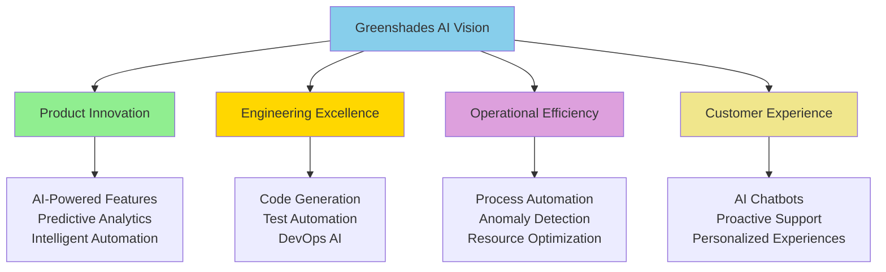
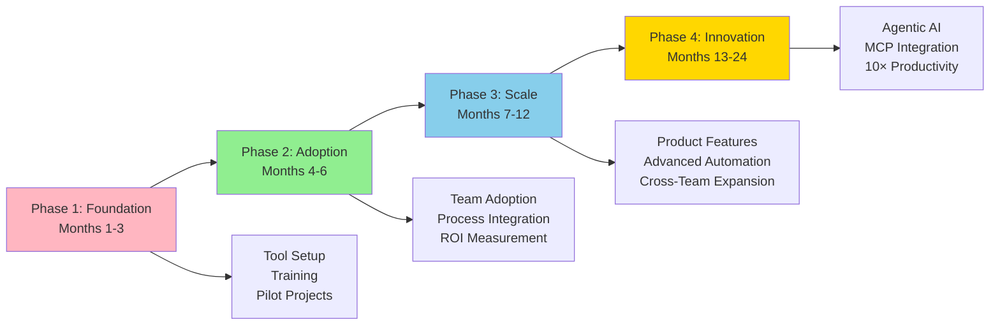

# AI at Greenshades Vision

**Title:** AI at Greenshades Vision  
**Audience:** All (Engineering, QA, Product, HR, Finance, Sales, Support, Leadership)  
**Duration:** 45-60 minutes  
**Prerequisites:** `00_what_is_ai.md`, `04_ai_in_business_landscape.md` (recommended)

---

## Learning Objectives

By the end of this lesson, you will be able to:

- Understand Greenshades' strategic vision for AI adoption
- Identify AI priorities across product, engineering, and operations
- Recognize how AI aligns with Greenshades business goals
- Understand the phased approach to AI implementation
- Connect AI vision to individual role contributions
- Articulate Greenshades' AI value proposition

---

## Core Content

### Greenshades AI Vision Statement

**"Greenshades will leverage AI to deliver 10× productivity gains, enhance product quality, and create exceptional employee and customer experiences—while maintaining the highest standards of security, compliance, and responsible AI practices."**

**Core Principles:**
1. **Productivity First:** AI should make teams more productive, not replace them
2. **Quality Enhancement:** AI improves accuracy, reduces errors, accelerates delivery
3. **Security & Compliance:** All AI implementations must meet security and regulatory requirements
4. **Responsible AI:** Ethical use, bias mitigation, transparency, and auditability
5. **Measurable Impact:** Track ROI, productivity gains, and business outcomes

---

### Strategic AI Pillars

---

### Pillar 1: Product Innovation

**Goal:** Embed AI capabilities into Greenshades products (Avocado, Payroll/Tax, Platform) to differentiate and add value.

**Key Initiatives:**

1. **Intelligent Payroll Processing**
   - AI-powered anomaly detection (flagging unusual calculations)
   - Predictive analytics (forecasting processing times, capacity planning)
   - Automated tax code classification
   - **Impact:** 90% reduction in manual review time, 95% error detection accuracy

2. **Smart Document Processing**
   - AI extraction from W-2s, 1099s, tax forms
   - Automated data validation and error correction
   - **Impact:** 80% faster data entry, 70% reduction in manual errors

3. **Proactive Employee Support**
   - AI chatbot answering payroll questions 24/7
   - Intelligent ticket routing and escalation
   - **Impact:** 60% of inquiries handled automatically, 50% faster resolution

4. **Predictive Insights**
   - Forecasting payroll processing bottlenecks
   - Identifying at-risk employees (compliance, retention)
   - **Impact:** Proactive problem resolution, improved planning

**Timeline:** 6-12 months for initial features, 12-24 months for advanced capabilities

---

### Pillar 2: Engineering Excellence

**Goal:** Accelerate development velocity, improve code quality, and enhance developer experience through AI tools.

**Key Initiatives:**

1. **AI-Assisted Development**
   - GitHub Copilot and Cursor for code generation
   - AI-powered code review and security scanning
   - **Impact:** 30-50% faster development, 40% reduction in bugs

2. **AI Test Automation**
   - AI generating test cases from requirements
   - Automated test execution and reporting
   - **Impact:** 70% reduction in test creation time, improved coverage

3. **AI-Powered DevOps**
   - Automated log analysis (Splunk, Azure)
   - Predictive incident detection
   - Intelligent deployment optimization
   - **Impact:** 80% faster incident detection, 50% reduction in deployment failures

4. **Spec-Driven Development**
   - AI generating code from specifications
   - Automated implementation and testing
   - **Impact:** Faster feature delivery, reduced manual coding

**Timeline:** Immediate (tools available now), 3-6 months for full adoption

---

### Pillar 3: Operational Efficiency

**Goal:** Automate repetitive tasks, optimize processes, and reduce operational costs.

**Key Initiatives:**

1. **Process Automation**
   - Automated payroll processing workflows
   - AI-driven data synchronization (Avocado, BC, D365)
   - **Impact:** 60% reduction in manual processing time

2. **Anomaly Detection & Monitoring**
   - AI monitoring payroll runs for errors
   - Automated alerting and ticket creation
   - **Impact:** 90% faster error detection, proactive problem resolution

3. **Resource Optimization**
   - AI predicting processing capacity needs
   - Intelligent workload distribution
   - **Impact:** 20% improvement in resource utilization

4. **Knowledge Management**
   - AI-powered search and documentation
   - Automated knowledge base updates
   - **Impact:** 50% faster information retrieval

**Timeline:** 3-6 months for initial automation, 6-12 months for advanced optimization

---

### Pillar 4: Customer Experience

**Goal:** Deliver exceptional support experiences through AI-powered tools and proactive service.

**Key Initiatives:**

1. **AI Chatbots**
   - 24/7 employee support for payroll questions
   - Intelligent question answering and routing
   - **Impact:** 60% of inquiries handled automatically, instant responses

2. **Proactive Support**
   - AI detecting issues before customers report them
   - Automated notifications and resolutions
   - **Impact:** 40% reduction in support tickets, improved satisfaction

3. **Personalized Experiences**
   - AI tailoring communications to employee needs
   - Predictive recommendations (payroll timing, tax planning)
   - **Impact:** Improved engagement and satisfaction

**Timeline:** 3-6 months for chatbot deployment, 6-12 months for advanced personalization

---

### Phased Implementation Approach

**Phase 1: Foundation (Months 1-3)**
- Set up AI tools (GitHub Copilot, Cursor, ChatGPT)
- Complete AI training curriculum (this program)
- Launch 2-3 pilot projects (anomaly detection, code generation)
- Establish AI governance and security policies

**Phase 2: Adoption (Months 4-6)**
- Expand AI tool usage across teams
- Integrate AI into daily workflows
- Measure productivity gains and ROI
- Deploy first product AI features (chatbot, anomaly detection)

**Phase 3: Scale (Months 7-12)**
- Roll out AI features in products (Avocado, Payroll/Tax)
- Expand automation to more processes
- Cross-team AI collaboration
- Advanced use cases (predictive analytics, document processing)

**Phase 4: Innovation (Months 13-24)**
- Agentic AI implementation (MCP, Spec-Driven Development)
- Advanced AI capabilities (autonomous workflows)
- 10× productivity framework fully operational
- Industry leadership in AI-powered payroll solutions

---

### Success Metrics & KPIs

**Productivity Metrics:**
- **Development Velocity:** 30-50% faster code delivery
- **Test Coverage:** 85%+ automated test coverage
- **Support Efficiency:** 60% of inquiries handled by AI
- **Processing Time:** 40% reduction in manual processing time

**Quality Metrics:**
- **Error Reduction:** 70% fewer manual errors
- **Anomaly Detection:** 95% accuracy in flagging issues
- **Customer Satisfaction:** 20% improvement in support ratings
- **Code Quality:** 40% reduction in bugs

**Business Metrics:**
- **ROI:** 3-5× return on AI investments
- **Time-to-Market:** 25-40% faster feature releases
- **Cost Reduction:** 20-30% reduction in operational costs
- **Competitive Advantage:** AI-powered features differentiate products

---

## Role-Based Contributions

### Developers
- **Adopt AI tools:** GitHub Copilot, Cursor for daily development
- **Contribute to AI features:** Build AI-powered product capabilities
- **Share learnings:** Document AI best practices and patterns

### QA Engineers
- **AI test automation:** Generate and execute tests using AI
- **Quality assurance:** Test AI features for accuracy and reliability
- **Anomaly detection:** Use AI to identify issues in test results

### Product Managers
- **AI feature planning:** Identify opportunities for AI in products
- **ROI tracking:** Measure impact of AI features on business metrics
- **User experience:** Ensure AI features enhance, not complicate, user experience

### Support Staff
- **AI chatbot training:** Help train and improve AI support tools
- **Escalation handling:** Manage complex cases that AI can't handle
- **Feedback loop:** Provide insights to improve AI accuracy

### Leadership
- **Strategic planning:** Set AI priorities and investment levels
- **Change management:** Support team adoption and address concerns
- **Governance:** Ensure responsible AI practices and compliance

---

## Try It: Exercise

**Scenario:** You're planning AI initiatives for your team. Create a 3-month action plan.

**Task:** Fill in the following template:

**Team:** _________________________

**Month 1 Goals:**
- Tool Setup: _________________________
- Training: _________________________
- Pilot Project: _________________________

**Month 2 Goals:**
- Adoption: _________________________
- Integration: _________________________
- Measurement: _________________________

**Month 3 Goals:**
- Expansion: _________________________
- Optimization: _________________________
- Documentation: _________________________

**Solution (Example for Engineering Team):**
- **Month 1:** Set up GitHub Copilot/Cursor, complete AI training, pilot AI code generation for one feature
- **Month 2:** Expand Copilot usage to all developers, integrate AI into code review process, measure productivity gains
- **Month 3:** Explore AI test automation, optimize AI prompts, document best practices

---

## Key Takeaways

1. **Greenshades AI Vision:** 10× productivity, quality enhancement, exceptional experiences, security/compliance, responsible AI

2. **Four Strategic Pillars:** Product Innovation, Engineering Excellence, Operational Efficiency, Customer Experience

3. **Phased Approach:** Foundation (1-3 months) → Adoption (4-6 months) → Scale (7-12 months) → Innovation (13-24 months)

4. **Success Metrics:** Productivity (30-50% faster), Quality (70% fewer errors), Business (3-5× ROI)

5. **Everyone contributes:** Developers adopt tools, QA automates tests, Product plans features, Support uses chatbots, Leadership sets strategy

6. **Measurable Impact:** Track ROI, productivity gains, and business outcomes to demonstrate value

---

## 5-Question Quiz

### Question 1 (Multiple Choice)
What is Greenshades' primary goal for AI adoption?

a) Replace human workers  
b) Achieve 10× productivity gains and enhance quality  
c) Reduce costs by 50%  
d) Implement AI in all products within 6 months

**Answer:** b) Achieve 10× productivity gains and enhance quality

---

### Question 2 (True/False)
Greenshades' AI vision includes maintaining the highest standards of security, compliance, and responsible AI practices.

**Answer:** True

---

### Question 3 (Short Answer)
Name one of the four strategic AI pillars at Greenshades.

**Answer:** Product Innovation, Engineering Excellence, Operational Efficiency, or Customer Experience

---

### Question 4 (Multiple Choice)
In which phase does Greenshades plan to implement Agentic AI and MCP integration?

a) Phase 1: Foundation  
b) Phase 2: Adoption  
c) Phase 3: Scale  
d) Phase 4: Innovation

**Answer:** d) Phase 4: Innovation

---

### Question 5 (Short Answer)
Give one example of how your role can contribute to Greenshades' AI vision.

**Answer:** Examples: Developers adopt Copilot/Cursor, QA engineers use AI for test automation, Product managers plan AI features, Support staff use AI chatbots, Leadership sets AI strategy. (Accept any role-appropriate example)

---

## One-Page Cheat Sheet

### Greenshades AI Vision
- **Goal:** 10× productivity, quality enhancement, exceptional experiences
- **Principles:** Productivity first, quality enhancement, security/compliance, responsible AI, measurable impact

### Strategic Pillars
1. **Product Innovation:** AI-powered features, predictive analytics, intelligent automation
2. **Engineering Excellence:** Code generation, test automation, DevOps AI
3. **Operational Efficiency:** Process automation, anomaly detection, resource optimization
4. **Customer Experience:** AI chatbots, proactive support, personalized experiences

### Phased Implementation
- **Phase 1 (1-3 months):** Foundation (tools, training, pilots)
- **Phase 2 (4-6 months):** Adoption (team usage, integration, ROI)
- **Phase 3 (7-12 months):** Scale (product features, automation, expansion)
- **Phase 4 (13-24 months):** Innovation (Agentic AI, MCP, 10× productivity)

### Success Metrics
- **Productivity:** 30-50% faster development, 60% AI-handled support
- **Quality:** 70% fewer errors, 95% anomaly detection accuracy
- **Business:** 3-5× ROI, 25-40% faster time-to-market

### Role Contributions
- **Developers:** Adopt AI tools, build AI features
- **QA:** AI test automation, quality assurance
- **Product:** AI feature planning, ROI tracking
- **Support:** AI chatbot training, feedback loop
- **Leadership:** Strategic planning, change management, governance

---

## Phrases & Prompts That Work

**When discussing AI vision:**
- "Greenshades' AI vision is 10× productivity with security, compliance, and responsible AI."
- "We're taking a phased approach: Foundation → Adoption → Scale → Innovation."

**When planning AI initiatives:**
- "Start with high-value, low-risk use cases (anomaly detection, code generation)."
- "Measure ROI and productivity gains to demonstrate value."

**When addressing concerns:**
- "AI enhances productivity and quality—it's a tool to make teams more effective."
- "Security and compliance are core to our AI vision—we prioritize responsible AI."

---

## Security & Compliance Note

⚠️ **Red Flags Checklist:**
- [ ] All AI implementations must meet security and regulatory requirements
- [ ] Responsible AI practices (ethics, bias mitigation, transparency) are mandatory
- [ ] Track and measure AI impact to ensure value and compliance
- [ ] Phased approach allows for careful evaluation and risk management

**Reference:** See `04_ai_ethics_and_security_basics/` for detailed security guidelines.

---

**Next Module:** `01_ai_vs_ai_assisted_vs_ai_driven/`

