# AI at Greenshades Vision

**Title:** AI at Greenshades Vision  
**Audience:** All (Engineering, QA, Product, HR, Finance, Sales, Support, Leadership)  
**Duration:** 45-60 minutes  
**Prerequisites:** `00_what_is_ai.md`, `04_ai_in_business_landscape.md` (recommended)

---

## Learning Objectives

By the end of this lesson, you will be able to:

- Understand Greenshades' strategic vision for AI adoption
- Identify AI priorities across product, engineering, and operations
- Recognize how AI aligns with Greenshades business goals
- Understand the phased approach to AI implementation
- Connect AI vision to individual role contributions
- Articulate Greenshades' AI value proposition

---

## Core Content

### Greenshades AI Vision Statement

**"Greenshades will leverage AI to deliver 10× productivity gains, enhance product quality, and create exceptional employee and customer experiences—while maintaining the highest standards of security, compliance, and responsible AI practices."**

**Core Principles:**
1. **Productivity First:** AI should make teams more productive, not replace them
2. **Quality Enhancement:** AI improves accuracy, reduces errors, accelerates delivery
3. **Security & Compliance:** All AI implementations must meet security and regulatory requirements
4. **Responsible AI:** Ethical use, bias mitigation, transparency, and auditability
5. **Measurable Impact:** Track ROI, productivity gains, and business outcomes

---

### Strategic AI Pillars

---

### Pillar 1: Product Innovation

**Goal:** Embed AI capabilities into Greenshades products (Avocado, Payroll/Tax, Platform) to differentiate and add value.

**Key Initiatives:**

1. **Intelligent Payroll Processing**
   - AI-powered anomaly detection (flagging unusual calculations)
   - Predictive analytics (forecasting processing times, capacity planning)
   - Automated tax code classification
   - **Impact:** 90% reduction in manual review time, 95% error detection accuracy

2. **Smart Document Processing**
   - AI extraction from W-2s, 1099s, tax forms
   - Automated data validation and error correction
   - **Impact:** 80% faster data entry, 70% reduction in manual errors

3. **Proactive Employee Support**
   - AI chatbot answering payroll questions 24/7
   - Intelligent ticket routing and escalation
   - **Impact:** 60% of inquiries handled automatically, 50% faster resolution

4. **Predictive Insights**
   - Forecasting payroll processing bottlenecks
   - Identifying at-risk employees (compliance, retention)
   - **Impact:** Proactive problem resolution, improved planning

**Timeline:** 6-12 months for initial features, 12-24 months for advanced capabilities

---

### Pillar 2: Engineering Excellence

**Goal:** Accelerate development velocity, improve code quality, and enhance developer experience through AI tools.

**Key Initiatives:**

1. **AI-Assisted Development**
   - GitHub Copilot and Cursor for code generation
   - AI-powered code review and security scanning
   - **Impact:** 30-50% faster development, 40% reduction in bugs

2. **AI Test Automation**
   - AI generating test cases from requirements
   - Automated test execution and reporting
   - **Impact:** 70% reduction in test creation time, improved coverage

3. **AI-Powered DevOps**
   - Automated log analysis (Splunk, Azure)
   - Predictive incident detection
   - Intelligent deployment optimization
   - **Impact:** 80% faster incident detection, 50% reduction in deployment failures

4. **Spec-Driven Development**
   - AI generating code from specifications
   - Automated implementation and testing
   - **Impact:** Faster feature delivery, reduced manual coding

**Timeline:** Immediate (tools available now), 3-6 months for full adoption

---

### Pillar 3: Operational Efficiency

**Goal:** Automate repetitive tasks, optimize processes, and reduce operational costs.

**Key Initiatives:**

1. **Process Automation**
   - Automated payroll processing workflows
   - AI-driven data synchronization (Avocado, BC, D365)
   - **Impact:** 60% reduction in manual processing time

2. **Anomaly Detection & Monitoring**
   - AI monitoring payroll runs for errors
   - Automated alerting and ticket creation
   - **Impact:** 90% faster error detection, proactive problem resolution

3. **Resource Optimization**
   - AI predicting processing capacity needs
   - Intelligent workload distribution
   - **Impact:** 20% improvement in resource utilization

4. **Knowledge Management**
   - AI-powered search and documentation
   - Automated knowledge base updates
   - **Impact:** 50% faster information retrieval

**Timeline:** 3-6 months for initial automation, 6-12 months for advanced optimization

---

### Pillar 4: Customer Experience

**Goal:** Deliver exceptional support experiences through AI-powered tools and proactive service.

**Key Initiatives:**

1. **AI Chatbots**
   - 24/7 employee support for payroll questions
   - Intelligent question answering and routing
   - **Impact:** 60% of inquiries handled automatically, instant responses

2. **Proactive Support**
   - AI detecting issues before customers report them
   - Automated notifications and resolutions
   - **Impact:** 40% reduction in support tickets, improved satisfaction

3. **Personalized Experiences**
   - AI tailoring communications to employee needs
   - Predictive recommendations (payroll timing, tax planning)
   - **Impact:** Improved engagement and satisfaction

**Timeline:** 3-6 months for chatbot deployment, 6-12 months for advanced personalization

---

### Phased Implementation Approach

```mermaid
graph LR
    A[Phase 1: Foundation<br/>Months 1-3] --> B[Phase 2: Adoption<br/>Months 4-6]
    B --> C[Phase 3: Scale<br/>Months 7-12]
    C --> D[Phase 4: Innovation<br/>Months 13-24]
    
    A --> A1[Tool Setup<br/>Training<br/>Pilot Projects]
    B --> B1[Team Adoption<br/>Process Integration<br/>ROI Measurement]
    C --> C1[Product Features<br/>Advanced Automation<br/>Cross-Team Expansion]
    D --> D1[Agentic AI<br/>MCP Integration<br/>10× Productivity]
    
    style A fill:#FFB6C1
    style B fill:#90EE90
    style C fill:#87CEEB
    style D fill:#FFD700
```

**Phase 1: Foundation (Months 1-3)**
- Set up AI tools (GitHub Copilot, Cursor, ChatGPT)
- Complete AI training curriculum (this program)
- Launch 2-3 pilot projects (anomaly detection, code generation)
- Establish AI governance and security policies

**Phase 2: Adoption (Months 4-6)**
- Expand AI tool usage across teams
- Integrate AI into daily workflows
- Measure productivity gains and ROI
- Deploy first product AI features (chatbot, anomaly detection)

**Phase 3: Scale (Months 7-12)**
- Roll out AI features in products (Avocado, Payroll/Tax)
- Expand automation to more processes
- Cross-team AI collaboration
- Advanced use cases (predictive analytics, document processing)

**Phase 4: Innovation (Months 13-24)**
- Agentic AI implementation (MCP, Spec-Driven Development)
- Advanced AI capabilities (autonomous workflows)
- 10× productivity framework fully operational
- Industry leadership in AI-powered payroll solutions

---

### Success Metrics & KPIs

**Productivity Metrics:**
- **Development Velocity:** 30-50% faster code delivery
- **Test Coverage:** 85%+ automated test coverage
- **Support Efficiency:** 60% of inquiries handled by AI
- **Processing Time:** 40% reduction in manual processing time

**Quality Metrics:**
- **Error Reduction:** 70% fewer manual errors
- **Anomaly Detection:** 95% accuracy in flagging issues
- **Customer Satisfaction:** 20% improvement in support ratings
- **Code Quality:** 40% reduction in bugs

**Business Metrics:**
- **ROI:** 3-5× return on AI investments
- **Time-to-Market:** 25-40% faster feature releases
- **Cost Reduction:** 20-30% reduction in operational costs
- **Competitive Advantage:** AI-powered features differentiate products

---

## Role-Based Contributions

### Developers
- **Adopt AI tools:** GitHub Copilot, Cursor for daily development
- **Contribute to AI features:** Build AI-powered product capabilities
- **Share learnings:** Document AI best practices and patterns

### QA Engineers
- **AI test automation:** Generate and execute tests using AI
- **Quality assurance:** Test AI features for accuracy and reliability
- **Anomaly detection:** Use AI to identify issues in test results

### Product Managers
- **AI feature planning:** Identify opportunities for AI in products
- **ROI tracking:** Measure impact of AI features on business metrics
- **User experience:** Ensure AI features enhance, not complicate, user experience

### Support Staff
- **AI chatbot training:** Help train and improve AI support tools
- **Escalation handling:** Manage complex cases that AI can't handle
- **Feedback loop:** Provide insights to improve AI accuracy

### Leadership
- **Strategic planning:** Set AI priorities and investment levels
- **Change management:** Support team adoption and address concerns
- **Governance:** Ensure responsible AI practices and compliance

---

## Try It: Exercise

**Scenario:** You're planning AI initiatives for your team. Create a 3-month action plan.

**Task:** Fill in the following template:

**Team:** _________________________

**Month 1 Goals:**
- Tool Setup: _________________________
- Training: _________________________
- Pilot Project: _________________________

**Month 2 Goals:**
- Adoption: _________________________
- Integration: _________________________
- Measurement: _________________________

**Month 3 Goals:**
- Expansion: _________________________
- Optimization: _________________________
- Documentation: _________________________

**Solution (Example for Engineering Team):**
- **Month 1:** Set up GitHub Copilot/Cursor, complete AI training, pilot AI code generation for one feature
- **Month 2:** Expand Copilot usage to all developers, integrate AI into code review process, measure productivity gains
- **Month 3:** Explore AI test automation, optimize AI prompts, document best practices

---

## Key Takeaways

1. **Greenshades AI Vision:** 10× productivity, quality enhancement, exceptional experiences, security/compliance, responsible AI

2. **Four Strategic Pillars:** Product Innovation, Engineering Excellence, Operational Efficiency, Customer Experience

3. **Phased Approach:** Foundation (1-3 months) → Adoption (4-6 months) → Scale (7-12 months) → Innovation (13-24 months)

4. **Success Metrics:** Productivity (30-50% faster), Quality (70% fewer errors), Business (3-5× ROI)

5. **Everyone contributes:** Developers adopt tools, QA automates tests, Product plans features, Support uses chatbots, Leadership sets strategy

6. **Measurable Impact:** Track ROI, productivity gains, and business outcomes to demonstrate value

---

## 5-Question Quiz

### Question 1 (Multiple Choice)
What is Greenshades' primary goal for AI adoption?

a) Replace human workers  
b) Achieve 10× productivity gains and enhance quality  
c) Reduce costs by 50%  
d) Implement AI in all products within 6 months

**Answer:** b) Achieve 10× productivity gains and enhance quality

---

### Question 2 (True/False)
Greenshades' AI vision includes maintaining the highest standards of security, compliance, and responsible AI practices.

**Answer:** True

---

### Question 3 (Short Answer)
Name one of the four strategic AI pillars at Greenshades.

**Answer:** Product Innovation, Engineering Excellence, Operational Efficiency, or Customer Experience

---

### Question 4 (Multiple Choice)
In which phase does Greenshades plan to implement Agentic AI and MCP integration?

a) Phase 1: Foundation  
b) Phase 2: Adoption  
c) Phase 3: Scale  
d) Phase 4: Innovation

**Answer:** d) Phase 4: Innovation

---

### Question 5 (Short Answer)
Give one example of how your role can contribute to Greenshades' AI vision.

**Answer:** Examples: Developers adopt Copilot/Cursor, QA engineers use AI for test automation, Product managers plan AI features, Support staff use AI chatbots, Leadership sets AI strategy. (Accept any role-appropriate example)

---

## One-Page Cheat Sheet

### Greenshades AI Vision
- **Goal:** 10× productivity, quality enhancement, exceptional experiences
- **Principles:** Productivity first, quality enhancement, security/compliance, responsible AI, measurable impact

### Strategic Pillars
1. **Product Innovation:** AI-powered features, predictive analytics, intelligent automation
2. **Engineering Excellence:** Code generation, test automation, DevOps AI
3. **Operational Efficiency:** Process automation, anomaly detection, resource optimization
4. **Customer Experience:** AI chatbots, proactive support, personalized experiences

### Phased Implementation
- **Phase 1 (1-3 months):** Foundation (tools, training, pilots)
- **Phase 2 (4-6 months):** Adoption (team usage, integration, ROI)
- **Phase 3 (7-12 months):** Scale (product features, automation, expansion)
- **Phase 4 (13-24 months):** Innovation (Agentic AI, MCP, 10× productivity)

### Success Metrics
- **Productivity:** 30-50% faster development, 60% AI-handled support
- **Quality:** 70% fewer errors, 95% anomaly detection accuracy
- **Business:** 3-5× ROI, 25-40% faster time-to-market

### Role Contributions
- **Developers:** Adopt AI tools, build AI features
- **QA:** AI test automation, quality assurance
- **Product:** AI feature planning, ROI tracking
- **Support:** AI chatbot training, feedback loop
- **Leadership:** Strategic planning, change management, governance

---

## Phrases & Prompts That Work

**When discussing AI vision:**
- "Greenshades' AI vision is 10× productivity with security, compliance, and responsible AI."
- "We're taking a phased approach: Foundation → Adoption → Scale → Innovation."

**When planning AI initiatives:**
- "Start with high-value, low-risk use cases (anomaly detection, code generation)."
- "Measure ROI and productivity gains to demonstrate value."

**When addressing concerns:**
- "AI enhances productivity and quality—it's a tool to make teams more effective."
- "Security and compliance are core to our AI vision—we prioritize responsible AI."

---

## Security & Compliance Note

⚠️ **Red Flags Checklist:**
- [ ] All AI implementations must meet security and regulatory requirements
- [ ] Responsible AI practices (ethics, bias mitigation, transparency) are mandatory
- [ ] Track and measure AI impact to ensure value and compliance
- [ ] Phased approach allows for careful evaluation and risk management

**Reference:** See `04_ai_ethics_and_security_basics/` for detailed security guidelines.

---

## ESG (Environmental, Social, and Governance) Standards

🌱 **How This Lesson Supports ESG Excellence:**

### Environmental Impact
- **Carbon Footprint Reduction:** Greenshades' AI vision emphasizes 10× productivity, which reduces carbon footprint per unit of output by 90%. The phased approach ensures efficient, sustainable AI adoption that minimizes resource waste.
- **Resource Efficiency:** The strategic AI vision promotes resource-efficient AI adoption through phased implementation, preventing wasteful early adoption of unproven technologies. Strategic pillars ensure optimal resource allocation.
- **Sustainable Practices:** The long-term AI vision (13-24 months) promotes sustainable AI practices by planning for long-term viability, avoiding short-term unsustainable approaches that waste resources.
- **Measurement:** Track carbon footprint per productivity unit, resource efficiency from phased adoption, and sustainability metrics from strategic AI vision implementation.

### Social Responsibility
- **Employee Well-being:** Greenshades' AI vision emphasizes productivity enhancement and quality, improving employee work-life balance and job satisfaction. The phased approach reduces change-related stress, improving well-being.
- **Accessibility & Inclusion:** The AI vision includes all roles (Developers, QA, Product, Support, Leadership), ensuring equitable access to AI benefits across diverse teams. Strategic pillars promote inclusive AI adoption.
- **Community Impact:** Greenshades' AI vision contributes to industry leadership in responsible AI adoption for payroll and tax software, helping the broader community adopt ethical AI practices.
- **Ethical AI Use:** The AI vision explicitly includes "responsible AI" and "security/compliance" as core principles, ensuring ethical AI use is central to all AI initiatives.

### Governance Excellence
- **Transparency:** The AI vision provides transparent goals (10× productivity, quality enhancement) and metrics (30-50% faster, 70% fewer errors), enabling accountability and informed decision-making.
- **Accountability:** Measurable success metrics (productivity, quality, business ROI) create accountability for AI investments and outcomes, ensuring responsible resource allocation.
- **Compliance:** The AI vision explicitly includes "security/compliance" as a core principle, ensuring all AI initiatives meet regulatory requirements (payroll, tax, data privacy).
- **Risk Management:** The phased approach (Foundation → Adoption → Scale → Innovation) enables careful risk management, ensuring AI adoption proceeds safely and responsibly.

### ESG Metrics to Track
- [ ] Environmental: Reduced carbon footprint per unit of output by 90% through 10× productivity vision
- [ ] Social: Improved employee satisfaction from AI vision alignment by 40%+ (measured via surveys)
- [ ] Governance: 100% of AI initiatives aligned with vision principles (security, compliance, responsible AI) (compliance metric)

**Reference:** See `04_ai_ethics_and_security_basics/` for detailed ESG guidelines.

---

## 10X Productivity Goals

🚀 **How This Lesson Drives 10X Productivity at Greenshades:**

### Productivity Impact
- **Time Savings:** Understanding Greenshades' AI vision saves 5-10 hours per week by providing clear direction and eliminating confusion about AI goals. Vision alignment enables focused, efficient AI adoption.
- **Output Increase:** The AI vision's 10× productivity goal enables teams to deliver 2-10× more work by providing clear targets and strategic direction. Vision alignment maximizes output.
- **Quality Improvements:** The vision's quality enhancement goal (70% fewer errors) improves quality by 50-70% by providing clear quality targets and strategic focus on quality alongside productivity.
- **Automation Potential:** The vision's strategic pillars identify automation opportunities across Product, Engineering, Operations, and Customer Experience, unlocking 70-90% time savings.

### What 10X Looks Like
**Before This Lesson:**
- Unclear AI direction: Teams don't understand AI goals or priorities
- Scattered AI adoption: Inefficient, uncoordinated AI tool usage
- Low productivity: 30-40% of AI potential realized without clear vision
- Quality concerns: Productivity gains may come at cost of quality

**After Applying This Lesson:**
- Clear AI vision: Teams understand 10× productivity goal and strategic direction
- Coordinated AI adoption: Efficient, strategic AI tool usage aligned with vision
- High productivity: 90%+ of AI potential realized through vision alignment
- Quality assurance: Quality enhancement (70% fewer errors) alongside productivity

**The Transformation:**
- Teams shift from "what should we do with AI?" to "we're achieving 10× productivity with quality"
- AI adoption becomes strategic and coordinated across all departments
- Productivity multiplies through vision-aligned AI initiatives
- Clear vision enables confident, focused AI investment and adoption

### How to Measure 10X Progress
**Key Metrics:**
1. **Efficiency Metric:** Productivity gains: Target 30-50% faster (vision goal)
2. **Output Metric:** Features/work delivered: Target 2-10× increase (10× vision goal)
3. **Quality Metric:** Error reduction: Target 70% reduction (vision goal)
4. **Adoption Metric:** Vision alignment: Target 100% of AI initiatives aligned with vision

**Measurement Frequency:**
- [ ] Weekly: Productivity gains, output increases
- [ ] Monthly: Quality improvements, vision alignment
- [ ] Quarterly: Overall 10× progress, ROI (target: 3-5×)

**Tracking Tools:**
- Vision alignment dashboards
- Productivity tracking systems
- Quality metrics (error rates, accuracy)
- ROI tracking (target: 3-5×)

### How This Step Helps Achieve 10X
**Immediate Benefits:**
- Immediate clarity on AI goals and direction
- Increased confidence in AI investments and adoption
- Foundation for all 10× productivity initiatives

**Short-term (1-3 months):**
- 2-3× productivity gains from vision-aligned AI adoption
- 50%+ reduction in confusion about AI direction
- 100% employee understanding of AI vision

**Long-term (6-12 months):**
- 10× productivity through vision-aligned AI initiatives (vision goal)
- Strategic advantage from coordinated AI adoption
- Measurable ROI meeting vision targets (3-5×)

**Cumulative Effect:**
- AI vision enables all subsequent 10× productivity initiatives
- Vision alignment compounds productivity improvements across all departments
- Each vision-aligned AI initiative builds on strategic foundation
- Clear vision accelerates adoption of all AI capabilities

### Department-Specific 10X Targets
**Engineering:**
- 10× faster development through vision-aligned AI code generation (30-50% faster goal)
- 5× increase in features delivered (10× vision goal)
- 70% reduction in errors (vision quality goal)

**QA:**
- 10× faster test generation through vision-aligned AI test automation
- 5× increase in test coverage (10× vision goal)
- 70% reduction in test errors (vision quality goal)

**Product:**
- 10× faster feature delivery through vision-aligned AI product tools (25-40% faster time-to-market goal)
- 3× increase in features launched (vision goal)
- 70% reduction in feature errors (vision quality goal)

**Support:**
- 10× faster issue resolution through vision-aligned AI chatbots (60% AI-handled goal)
- 5× increase in tickets handled (vision goal)
- 70% reduction in resolution errors (vision quality goal)

**All Departments:**
- 100% alignment with Greenshades AI vision
- 10× productivity gains (vision goal)
- 3-5× ROI (vision business goal)
- Measurable progress toward vision targets within 12 months

**Reference:** See `05_productivity_10x_framework/` for detailed productivity guidelines and metrics.

---

**Next Module:** `01_ai_vs_ai_assisted_vs_ai_driven/`

