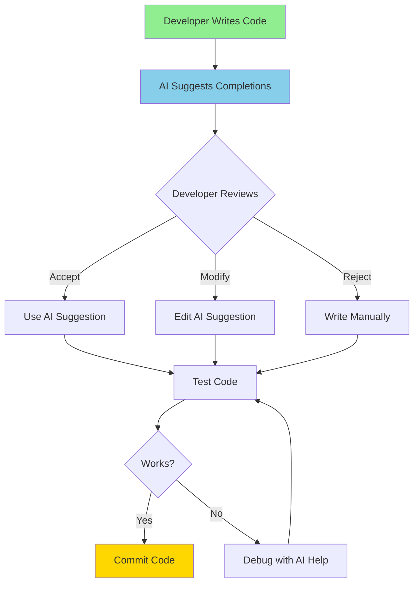

# AI-Assisted Development

**Title:** AI-Assisted Development  
**Audience:** Engineering, QA, Product  
**Duration:** 45-60 minutes  
**Prerequisites:** `00_introduction_to_ai_and_agentic_ai/00_what_is_ai.md` (recommended)

---

## Learning Objectives

By the end of this lesson, you will be able to:

- Define AI-assisted development and distinguish it from traditional development
- Identify common AI-assisted development tools and their use cases
- Understand when to use AI assistance vs. manual coding
- Apply AI-assisted development practices in daily work
- Recognize limitations and best practices for AI-assisted development
- Evaluate productivity gains from AI assistance

---

## Core Content

### What is AI-Assisted Development?

**AI-Assisted Development** is a development paradigm where developers use AI tools (like GitHub Copilot, Cursor, ChatGPT) to help write, review, and debug code—but the developer remains in control, making final decisions and maintaining code ownership.

**Key Characteristics:**
- ✅ Developer is in control (makes final decisions)
- ✅ AI suggests code, but developer reviews and modifies
- ✅ Human-AI collaboration (pair programming with AI)
- ✅ AI accelerates development but doesn't replace developer judgment
- ❌ AI doesn't autonomously plan or execute workflows

**Analogy:** Like a GPS navigation system—it suggests routes, but you decide which one to take and when to deviate.

---

### AI-Assisted Development Workflow



---

### Common AI-Assisted Development Tools

#### 1. GitHub Copilot
- **What it does:** Autocompletes code as you type
- **Best for:** Code snippets, function implementations, boilerplate code
- **Example:** Type `function calculatePayrollTax(income, state)` → Copilot suggests implementation
- **Greenshades Context:** Generating payroll calculation functions, test cases, API endpoints

#### 2. Cursor
- **What it does:** AI-powered code editor with chat interface
- **Best for:** Code generation, refactoring, debugging, documentation
- **Example:** Chat: "Add error handling to this payroll function" → Cursor generates code
- **Greenshades Context:** Refactoring Avocado code, adding error handling, generating tests

#### 3. ChatGPT / Claude
- **What it does:** Conversational AI for code questions and generation
- **Best for:** Explaining code, debugging, architecture decisions, learning
- **Example:** "Why is this payroll calculation failing?" → AI explains and suggests fixes
- **Greenshades Context:** Understanding complex tax logic, debugging integration issues

#### 4. Code Review AI Tools
- **What it does:** Automated code review for security, quality, best practices
- **Best for:** Catching bugs, security vulnerabilities, code smells
- **Example:** AI flags potential SQL injection, suggests improvements
- **Greenshades Context:** Reviewing payroll code for security and compliance

---

### When to Use AI Assistance

**Use AI Assistance For:**
- ✅ **Boilerplate code:** Repetitive patterns, API endpoints, CRUD operations
- ✅ **Code completion:** Function implementations, variable names, imports
- ✅ **Documentation:** Generating docstrings, comments, README files
- ✅ **Test generation:** Creating unit tests, integration tests, test data
- ✅ **Debugging:** Explaining errors, suggesting fixes, understanding code
- ✅ **Refactoring:** Improving code structure, extracting functions, renaming
- ✅ **Learning:** Understanding unfamiliar code, libraries, patterns

**Don't Rely on AI For:**
- ❌ **Business logic decisions:** Complex payroll rules, tax calculations (verify carefully)
- ❌ **Security-critical code:** Authentication, authorization, encryption (review thoroughly)
- ❌ **Architecture decisions:** System design, technology choices (human judgment required)
- ❌ **Final code quality:** Always review and test AI-generated code

---

### AI-Assisted Development Best Practices

1. **Review All AI Suggestions**
   - AI can generate incorrect or insecure code
   - Always understand what the code does before accepting
   - Test AI-generated code thoroughly

2. **Use AI for Acceleration, Not Replacement**
   - AI speeds up development but doesn't replace developer expertise
   - Use AI to handle repetitive tasks, focus human time on complex problems

3. **Provide Clear Context**
   - Better prompts = better AI suggestions
   - Include function names, variable types, business rules in prompts

4. **Iterate and Refine**
   - AI suggestions are starting points, not final solutions
   - Modify and improve AI-generated code to match your standards

5. **Verify Business Logic**
   - Especially important for payroll, tax, financial calculations
   - AI may not understand domain-specific rules correctly

6. **Security First**
   - AI may suggest insecure code (SQL injection, XSS, etc.)
   - Always review for security vulnerabilities

---

## Greenshades-Specific Examples

### Example 1: Generating Payroll Calculation Function

**Scenario:** You need to write a function that calculates overtime pay.

**Traditional Approach:**
```python
def calculate_overtime_pay(hours_worked, hourly_rate):
    # Manual implementation
    if hours_worked > 40:
        regular_hours = 40
        overtime_hours = hours_worked - 40
        regular_pay = regular_hours * hourly_rate
        overtime_pay = overtime_hours * hourly_rate * 1.5
        return regular_pay + overtime_pay
    else:
        return hours_worked * hourly_rate
```

**AI-Assisted Approach:**
1. Type function signature: `def calculate_overtime_pay(hours_worked, hourly_rate):`
2. Copilot suggests implementation (similar to above)
3. Review and test: Verify logic matches business rules (e.g., is overtime 1.5× or 2×?)
4. Add error handling: AI suggests adding validation for negative values
5. **Time saved:** 50% faster than writing from scratch

---

### Example 2: Generating Test Cases

**Scenario:** You need to write unit tests for a payroll tax calculation function.

**AI Prompt (Cursor/ChatGPT):**
```
Generate unit tests for this function:
def calculate_state_tax(income, state):
    # Tax brackets for different states
    if state == "CA":
        if income < 10000:
            return income * 0.01
        elif income < 50000:
            return 100 + (income - 10000) * 0.05
        else:
            return 2100 + (income - 50000) * 0.10
    # ... more states
```

**AI-Generated Tests:**
```python
def test_calculate_state_tax_ca_low_income():
    assert calculate_state_tax(5000, "CA") == 50.0

def test_calculate_state_tax_ca_medium_income():
    assert calculate_state_tax(30000, "CA") == 1100.0

def test_calculate_state_tax_ca_high_income():
    assert calculate_state_tax(60000, "CA") == 3100.0

def test_calculate_state_tax_negative_income():
    with pytest.raises(ValueError):
        calculate_state_tax(-1000, "CA")
```

**Developer Action:** Review tests, add edge cases, verify tax brackets are correct.

**Time saved:** 70% faster than writing tests manually.

---

### Example 3: Debugging Integration Issue

**Scenario:** Avocado integration with Business Central is failing intermittently.

**AI Prompt (ChatGPT):**
```
This integration code is failing intermittently. What could be wrong?

def sync_payroll_to_bc(payroll_data):
    try:
        response = requests.post(BC_API_URL, json=payroll_data, timeout=5)
        response.raise_for_status()
        return response.json()
    except requests.exceptions.Timeout:
        logger.error("BC API timeout")
        raise
```

**AI Suggestions:**
1. **Timeout too short:** BC API might be slow; increase timeout or add retries
2. **Missing retry logic:** Network issues are intermittent; add exponential backoff
3. **Error handling:** Catch specific exceptions, log more details
4. **Rate limiting:** BC API might have rate limits; add throttling

**Developer Action:** Implement retry logic with exponential backoff, increase timeout, add better error handling.

---

## Try It: Exercise

**Scenario:** You need to write a function that validates payroll data before processing.

**Task:** Use AI assistance (or simulate with a prompt) to generate this function, then:
1. Write the AI prompt you would use
2. List 3 things you would verify/review in the AI-generated code
3. Identify one potential issue AI might miss

**Function Requirements:**
- Validates employee ID exists in database
- Checks that hours worked are between 0 and 80
- Ensures gross pay is positive
- Validates tax deductions don't exceed gross pay

**Solution:**
1. **AI Prompt:** "Generate a Python function that validates payroll data: employee ID exists, hours 0-80, gross pay positive, deductions <= gross pay. Include error messages for each validation."

2. **Things to verify:**
   - Database connection handling (does it handle connection errors?)
   - Edge cases (what if hours = 0? What if deductions = gross pay exactly?)
   - Performance (is database query efficient? Should it batch validate multiple records?)

3. **Potential issue AI might miss:**
   - **Race condition:** Employee ID might exist when checked but be deleted before processing
   - **Data type validation:** AI might not check if hours_worked is a number (could be string)
   - **Business rules:** AI might not know that some employees can work > 80 hours (exempt employees)

---

## Role-Based "How This Helps You"

### Developers
- **Accelerate coding:** 30-50% faster development with AI assistance
- **Focus on complex problems:** Use AI for boilerplate, focus human time on architecture and business logic
- **Learn faster:** AI explains code and suggests best practices

### QA Engineers
- **Generate test cases:** AI creates test data and test scenarios
- **Debug test failures:** AI helps understand why tests are failing
- **Automate test writing:** 70% faster test case creation

### Product Managers
- **Faster feature delivery:** AI-assisted development accelerates time-to-market
- **Better quality:** AI catches bugs and suggests improvements
- **Cost efficiency:** Productivity gains reduce development costs

---

## Key Takeaways

1. **AI-Assisted Development:** Developer uses AI tools to accelerate coding, but remains in control

2. **Common Tools:** GitHub Copilot (autocomplete), Cursor (code editor), ChatGPT (Q&A), Code review tools

3. **Best For:** Boilerplate code, test generation, documentation, debugging, learning

4. **Always Review:** AI can generate incorrect or insecure code—always review and test

5. **Best Practices:** Provide clear context, iterate and refine, verify business logic, security first

6. **Productivity Gains:** 30-50% faster development, 70% faster test creation

---

## 5-Question Quiz

### Question 1 (Multiple Choice)
What is the key characteristic of AI-assisted development?

a) AI autonomously writes all code  
b) Developer remains in control and makes final decisions  
c) AI replaces the need for code review  
d) AI only works for simple code

**Answer:** b) Developer remains in control and makes final decisions

---

### Question 2 (True/False)
AI-assisted development tools can generate secure code that doesn't require security review.

**Answer:** False. AI can generate insecure code (SQL injection, XSS, etc.)—always review for security vulnerabilities.

---

### Question 3 (Short Answer)
Name one thing you should always do with AI-generated code before using it in production.

**Answer:** Review it, test it, verify business logic, check for security vulnerabilities, or understand what it does. (Accept any reasonable answer)

---

### Question 4 (Multiple Choice)
Which task is best suited for AI assistance?

a) Making architecture decisions  
b) Writing boilerplate code and test cases  
c) Deciding business logic for payroll calculations  
d) All of the above

**Answer:** b) Writing boilerplate code and test cases

---

### Question 5 (Short Answer)
Give one example of how AI-assisted development could help in Greenshades payroll development.

**Answer:** Examples: Generating test cases for tax calculations, autocompleting API endpoints, debugging integration issues, generating documentation. (Accept any realistic example)

---

## One-Page Cheat Sheet

### AI-Assisted Development
- **Definition:** Developer uses AI tools to accelerate coding, remains in control
- **Tools:** GitHub Copilot, Cursor, ChatGPT, Code review AI
- **Workflow:** Write code → AI suggests → Review → Accept/Modify/Reject → Test

### When to Use AI
- ✅ Boilerplate code, test generation, documentation, debugging, learning
- ❌ Business logic decisions, security-critical code, architecture decisions

### Best Practices
1. Review all AI suggestions
2. Use AI for acceleration, not replacement
3. Provide clear context in prompts
4. Iterate and refine AI code
5. Verify business logic
6. Security first

### Productivity Gains
- **Development:** 30-50% faster
- **Test Creation:** 70% faster
- **Documentation:** 80% faster

### Common Use Cases
- Code completion, function generation, test cases, debugging, refactoring, documentation

### Limitations
- AI can generate incorrect or insecure code
- Always review and test AI-generated code
- AI may not understand domain-specific business rules

---

## Phrases & Prompts That Work

**When using AI tools:**
- "Generate a function that [specific requirement] with error handling"
- "Write unit tests for this function covering edge cases"
- "Explain why this code is failing and suggest a fix"

**When reviewing AI code:**
- "Does this handle edge cases? What about error scenarios?"
- "Is this secure? Check for SQL injection, XSS, etc."
- "Does this match our business rules? Verify with domain experts."

---

## Security & Compliance Note

⚠️ **Red Flags Checklist:**
- [ ] Always review AI-generated code for security vulnerabilities (SQL injection, XSS, etc.)
- [ ] Verify business logic, especially for payroll/tax calculations (AI may not understand domain rules)
- [ ] Never paste sensitive data (SSNs, passwords) into public AI tools
- [ ] Test AI-generated code thoroughly before deploying to production

**Reference:** See `04_ai_ethics_and_security_basics/` for detailed security guidelines.

---

**Next Lesson:** `01_ai_driven_development.md`

