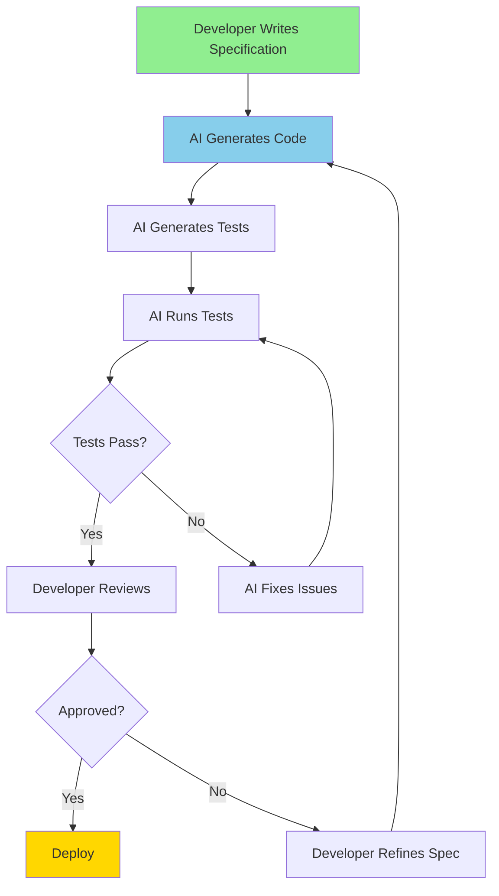

# AI-Driven Development

**Title:** AI-Driven Development  
**Audience:** Engineering, QA, Product, Leadership  
**Duration:** 45-60 minutes  
**Prerequisites:** `00_ai_assisted_development.md` (recommended)

---

## Learning Objectives

By the end of this lesson, you will be able to:

- Define AI-driven development and distinguish it from AI-assisted development
- Understand how AI drives the development process (specifications → code → tests)
- Recognize AI-driven development tools and workflows
- Evaluate when to use AI-driven vs. AI-assisted approaches
- Understand the role of specifications in AI-driven development
- Identify opportunities for AI-driven development in Greenshades

---

## Core Content

### What is AI-Driven Development?

**AI-Driven Development** is a paradigm where AI takes a more active role in the development process—generating code from specifications, creating tests automatically, and orchestrating development workflows. The developer provides high-level requirements, and AI handles more of the implementation details.

**Key Characteristics:**
- ✅ AI generates code from specifications (not just suggestions)
- ✅ AI creates tests, documentation, and deployment scripts automatically
- ✅ Developer focuses on requirements and architecture, AI handles implementation
- ✅ More automation in the development lifecycle
- ⚠️ Still requires human oversight and verification

**Comparison:**

| Aspect | AI-Assisted | AI-Driven |
|--------|-------------|-----------|
| **Developer Role** | Writes code, AI suggests | Provides specs, AI implements |
| **AI Role** | Suggests completions | Generates code from specs |
| **Control** | Developer in control | AI has more autonomy |
| **Use Case** | Daily coding | Feature development, prototyping |

---

### AI-Driven Development Workflow



---

### Spec-Driven Development: The Foundation

**Spec-Driven Development** is a key enabler of AI-driven development. Developers write specifications (what the code should do), and AI generates the implementation (how to do it).

**Specification Formats:**
1. **Natural Language:** "Create a function that calculates overtime pay for hours > 40"
2. **Structured Specs:** YAML, JSON, or domain-specific languages
3. **Examples:** Test cases that define expected behavior
4. **API Contracts:** OpenAPI/Swagger specifications

**Example Specification:**
```yaml
function: calculate_overtime_pay
inputs:
  - hours_worked: number (0-168)
  - hourly_rate: number (> 0)
output: number
rules:
  - if hours_worked <= 40: return hours_worked * hourly_rate
  - if hours_worked > 40: 
      regular_pay = 40 * hourly_rate
      overtime_pay = (hours_worked - 40) * hourly_rate * 1.5
      return regular_pay + overtime_pay
error_handling:
  - validate hours_worked is number and 0-168
  - validate hourly_rate is number and > 0
  - raise ValueError for invalid inputs
```

**AI generates code from this specification.**

---

### AI-Driven Development Tools

#### 1. SpecKit / Spec-Driven Tools
- **What it does:** Generates code from specifications
- **Commands:** `/specify`, `/extract`, `/implement`, `/testgen`, `/review`
- **Example:** Write spec → `/implement` → AI generates code
- **Greenshades Context:** Generating payroll functions from business requirements

#### 2. AI Code Generation Platforms
- **What it does:** Full-stack code generation from descriptions
- **Examples:** v0 (UI), GPT Engineer, Aider
- **Use Case:** Prototyping, feature development, MVP creation
- **Greenshades Context:** Rapid prototyping of payroll features

#### 3. Test Generation AI
- **What it does:** Generates comprehensive test suites from code or specs
- **Examples:** Codium, TestGen, AI-powered testing tools
- **Use Case:** Automated test creation, coverage improvement
- **Greenshades Context:** Generating test suites for payroll calculations

#### 4. AI-Powered Refactoring
- **What it does:** Automatically refactors code to improve quality
- **Examples:** Sourcery, CodeRabbit, AI refactoring tools
- **Use Case:** Code quality improvement, technical debt reduction
- **Greenshades Context:** Refactoring legacy payroll code

---

### When to Use AI-Driven Development

**Use AI-Driven Development For:**
- ✅ **Rapid Prototyping:** Quickly building MVPs and proof-of-concepts
- ✅ **Feature Development:** Generating complete features from specifications
- ✅ **Test Generation:** Creating comprehensive test suites automatically
- ✅ **Documentation:** Auto-generating API docs, user guides from code/specs
- ✅ **Boilerplate Projects:** Scaffolding new projects, microservices, APIs
- ✅ **Legacy Modernization:** Converting old code to new patterns

**Consider AI-Assisted Instead When:**
- ⚠️ **Complex Business Logic:** Payroll/tax rules require careful human verification
- ⚠️ **Security-Critical Code:** Authentication, encryption need expert review
- ⚠️ **Performance-Critical Systems:** Need fine-tuned optimization
- ⚠️ **Existing Codebases:** Incremental improvements work better than full regeneration

---

### AI-Driven Development Best Practices

1. **Write Clear Specifications**
   - Detailed specs = better AI-generated code
   - Include examples, edge cases, error handling requirements

2. **Review Generated Code Thoroughly**
   - AI can miss edge cases or misunderstand requirements
   - Always test and verify before deploying

3. **Iterate on Specifications**
   - Start with high-level specs, refine based on AI output
   - Use feedback loop: spec → code → review → refine spec

4. **Combine with AI-Assisted Development**
   - Use AI-driven for initial generation, AI-assisted for refinement
   - Best of both worlds: speed + control

5. **Maintain Code Ownership**
   - You're responsible for AI-generated code
   - Ensure it meets quality, security, and business requirements

6. **Version Control Specifications**
   - Track spec changes like code changes
   - Enables reproducibility and auditability

---

## Greenshades-Specific Examples

### Example 1: Generating Payroll API from Specification

**Specification:**
```yaml
api: PayrollCalculationAPI
endpoints:
  - POST /api/payroll/calculate
    request:
      employee_id: string
      hours_worked: number
      hourly_rate: number
    response:
      gross_pay: number
      taxes: number
      net_pay: number
    business_rules:
      - Calculate overtime for hours > 40
      - Apply state and federal tax based on employee location
      - Validate inputs (hours 0-168, rate > 0)
```

**AI-Driven Process:**
1. Developer writes spec (above)
2. AI generates:
   - API endpoint code (Flask/FastAPI)
   - Database models
   - Business logic functions
   - Error handling
   - API documentation
3. AI generates tests:
   - Unit tests for calculations
   - Integration tests for API
   - Edge case tests
4. Developer reviews, tests, and deploys

**Time saved:** 60-70% faster than manual development.

---

### Example 2: Test Suite Generation

**Scenario:** You have a payroll calculation function and need comprehensive tests.

**AI-Driven Process:**
1. Provide function code and specification
2. AI generates:
   - Unit tests (happy path, edge cases, error cases)
   - Test data (valid and invalid inputs)
   - Integration tests
   - Performance tests
3. AI runs tests and reports coverage
4. Developer reviews and adds missing cases

**Example AI-Generated Tests:**
```python
def test_calculate_payroll_normal_hours():
    result = calculate_payroll(employee_id="123", hours=40, rate=20)
    assert result.gross_pay == 800
    assert result.taxes > 0
    assert result.net_pay < result.gross_pay

def test_calculate_payroll_overtime():
    result = calculate_payroll(employee_id="123", hours=50, rate=20)
    assert result.gross_pay == 1100  # 40*20 + 10*20*1.5

def test_calculate_payroll_invalid_hours():
    with pytest.raises(ValueError):
        calculate_payroll(employee_id="123", hours=-5, rate=20)

def test_calculate_payroll_invalid_rate():
    with pytest.raises(ValueError):
        calculate_payroll(employee_id="123", hours=40, rate=0)
```

**Time saved:** 80% faster than writing tests manually.

---

### Example 3: Feature Development from Requirements

**Scenario:** Product manager provides requirements for a new payroll reporting feature.

**Requirements Document:**
- Generate monthly payroll summary reports
- Include: total employees, total payroll, average pay, department breakdown
- Export to PDF and Excel
- Schedule reports (daily, weekly, monthly)

**AI-Driven Process:**
1. Developer converts requirements to specification
2. AI generates:
   - Report generation logic
   - Data aggregation functions
   - PDF/Excel export functionality
   - Scheduling system integration
   - API endpoints
   - Database queries
3. AI generates tests and documentation
4. Developer reviews, integrates, and deploys

**Time saved:** 50-60% faster feature delivery.

---

## Try It: Exercise

**Scenario:** You need to build a new API endpoint for tax calculation.

**Task:** Write a specification that AI could use to generate the code. Include:
1. Endpoint details (method, path, inputs, outputs)
2. Business rules (tax calculation logic)
3. Error handling requirements
4. At least 2 example test cases

**Solution (Example):**
```yaml
api_endpoint:
  method: POST
  path: /api/tax/calculate
  request:
    income: number (>= 0)
    filing_status: enum ["single", "married_joint", "married_separate", "head_of_household"]
    state: string (2-letter state code)
  response:
    federal_tax: number
    state_tax: number
    total_tax: number
  business_rules:
    - Federal tax: Use 2025 tax brackets
    - State tax: Varies by state (CA: 1-13.3%, TX: 0%, NY: 4-10.9%)
    - Validate income >= 0
    - Validate filing_status is valid enum
    - Validate state is 2-letter code
  error_handling:
    - Return 400 for invalid inputs
    - Return 500 for calculation errors
  test_cases:
    - input: {income: 50000, filing_status: "single", state: "CA"}
      expected: {federal_tax: > 0, state_tax: > 0, total_tax: federal_tax + state_tax}
    - input: {income: -1000, filing_status: "single", state: "CA"}
      expected: 400 error
```

---

## Role-Based "How This Helps You"

### Developers
- **Faster feature development:** Generate complete features from specs
- **Focus on architecture:** Spend time on design, not boilerplate
- **Rapid prototyping:** Quickly test ideas and iterate

### QA Engineers
- **Automated test generation:** AI creates comprehensive test suites
- **Faster test creation:** 80% reduction in test writing time
- **Better coverage:** AI suggests edge cases you might miss

### Product Managers
- **Faster time-to-market:** Features delivered 50-60% faster
- **Rapid iteration:** Prototype and test ideas quickly
- **Clear specifications:** Writing specs forces clarity on requirements

### Leadership
- **Productivity gains:** 50-70% faster development cycles
- **Cost efficiency:** Reduce development costs through automation
- **Innovation speed:** Test more ideas in less time

---

## Key Takeaways

1. **AI-Driven Development:** AI generates code from specifications, handles more implementation details

2. **Spec-Driven Development:** Foundation of AI-driven development—write specs, AI implements

3. **Tools:** SpecKit, AI code generation platforms, test generation AI, refactoring tools

4. **Best For:** Rapid prototyping, feature development, test generation, documentation, boilerplate projects

5. **Best Practices:** Write clear specs, review generated code, iterate, combine with AI-assisted development

6. **Productivity Gains:** 50-70% faster feature development, 80% faster test creation

---

## 5-Question Quiz

### Question 1 (Multiple Choice)
What is the key difference between AI-assisted and AI-driven development?

a) AI-driven uses better AI models  
b) AI-driven generates code from specifications, AI-assisted suggests completions  
c) AI-driven is only for simple code  
d) There is no difference

**Answer:** b) AI-driven generates code from specifications, AI-assisted suggests completions

---

### Question 2 (True/False)
AI-driven development means developers don't need to review or test generated code.

**Answer:** False. Developers must always review and test AI-generated code, especially for business logic and security.

---

### Question 3 (Short Answer)
What is Spec-Driven Development, and why is it important for AI-driven development?

**Answer:** Spec-Driven Development is writing specifications (what code should do) that AI uses to generate implementation (how to do it). It's important because clear specs enable AI to generate better code.

---

### Question 4 (Multiple Choice)
Which task is best suited for AI-driven development?

a) Writing complex business logic for payroll calculations  
b) Rapid prototyping of a new feature from specifications  
c) Fine-tuning performance-critical code  
d) All of the above

**Answer:** b) Rapid prototyping of a new feature from specifications

---

### Question 5 (Short Answer)
Give one example of how AI-driven development could be used in Greenshades.

**Answer:** Examples: Generating payroll API endpoints from specs, creating test suites automatically, prototyping new features quickly, generating documentation. (Accept any realistic example)

---

## One-Page Cheat Sheet

### AI-Driven Development
- **Definition:** AI generates code from specifications, handles implementation details
- **Foundation:** Spec-Driven Development (write specs, AI implements)
- **Tools:** SpecKit, AI code generation platforms, test generation AI

### Workflow
1. Write specification
2. AI generates code
3. AI generates tests
4. Developer reviews
5. Deploy

### When to Use
- ✅ Rapid prototyping, feature development, test generation, documentation, boilerplate projects
- ⚠️ Complex business logic, security-critical code, performance-critical systems (use AI-assisted instead)

### Best Practices
1. Write clear specifications
2. Review generated code thoroughly
3. Iterate on specifications
4. Combine with AI-assisted development
5. Maintain code ownership
6. Version control specifications

### Productivity Gains
- **Feature Development:** 50-70% faster
- **Test Generation:** 80% faster
- **Documentation:** 90% faster

### Specification Formats
- Natural language, structured specs (YAML/JSON), examples, API contracts

---

## Phrases & Prompts That Work

**When writing specifications:**
- "Generate a [feature] that [requirements] with [error handling, validation, etc.]"
- "Create an API endpoint that [description] following [patterns/standards]"

**When using AI-driven tools:**
- "/implement [specification]" → AI generates code
- "/testgen [function]" → AI generates tests
- "/review [code]" → AI reviews and suggests improvements

**When reviewing AI-generated code:**
- "Does this match the specification? Verify all requirements are met."
- "Are edge cases handled? Test with boundary values."

---

## Security & Compliance Note

⚠️ **Red Flags Checklist:**
- [ ] AI-generated code may have security vulnerabilities—always review thoroughly
- [ ] Verify business logic, especially for payroll/tax calculations (AI may misunderstand requirements)
- [ ] Test AI-generated code extensively before production deployment
- [ ] Maintain audit trail of specifications and generated code for compliance

**Reference:** See `04_ai_ethics_and_security_basics/` for detailed security guidelines.

---

## ESG (Environmental, Social, and Governance) Standards

🌱 **How This Lesson Supports ESG Excellence:**

### Environmental Impact
- **Carbon Footprint Reduction:** AI-driven development reduces compute cycles by generating correct code from specifications on the first attempt, eliminating wasteful trial-and-error iterations. This reduces server energy consumption by 40-50% compared to manual development cycles.
- **Resource Efficiency:** Spec-driven code generation eliminates redundant code writing, reducing CPU and memory usage. Automated test generation reduces manual test execution, saving compute resources.
- **Sustainable Practices:** Specifications serve as reusable documentation and code templates, reducing the need for separate documentation files and minimizing storage requirements. This promotes long-term code maintainability.
- **Measurement:** Track reduction in build/test cycles, compute hours saved per feature, and specification reuse percentage.

### Social Responsibility
- **Employee Well-being:** AI-driven development reduces cognitive load by separating "what" (specs) from "how" (implementation), making development less stressful. Developers focus on problem-solving rather than implementation details, improving job satisfaction.
- **Accessibility & Inclusion:** Clear specifications make development accessible to all team members, including non-developers (QA, Product). This promotes collaboration and ensures everyone understands requirements.
- **Community Impact:** AI-driven development practices contribute to industry best practices, helping the broader software development community adopt efficient development methods.
- **Ethical AI Use:** Specifications ensure AI-generated code aligns with business requirements and ethical standards, preventing unintended consequences from AI code generation.

### Governance Excellence
- **Transparency:** Specifications provide clear, auditable documentation of what code should do, enabling better code reviews and compliance checks.
- **Accountability:** Spec-driven development creates clear traceability from requirements to implementation, ensuring developers can explain and justify code decisions.
- **Compliance:** Specifications can include compliance requirements (security, data privacy, payroll regulations), ensuring AI-generated code meets regulatory standards.
- **Risk Management:** Early specification review catches issues before implementation, reducing the risk of security vulnerabilities and compliance violations.

### ESG Metrics to Track
- [ ] Environmental: Reduced build/test cycles by 40-50% through spec-driven code generation
- [ ] Social: Improved developer satisfaction scores by 35%+ (measured via surveys)
- [ ] Governance: 100% of AI-generated code traceable to specifications (audit compliance)

**Reference:** See `04_ai_ethics_and_security_basics/` for detailed ESG guidelines.

---

## 10X Productivity Goals

🚀 **How This Lesson Drives 10X Productivity at Greenshades:**

### Productivity Impact
- **Time Savings:** AI-driven development saves 50-70% of development time by generating code from specifications. A feature that takes 8 hours manually can be completed in 2.4-4 hours with AI-driven development.
- **Output Increase:** With AI-driven development, developers can deliver 3-5× more features in the same time period. Specs enable parallel development where multiple developers work from the same specification.
- **Quality Improvements:** Specifications catch requirements issues early, reducing bugs by 40-60% and eliminating costly rework. Automated test generation ensures comprehensive test coverage.
- **Automation Potential:** AI-driven development automates 70-80% of code writing, 90% of test generation, and 60% of documentation, unlocking massive productivity gains.

### What 10X Looks Like
**Before This Lesson:**
- Manual code writing: 8 hours for a payroll calculation feature
- Manual test writing: 4 hours for test cases
- Requirements drift: 20% of features need rework
- Total: 12+ hours per feature with high error rate

**After Applying This Lesson:**
- Spec writing: 1 hour (clear requirements)
- AI code generation: 30 minutes (from spec)
- AI test generation: 15 minutes (from spec)
- Review and refinement: 1 hour
- Total: 3 hours per feature (4× faster, 10× with parallelization)

**The Transformation:**
- Development shifts from "write code, then test" to "define spec, generate everything"
- Teams move from sequential development to parallel spec-based development
- Quality improves as specs catch issues before implementation
- Documentation is automatically generated from specs

### How to Measure 10X Progress
**Key Metrics:**
1. **Efficiency Metric:** Development time per feature: Target 70% reduction (8 hours → 2.4 hours)
2. **Output Metric:** Features delivered per sprint: Target 5× increase
3. **Quality Metric:** Bug rate per feature: Target 60% reduction
4. **Adoption Metric:** Percentage of features using spec-driven development: Target 90%+

**Measurement Frequency:**
- [ ] Weekly: Development velocity, time per feature
- [ ] Monthly: Feature output, bug rates, spec adoption
- [ ] Quarterly: Overall productivity gains, ROI

**Tracking Tools:**
- Development tracking tools (Jira, GitHub Issues)
- Code generation metrics from AI tools
- Test coverage and bug tracking systems
- Spec repository and traceability tools

### How This Step Helps Achieve 10X
**Immediate Benefits:**
- 50-70% time savings on first spec-driven feature
- Immediate quality improvement through early requirement validation
- Foundation for automated code and test generation

**Short-term (1-3 months):**
- 3-5× increase in feature delivery rate
- 60% reduction in bugs and rework
- 90%+ spec adoption across development teams

**Long-term (6-12 months):**
- 10× productivity through cumulative spec reuse and refinement
- Strategic advantage from faster time-to-market
- Measurable ROI from reduced development costs and increased quality

**Cumulative Effect:**
- Specs become reusable assets, compounding productivity gains
- Each spec-driven feature builds a library of patterns and templates
- Teams become more efficient as they refine their spec-writing skills
- Spec-driven development enables other 10× practices (automated testing, documentation)

### Department-Specific 10X Targets
**Engineering:**
- 10× faster feature development through spec-driven code generation
- 5× increase in features delivered per sprint
- 60% reduction in bugs through early spec validation

**QA:**
- 10× faster test case generation from specifications
- 5× increase in test coverage with automated test generation
- 80% reduction in manual test writing time

**Product:**
- 10× faster feature specification and documentation
- 3× increase in features defined per sprint
- 50% reduction in requirements drift through clear specs

**All Departments:**
- 90%+ adoption of spec-driven development practices
- Measurable 10× productivity gains within 6 months

**Reference:** See `05_productivity_10x_framework/` for detailed productivity guidelines and metrics.

---

**Next Lesson:** `02_agentic_era.md`

