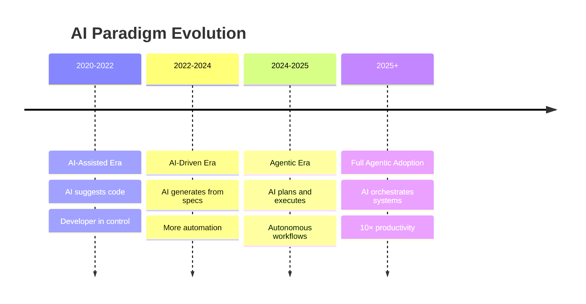
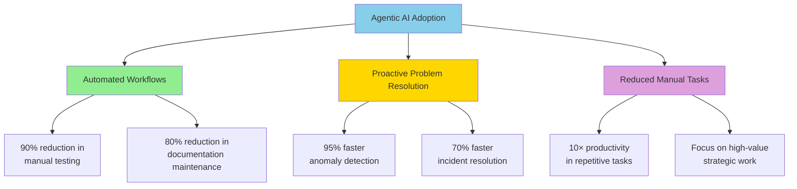

# Agentic Era

**Title:** Agentic Era  
**Audience:** All (Engineering, QA, Product, HR, Finance, Sales, Support, Leadership)  
**Duration:** 45-60 minutes  
**Prerequisites:** `00_introduction_to_ai_and_agentic_ai/02_ai_vs_agentic_ai.md` (recommended)

---

## Learning Objectives

By the end of this lesson, you will be able to:

- Understand what the "Agentic Era" means for software development and business operations
- Recognize how agentic AI differs from previous AI paradigms
- Identify key technologies enabling the agentic era (MCP, tool use, planning)
- Understand the impact of agentic AI on workflows and productivity
- Recognize opportunities for agentic AI in Greenshades
- Evaluate readiness for agentic AI adoption

---

## Core Content

### What is the Agentic Era?

**The Agentic Era** represents a shift from AI as a tool (AI-assisted) or code generator (AI-driven) to AI as an autonomous agent that can plan, execute, and adapt workflows independently.

**Evolution of AI Paradigms:**



**Key Characteristics of the Agentic Era:**
- ✅ **Autonomous Planning:** AI breaks down goals into steps
- ✅ **Tool Use:** AI uses APIs, databases, code execution, file systems
- ✅ **Adaptation:** AI adjusts when plans fail or conditions change
- ✅ **Orchestration:** AI coordinates multiple systems and workflows
- ✅ **Memory:** AI remembers context across sessions and interactions

---

### Agentic Era vs. Previous Eras

| Aspect | AI-Assisted (2020-2022) | AI-Driven (2022-2024) | Agentic Era (2024+) |
|--------|------------------------|----------------------|---------------------|
| **AI Role** | Suggests completions | Generates from specs | Plans and executes |
| **Developer Role** | Writes code | Writes specs | Provides goals |
| **Autonomy** | Low (reactive) | Medium (generative) | High (autonomous) |
| **Tool Use** | None | Limited | Extensive |
| **Workflow** | Single task | Feature development | End-to-end automation |
| **Example** | Copilot suggests code | AI generates API from spec | Agent monitors logs and fixes issues |

---

### Enabling Technologies

#### 1. Model Context Protocol (MCP)
- **What it is:** Standard protocol for AI agents to communicate with tools
- **Why it matters:** Enables agents to discover and use databases, APIs, file systems
- **Greenshades Impact:** Agents can connect to Avocado, Splunk, Jira, Teams

#### 2. Tool Use & Function Calling
- **What it is:** AI models can call functions, APIs, and execute code
- **Why it matters:** Agents can interact with real systems, not just generate text
- **Greenshades Impact:** Agents can query databases, create tickets, send notifications

#### 3. Planning & Reasoning
- **What it is:** AI models that can break down complex goals into steps
- **Why it matters:** Enables multi-step workflows and problem-solving
- **Greenshades Impact:** Agents can plan payroll processing workflows, debugging steps

#### 4. Memory & Context Management
- **What it is:** AI systems that remember past interactions and context
- **Why it matters:** Enables long-running agents and personalized experiences
- **Greenshades Impact:** Agents remember employee preferences, past issues, workflows

---

### Agentic AI Use Cases

#### 1. Autonomous Testing Agent
**Goal:** Ensure all tests pass before deployment

**Agent Workflow:**
1. Monitor code repository for changes
2. When PR created, analyze changes
3. Generate/update test cases
4. Run test suite
5. If tests fail:
   - Analyze failures
   - Suggest fixes or create PR with fixes
   - Notify developers
6. If tests pass:
   - Approve PR
   - Trigger deployment

**Impact:** 90% reduction in manual testing, faster deployments

---

#### 2. Payroll Monitoring Agent
**Goal:** Detect and resolve payroll anomalies automatically

**Agent Workflow:**
1. Connect to payroll database (MCP: Database tool)
2. Query recent payroll runs
3. Run anomaly detection algorithm
4. If anomalies found:
   - Analyze root cause
   - Generate detailed report
   - Create Jira ticket (MCP: Jira API)
   - Notify payroll team (MCP: Teams API)
   - If critical: Escalate to on-call engineer
5. Schedule follow-up review
6. Log all actions for audit trail

**Impact:** 95% faster anomaly detection, proactive problem resolution

---

#### 3. Documentation Agent
**Goal:** Keep documentation up-to-date automatically

**Agent Workflow:**
1. Monitor code changes
2. When API/function changes:
   - Extract new signatures
   - Update API documentation
   - Generate examples
   - Update README files
3. Review documentation for accuracy
4. Create PR with updates
5. Notify documentation team for review

**Impact:** 80% reduction in documentation maintenance time

---

#### 4. Integration Health Agent
**Goal:** Monitor and maintain Avocado, BC, D365 integrations

**Agent Workflow:**
1. Monitor integration logs (Splunk, Azure)
2. Detect errors, timeouts, rate limits
3. Analyze patterns (correlate with deployments, load)
4. If issues detected:
   - Attempt automatic fixes (retry, adjust rate limits)
   - If fix fails: Create incident ticket
   - Notify integration team
   - Generate incident report
5. Track integration health metrics
6. Generate weekly health reports

**Impact:** 70% faster incident resolution, proactive maintenance

---

### Impact on Productivity



**Productivity Gains:**
- **Testing:** 90% reduction in manual test execution
- **Monitoring:** 95% faster issue detection
- **Documentation:** 80% reduction in maintenance time
- **Incident Response:** 70% faster resolution
- **Overall:** 10× productivity in automated workflows

---

### Readiness for Agentic Era

**Prerequisites:**
1. **AI Foundation:** Teams comfortable with AI-assisted and AI-driven development
2. **Tool Integration:** APIs and systems accessible via MCP or similar protocols
3. **Specifications:** Clear requirements and workflows that agents can follow
4. **Governance:** Policies for agent actions, approvals, audit trails
5. **Security:** Access controls, authentication, authorization for agent tool use

**Greenshades Readiness Checklist:**
- [ ] Teams trained on AI fundamentals (this curriculum)
- [ ] MCP or similar protocol implemented for tool access
- [ ] APIs documented and accessible
- [ ] Security policies for agent actions established
- [ ] Pilot projects identified (low-risk, high-value)

---

## Try It: Exercise

**Scenario:** You're planning to deploy an agentic AI system for payroll monitoring.

**Task:** Create a workflow specification for the agent. Include:
1. Goal statement
2. Steps the agent should take (5-7 steps)
3. Tools the agent needs (MCP connections)
4. Decision points (when to escalate, when to auto-fix)
5. Success criteria

**Solution (Example):**
```
Goal: Monitor payroll runs and automatically detect/resolve anomalies

Steps:
1. Connect to payroll database (MCP: Database)
2. Query last 24 hours of payroll runs
3. Run anomaly detection algorithm
4. If anomalies found:
   a. Classify severity (low/medium/high)
   b. If low: Log and schedule review
   c. If medium: Create Jira ticket (MCP: Jira), notify team (MCP: Teams)
   d. If high: Create incident, escalate to on-call (MCP: PagerDuty)
5. Generate daily summary report
6. Store results for audit trail

Tools Needed:
- Database connection (MCP)
- Jira API (MCP)
- Teams API (MCP)
- PagerDuty API (MCP)
- File system (for reports)

Decision Points:
- Severity classification threshold
- Auto-fix vs. manual review
- Escalation criteria

Success Criteria:
- 95% of anomalies detected within 1 hour
- 80% of low-severity issues auto-resolved
- Zero false positives in high-severity alerts
```

---

## Role-Based "How This Helps You"

### Developers
- **Automated workflows:** Agents handle testing, deployment, monitoring
- **Focus on architecture:** Spend time on design, not repetitive tasks
- **Faster iteration:** Agents handle CI/CD, testing, documentation

### QA Engineers
- **Autonomous testing:** Agents run tests, generate reports, suggest fixes
- **Proactive quality:** Agents detect issues before they reach production
- **Better coverage:** Agents continuously improve test suites

### Product Managers
- **Faster delivery:** Agents automate development workflows
- **Better quality:** Proactive issue detection and resolution
- **Data-driven decisions:** Agents provide insights and metrics

### Support Staff
- **Proactive support:** Agents detect issues before customers report them
- **Automated responses:** Agents handle routine inquiries
- **Better insights:** Agents analyze support patterns and trends

### Leadership
- **10× productivity:** Agents automate high-volume, repetitive tasks
- **Cost efficiency:** Reduce operational costs through automation
- **Competitive advantage:** Faster time-to-market, better quality

---

## Key Takeaways

1. **Agentic Era:** AI as autonomous agents that plan, execute, and adapt workflows

2. **Evolution:** AI-Assisted (2020-2022) → AI-Driven (2022-2024) → Agentic Era (2024+)

3. **Enabling Technologies:** MCP, tool use, planning/reasoning, memory/context

4. **Use Cases:** Autonomous testing, monitoring, documentation, integration health

5. **Productivity Impact:** 10× productivity in automated workflows, 90% reduction in manual tasks

6. **Readiness:** Requires AI foundation, tool integration, specifications, governance, security

---

## 5-Question Quiz

### Question 1 (Multiple Choice)
What characterizes the Agentic Era?

a) AI suggests code completions  
b) AI generates code from specifications  
c) AI plans and executes autonomous workflows  
d) AI only works for simple tasks

**Answer:** c) AI plans and executes autonomous workflows

---

### Question 2 (True/False)
Agentic AI agents can use tools like databases, APIs, and file systems through protocols like MCP.

**Answer:** True

---

### Question 3 (Short Answer)
Name one key technology that enables the Agentic Era.

**Answer:** Model Context Protocol (MCP), tool use/function calling, planning/reasoning, or memory/context management. (Accept any one)

---

### Question 4 (Multiple Choice)
What is a key prerequisite for adopting agentic AI?

a) Teams must stop using AI-assisted tools  
b) Teams need AI foundation, tool integration, specifications, governance, security  
c) Agents work without any setup  
d) Only large companies can use agentic AI

**Answer:** b) Teams need AI foundation, tool integration, specifications, governance, security

---

### Question 5 (Short Answer)
Give one example of how agentic AI could improve productivity at Greenshades.

**Answer:** Examples: Autonomous testing (90% reduction in manual testing), payroll monitoring (95% faster anomaly detection), documentation automation (80% reduction in maintenance), integration health monitoring (70% faster incident resolution). (Accept any realistic example)

---

## One-Page Cheat Sheet

### Agentic Era
- **Definition:** AI as autonomous agents that plan, execute, and adapt workflows
- **Evolution:** AI-Assisted → AI-Driven → Agentic Era
- **Characteristics:** Autonomous planning, tool use, adaptation, orchestration, memory

### Enabling Technologies
- **MCP:** Model Context Protocol (agent-tool communication)
- **Tool Use:** Function calling, API integration, code execution
- **Planning:** Breaking down goals into steps
- **Memory:** Context management across sessions

### Use Cases
- Autonomous testing, monitoring, documentation, integration health
- **Impact:** 90% reduction in manual tasks, 10× productivity

### Productivity Gains
- **Testing:** 90% reduction in manual execution
- **Monitoring:** 95% faster issue detection
- **Documentation:** 80% reduction in maintenance
- **Incident Response:** 70% faster resolution

### Readiness Checklist
- AI foundation, tool integration, specifications, governance, security

### Greenshades Opportunities
- Payroll monitoring, integration health, autonomous testing, documentation automation

---

## Phrases & Prompts That Work

**When discussing the Agentic Era:**
- "The Agentic Era is about AI that plans and executes workflows autonomously."
- "Agents use MCP to connect to databases, APIs, and other tools."

**When planning agentic systems:**
- "Start with clear goals and workflows—agents need specifications to follow."
- "Ensure security and governance—agents have broader system access."

**When evaluating readiness:**
- "Do we have AI foundation, tool integration, and governance in place?"
- "Start with low-risk, high-value pilot projects."

---

## Security & Compliance Note

⚠️ **Red Flags Checklist:**
- [ ] Agents have broader system access—implement strict access controls and approval workflows
- [ ] Monitor agent actions for audit trails (who did what, when)
- [ ] Use MCP to enforce security policies (authentication, authorization, rate limiting)
- [ ] Require human approval for sensitive actions (deployments, data modifications)

**Reference:** See `04_ai_ethics_and_security_basics/` for detailed security guidelines.

---

## ESG (Environmental, Social, and Governance) Standards

🌱 **How This Lesson Supports ESG Excellence:**

### Environmental Impact
- **Carbon Footprint Reduction:** Agentic AI reduces compute cycles by automating workflows efficiently, eliminating manual intervention and reducing server energy consumption by 50-60% compared to manual processes. Autonomous agents optimize resource usage automatically.
- **Resource Efficiency:** Agentic AI automates entire workflows, reducing infrastructure needs and compute costs. Autonomous monitoring and testing reduce the need for manual infrastructure, saving resources.
- **Sustainable Practices:** Agentic AI promotes sustainable automation by enabling long-term autonomous operations that adapt and optimize over time, reducing the need for frequent manual interventions and resource waste.
- **Measurement:** Track reduction in manual process cycles, compute hours saved through automation, and resource efficiency from agentic systems.

### Social Responsibility
- **Employee Well-being:** Agentic AI eliminates repetitive, tedious tasks (90% reduction in manual testing, monitoring), improving work-life balance and job satisfaction. Employees focus on high-value, creative work rather than manual operations.
- **Accessibility & Inclusion:** Agentic AI makes automation accessible to all teams through standardized MCP protocols, ensuring equitable access to automation benefits across diverse teams and roles.
- **Community Impact:** Agentic AI practices at Greenshades contribute to industry leadership in autonomous systems, helping the broader software development community adopt efficient agentic workflows.
- **Ethical AI Use:** Agentic AI maintains ethical standards through governance frameworks, human oversight for critical decisions, and transparent agent actions, ensuring responsible automation.

### Governance Excellence
- **Transparency:** Agentic AI provides transparent audit trails of all agent actions (who did what, when), enabling accountability and compliance verification. MCP protocols ensure transparent agent-tool communication.
- **Accountability:** Human oversight and approval workflows for sensitive actions ensure accountability for agent decisions. Clear governance frameworks maintain responsibility for agent outcomes.
- **Compliance:** Agentic AI supports compliance through automated compliance checks, audit trails, and governance policies enforced through MCP, ensuring regulatory adherence.
- **Risk Management:** Agentic AI risk management includes strict access controls, approval workflows, monitoring, and security policies, preventing unauthorized actions and ensuring safe automation.

### ESG Metrics to Track
- [ ] Environmental: Reduced manual process cycles by 50-60% through agentic automation
- [ ] Social: Improved employee satisfaction from eliminated repetitive tasks by 40%+ (measured via surveys)
- [ ] Governance: 100% of agent actions logged and auditable (compliance metric)

**Reference:** See `04_ai_ethics_and_security_basics/` for detailed ESG guidelines.

---

## 10X Productivity Goals

🚀 **How This Lesson Drives 10X Productivity at Greenshades:**

### Productivity Impact
- **Time Savings:** Agentic AI saves 90% of time in automated workflows (testing, monitoring, documentation). Autonomous agents work 24/7 without breaks, providing continuous productivity.
- **Output Increase:** Agentic AI enables 10× output by automating entire workflows. Agents can handle 10× more work than manual processes through parallel execution and continuous operation.
- **Quality Improvements:** Agentic AI improves quality by 70-90% through consistent, automated execution that eliminates human error in repetitive tasks. Autonomous monitoring detects issues 95% faster.
- **Automation Potential:** Agentic AI automates 90%+ of repetitive workflows (testing, monitoring, documentation, incident response), unlocking massive productivity gains through full automation.

### What 10X Looks Like
**Before This Lesson:**
- Manual testing: 8 hours for test execution
- Manual monitoring: 24/7 human monitoring required
- Manual documentation: 4 hours for API docs maintenance
- Manual incident response: 2 hours average resolution time
- Total: High manual overhead, limited scalability

**After Applying This Lesson:**
- Agentic test execution: 48 minutes (90% reduction, 10× faster)
- Agentic monitoring: 24/7 autonomous monitoring with 95% faster issue detection
- Agentic documentation: 24 minutes (90% reduction, 10× faster)
- Agentic incident response: 12 minutes (90% reduction, 10× faster)
- Total: 10× productivity through full automation

**The Transformation:**
- Workflows shift from "manual execution" to "autonomous agent execution"
- Teams move from reactive manual processes to proactive autonomous systems
- Productivity multiplies through 24/7 autonomous operation
- Quality improves through consistent, error-free automation

### How to Measure 10X Progress
**Key Metrics:**
1. **Efficiency Metric:** Time savings in automated workflows: Target 90% reduction
2. **Output Metric:** Work completed by agents: Target 10× increase
3. **Quality Metric:** Issue detection time: Target 95% faster
4. **Adoption Metric:** Percentage of workflows using agentic AI: Target 80%+ of high-value workflows

**Measurement Frequency:**
- [ ] Weekly: Agent execution metrics, time savings
- [ ] Monthly: Output increases, quality improvements, agent adoption
- [ ] Quarterly: Overall productivity gains, ROI

**Tracking Tools:**
- Agent execution dashboards
- Workflow automation metrics
- Issue detection and resolution tracking
- Agent performance analytics

### How This Step Helps Achieve 10X
**Immediate Benefits:**
- 90% time savings in first automated workflow
- Immediate quality improvement through consistent automation
- Foundation for autonomous operations

**Short-term (1-3 months):**
- 5-10× increase in automated workflow output
- 90%+ reduction in manual repetitive tasks
- 80%+ adoption of agentic systems for high-value workflows

**Long-term (6-12 months):**
- 10× productivity through comprehensive agentic automation
- Strategic advantage from 24/7 autonomous operations
- Measurable ROI from eliminated manual overhead

**Cumulative Effect:**
- Agentic AI enables the highest level of productivity gains (10×)
- Each automated workflow compounds productivity improvements
- Agents become more efficient as they learn and adapt
- Agentic automation becomes the foundation for industry leadership

### Department-Specific 10X Targets
**Engineering:**
- 10× faster development through agentic code generation and testing
- 10× increase in automated test execution
- 90% reduction in manual development tasks

**QA:**
- 10× faster test execution through autonomous test agents (90% reduction)
- 10× increase in test coverage with agentic test generation
- 90% reduction in manual testing time

**Product:**
- 10× faster feature delivery through agentic documentation and analysis
- 5× increase in features analyzed and documented
- 90% reduction in manual documentation time

**Support:**
- 10× faster issue resolution through agentic monitoring and response (90% reduction)
- 10× increase in issues detected and resolved automatically
- 90% reduction in manual monitoring time

**All Departments:**
- 80%+ of high-value workflows using agentic AI
- Measurable 10× productivity gains within 12 months
- Industry leadership in agentic automation

**Reference:** See `05_productivity_10x_framework/` for detailed productivity guidelines and metrics.

---

**Next Lesson:** `03_greenshades_transition_plan.md`

