# Greenshades Transition Plan

**Title:** Greenshades Transition Plan: From AI-Assisted to Agentic  
**Audience:** All (Engineering, QA, Product, HR, Finance, Sales, Support, Leadership)  
**Duration:** 45-60 minutes  
**Prerequisites:** `00_ai_assisted_development.md`, `01_ai_driven_development.md`, `02_agentic_era.md` (recommended)

---

## Learning Objectives

By the end of this lesson, you will be able to:

- Understand Greenshades' phased transition from AI-assisted to agentic development
- Identify your role in the transition plan
- Recognize milestones and success criteria for each phase
- Understand resource requirements and training needs
- Plan team-specific adoption strategies
- Evaluate readiness and identify gaps

---

## Core Content

### Transition Overview

Greenshades will transition through three AI maturity levels over 24 months:

```mermaid
graph LR
    A[Phase 1: AI-Assisted<br/>Months 1-6] --> B[Phase 2: AI-Driven<br/>Months 7-12]
    B --> C[Phase 3: Agentic<br/>Months 13-24]
    
    A --> A1[Tool Adoption<br/>Training<br/>Pilot Projects]
    B --> B1[Spec-Driven Dev<br/>Automation<br/>ROI Measurement]
    C --> C1[Agentic Systems<br/>MCP Integration<br/>10× Productivity]
    
    style A fill:#FFB6C1
    style B fill:#90EE90
    style C fill:#87CEEB
```



**Timeline:** 24 months total
- **Phase 1 (Months 1-6):** AI-Assisted Development
- **Phase 2 (Months 7-12):** AI-Driven Development
- **Phase 3 (Months 13-24):** Agentic Era

---

### Phase 1: AI-Assisted Development (Months 1-6)

**Goal:** Establish AI foundation, adopt AI tools, build team capabilities

**Key Activities:**

1. **Tool Setup & Licensing**
   - GitHub Copilot for all developers
   - Cursor for advanced use cases
   - ChatGPT/Claude for Q&A and learning
   - **Timeline:** Month 1
   - **Owner:** Engineering Leadership, IT

2. **Training & Enablement**
   - Complete AI Awareness curriculum (this program)
   - Hands-on workshops: Copilot, Cursor, prompt engineering
   - Best practices documentation
   - **Timeline:** Months 1-3
   - **Owner:** Learning Hub, Engineering Managers

3. **Pilot Projects**
   - **Project 1:** AI-assisted code generation for payroll API endpoints
   - **Project 2:** AI test case generation for tax calculation functions
   - **Project 3:** AI documentation generation for Avocado APIs
   - **Timeline:** Months 2-4
   - **Owner:** Engineering Teams

4. **Process Integration**
   - Integrate AI tools into daily workflows
   - Update code review guidelines for AI-generated code
   - Establish AI usage metrics
   - **Timeline:** Months 4-6
   - **Owner:** Engineering, QA

**Success Criteria:**
- ✅ 90% of developers using AI tools daily
- ✅ 30% productivity gain in code generation
- ✅ 70% reduction in test case creation time
- ✅ Zero security incidents from AI-generated code

**Resource Requirements:**
- Tool licensing: $50-100K/year
- Training: 40 hours per developer
- Support: 1 AI champion per team

---

### Phase 2: AI-Driven Development (Months 7-12)

**Goal:** Adopt spec-driven development, automate feature generation, scale AI usage

**Key Activities:**

1. **Spec-Driven Development Framework**
   - Establish specification standards (YAML, JSON, natural language)
   - Train teams on writing effective specifications
   - Implement SpecKit or similar tools
   - **Timeline:** Months 7-8
   - **Owner:** Engineering Architecture Team

2. **AI-Driven Feature Development**
   - **Project 1:** Generate payroll reporting API from specifications
   - **Project 2:** Auto-generate test suites for new features
   - **Project 3:** AI-powered refactoring of legacy code
   - **Timeline:** Months 8-10
   - **Owner:** Engineering Teams

3. **Automation Expansion**
   - Automated test generation and execution
   - AI-powered code review and security scanning
   - Documentation auto-generation
   - **Timeline:** Months 10-12
   - **Owner:** Engineering, QA

4. **ROI Measurement**
   - Track productivity metrics (development velocity, test coverage)
   - Measure quality improvements (bug reduction, security)
   - Calculate cost savings and ROI
   - **Timeline:** Ongoing, report at Month 12
   - **Owner:** Product, Engineering Leadership

**Success Criteria:**
- ✅ 50% of new features generated from specifications
- ✅ 80% test coverage through AI-generated tests
- ✅ 50% faster feature delivery
- ✅ 3-5× ROI on AI investments

**Resource Requirements:**
- Spec-driven development tools: $20-50K/year
- Additional training: 20 hours per developer
- Architecture support: 1 architect per 2 teams

---

### Phase 3: Agentic Era (Months 13-24)

**Goal:** Deploy autonomous agents, achieve 10× productivity, full MCP integration

**Key Activities:**

1. **MCP Infrastructure**
   - Implement Model Context Protocol for tool access
   - Connect agents to Avocado, Splunk, Jira, Teams, databases
   - Establish security and access controls
   - **Timeline:** Months 13-15
   - **Owner:** Platform Engineering, Security

2. **Agentic System Development**
   - **Agent 1:** Payroll monitoring and anomaly detection
   - **Agent 2:** Autonomous testing and deployment
   - **Agent 3:** Integration health monitoring (Avocado, BC, D365)
   - **Agent 4:** Documentation maintenance
   - **Timeline:** Months 15-20
   - **Owner:** Engineering Teams, Platform

3. **Workflow Automation**
   - End-to-end automated workflows
   - Proactive problem detection and resolution
   - Autonomous decision-making (with human oversight)
   - **Timeline:** Months 20-24
   - **Owner:** All Teams

4. **10× Productivity Framework**
   - Measure and optimize productivity gains
   - Expand agentic systems to all high-value workflows
   - Industry leadership in AI-powered payroll solutions
   - **Timeline:** Months 21-24
   - **Owner:** Leadership, All Teams

**Success Criteria:**
- ✅ 5+ agentic systems in production
- ✅ 90% reduction in manual monitoring tasks
- ✅ 10× productivity in automated workflows
- ✅ Zero critical incidents from agent actions

**Resource Requirements:**
- MCP infrastructure: $100-200K
- Agent development: 2-3 engineers per agent
- Governance and security: Dedicated team

---

### Role-Based Transition Plans

#### Developers
**Phase 1 (Months 1-6):**
- Complete AI training
- Adopt GitHub Copilot/Cursor
- Use AI for code generation, debugging, documentation
- **Goal:** 30% productivity gain

**Phase 2 (Months 7-12):**
- Learn spec-driven development
- Write specifications for new features
- Review and refine AI-generated code
- **Goal:** 50% faster feature delivery

**Phase 3 (Months 13-24):**
- Develop and maintain agentic systems
- Monitor agent performance
- Optimize agent workflows
- **Goal:** 10× productivity in automated tasks

---

#### QA Engineers
**Phase 1 (Months 1-6):**
- Use AI for test case generation
- AI-assisted test data creation
- **Goal:** 70% faster test creation

**Phase 2 (Months 7-12):**
- AI-driven test suite generation
- Automated test execution and reporting
- **Goal:** 80% test coverage

**Phase 3 (Months 13-24):**
- Autonomous testing agents
- Proactive quality monitoring
- **Goal:** 90% reduction in manual testing

---

#### Product Managers
**Phase 1 (Months 1-6):**
- Understand AI capabilities and limitations
- Identify AI opportunities in products
- **Goal:** AI feature roadmap

**Phase 2 (Months 7-12):**
- Write specifications for AI-driven features
- Measure AI ROI and productivity gains
- **Goal:** 50% faster time-to-market

**Phase 3 (Months 13-24):**
- Plan agentic system features
- Measure 10× productivity impact
- **Goal:** Industry leadership in AI-powered products

---

#### Support Staff
**Phase 1 (Months 1-6):**
- Use AI chatbots for common questions
- AI-assisted ticket routing
- **Goal:** 60% of inquiries handled by AI

**Phase 2 (Months 7-12):**
- Advanced AI support features
- Proactive issue detection
- **Goal:** 50% faster resolution

**Phase 3 (Months 13-24):**
- Agentic support systems
- Autonomous issue resolution
- **Goal:** 80% automated support

---

#### Leadership
**Phase 1 (Months 1-6):**
- Set AI strategy and priorities
- Allocate resources and budget
- **Goal:** AI foundation established

**Phase 2 (Months 7-12):**
- Measure ROI and productivity gains
- Scale AI adoption
- **Goal:** 3-5× ROI demonstrated

**Phase 3 (Months 13-24):**
- Full agentic adoption
- Industry leadership
- **Goal:** 10× productivity achieved

---

### Readiness Assessment

**Checklist for Phase 1 (AI-Assisted):**
- [ ] AI training curriculum completed
- [ ] Tools licensed and configured
- [ ] Security policies established
- [ ] Pilot projects identified
- [ ] Success metrics defined

**Checklist for Phase 2 (AI-Driven):**
- [ ] Phase 1 success criteria met
- [ ] Spec-driven development framework ready
- [ ] Teams trained on specifications
- [ ] ROI measurement system in place
- [ ] Architecture support available

**Checklist for Phase 3 (Agentic):**
- [ ] Phase 2 success criteria met
- [ ] MCP infrastructure implemented
- [ ] Security and governance frameworks ready
- [ ] Agent development team assigned
- [ ] Success metrics and monitoring in place

---

## Try It: Exercise

**Scenario:** You're planning your team's transition to AI-driven development (Phase 2).

**Task:** Create a 3-month action plan for your team. Include:
1. Month 1 goals (spec-driven development setup)
2. Month 2 goals (first AI-driven feature)
3. Month 3 goals (scaling and optimization)
4. Success metrics for each month
5. Risks and mitigation strategies

**Solution (Example for Engineering Team):**
```
Month 1: Spec-Driven Development Setup
- Goals: Complete spec-driven development training, establish specification standards, set up SpecKit tools
- Success Metrics: 100% of team trained, specification template created, tools configured
- Risks: Learning curve, tool setup issues
- Mitigation: Hands-on workshops, dedicated support

Month 2: First AI-Driven Feature
- Goals: Develop one feature using spec-driven development, generate tests automatically
- Success Metrics: Feature delivered 50% faster, 80% test coverage
- Risks: Specifications unclear, AI-generated code issues
- Mitigation: Review specs with product, thorough code review

Month 3: Scaling and Optimization
- Goals: Expand to 3 more features, optimize specifications, measure ROI
- Success Metrics: 50% of new features use spec-driven dev, 3× ROI
- Risks: Scaling challenges, quality concerns
- Mitigation: Continuous improvement, quality gates
```

---

## Key Takeaways

1. **Three-Phase Transition:** AI-Assisted (Months 1-6) → AI-Driven (Months 7-12) → Agentic (Months 13-24)

2. **Phase 1 Focus:** Tool adoption, training, pilot projects, 30% productivity gain

3. **Phase 2 Focus:** Spec-driven development, automation, 50% faster delivery, 3-5× ROI

4. **Phase 3 Focus:** Agentic systems, MCP integration, 10× productivity, industry leadership

5. **Role-Based Plans:** Each role has specific goals and activities for each phase

6. **Success Criteria:** Measurable metrics for each phase (productivity, quality, ROI)

---

## 5-Question Quiz

### Question 1 (Multiple Choice)
What is the timeline for Greenshades' AI transition plan?

a) 6 months  
b) 12 months  
c) 24 months  
d) 36 months

**Answer:** c) 24 months

---

### Question 2 (True/False)
Phase 1 (AI-Assisted) focuses on tool adoption and training, while Phase 3 (Agentic) focuses on autonomous agents.

**Answer:** True

---

### Question 3 (Short Answer)
What is the primary goal of Phase 2 (AI-Driven Development)?

**Answer:** Adopt spec-driven development, automate feature generation, achieve 50% faster delivery and 3-5× ROI. (Accept similar answers)

---

### Question 4 (Multiple Choice)
Which phase includes MCP infrastructure and agentic system development?

a) Phase 1: AI-Assisted  
b) Phase 2: AI-Driven  
c) Phase 3: Agentic  
d) All phases

**Answer:** c) Phase 3: Agentic

---

### Question 5 (Short Answer)
Give one example of a success criterion for Phase 1 (AI-Assisted Development).

**Answer:** Examples: 90% of developers using AI tools daily, 30% productivity gain, 70% reduction in test case creation time, zero security incidents. (Accept any one)

---

## One-Page Cheat Sheet

### Transition Timeline
- **Phase 1 (Months 1-6):** AI-Assisted Development
- **Phase 2 (Months 7-12):** AI-Driven Development
- **Phase 3 (Months 13-24):** Agentic Era

### Phase 1 Goals
- Tool adoption, training, pilot projects
- **Success:** 30% productivity gain, 90% tool usage

### Phase 2 Goals
- Spec-driven development, automation
- **Success:** 50% faster delivery, 3-5× ROI

### Phase 3 Goals
- Agentic systems, MCP integration
- **Success:** 10× productivity, industry leadership

### Role-Based Plans
- **Developers:** Tool adoption → Spec-driven → Agentic systems
- **QA:** Test generation → Automated testing → Autonomous agents
- **Product:** AI roadmap → Spec-driven features → Agentic products
- **Support:** Chatbots → Proactive support → Autonomous resolution

### Readiness Checklist
- Training, tools, security, pilots, metrics (Phase 1)
- Spec framework, ROI measurement (Phase 2)
- MCP infrastructure, governance (Phase 3)

---

## Phrases & Prompts That Work

**When discussing transition:**
- "We're in a 24-month transition: AI-Assisted → AI-Driven → Agentic."
- "Phase 1 is about foundation—tools, training, pilots."

**When planning:**
- "Start with low-risk, high-value pilot projects."
- "Measure success at each phase—productivity, quality, ROI."

**When addressing concerns:**
- "We're taking a phased approach to manage risk and ensure success."
- "Each phase builds on the previous one—we won't skip steps."

---

## Security & Compliance Note

⚠️ **Red Flags Checklist:**
- [ ] Each phase requires security and governance frameworks
- [ ] Phase 3 (Agentic) requires stricter access controls and monitoring
- [ ] Establish audit trails for all AI actions
- [ ] Regular security reviews at each phase transition

**Reference:** See `04_ai_ethics_and_security_basics/` for detailed security guidelines.

---

## ESG (Environmental, Social, and Governance) Standards

🌱 **How This Lesson Supports ESG Excellence:**

### Environmental Impact
- **Carbon Footprint Reduction:** The phased transition plan ensures efficient, sustainable AI adoption that minimizes resource waste. Each phase optimizes resource usage before scaling, reducing carbon footprint by 40-50% compared to unplanned adoption.
- **Resource Efficiency:** The phased approach prevents wasteful early adoption of unproven technologies, ensuring resource-efficient AI tool selection and infrastructure scaling. Strategic resource allocation reduces infrastructure waste.
- **Sustainable Practices:** The 24-month transition plan promotes sustainable long-term AI practices by building foundation before scaling, ensuring long-term viability and avoiding unsustainable approaches.
- **Measurement:** Track carbon footprint reduction per phase, resource efficiency from phased adoption, and sustainability metrics from strategic transition.

### Social Responsibility
- **Employee Well-being:** The phased transition reduces change-related stress by providing clear milestones and gradual adoption, improving employee well-being. Training and support at each phase improve job satisfaction and confidence.
- **Accessibility & Inclusion:** The phased approach ensures all employees have time to learn and adapt, promoting equitable access to AI benefits across diverse teams and roles. Role-based plans ensure inclusive adoption.
- **Community Impact:** Greenshades' structured transition plan contributes to industry best practices, helping the broader software development community adopt AI through proven phased approaches.
- **Ethical AI Use:** The phased transition includes governance and security at each phase, ensuring ethical AI use is built into the transition from the start.

### Governance Excellence
- **Transparency:** The transition plan provides transparent goals, milestones, and success criteria for each phase, enabling accountability and informed decision-making.
- **Accountability:** Measurable success criteria for each phase create accountability for AI adoption progress, ensuring responsible resource allocation and ROI tracking.
- **Compliance:** The phased approach includes security and compliance frameworks at each phase, ensuring AI adoption meets regulatory requirements throughout the transition.
- **Risk Management:** The phased transition enables careful risk management by validating each phase before proceeding, preventing costly mistakes and ensuring safe AI adoption.

### ESG Metrics to Track
- [ ] Environmental: Reduced resource waste by 40-50% through phased transition approach
- [ ] Social: Improved employee satisfaction from structured transition by 35%+ (measured via surveys)
- [ ] Governance: 100% of phases meeting success criteria before proceeding (compliance metric)

**Reference:** See `04_ai_ethics_and_security_basics/` for detailed ESG guidelines.

---

## 10X Productivity Goals

🚀 **How This Lesson Drives 10X Productivity at Greenshades:**

### Productivity Impact
- **Time Savings:** The phased transition plan enables systematic productivity gains: Phase 1 (30% gain), Phase 2 (50% faster), Phase 3 (10× productivity). Cumulative gains reach 10× over 24 months.
- **Output Increase:** Each phase increases output: Phase 1 (2×), Phase 2 (3-5×), Phase 3 (10×). The transition plan ensures systematic output growth.
- **Quality Improvements:** The phased approach improves quality at each phase through training, governance, and best practices, ensuring quality alongside productivity gains.
- **Automation Potential:** The transition plan systematically unlocks automation: Phase 1 (AI assistance), Phase 2 (AI-driven automation), Phase 3 (agentic automation), reaching 90%+ automation.

### What 10X Looks Like
**Before This Lesson:**
- Unplanned AI adoption: Scattered, inefficient AI tool usage
- No clear path: Teams don't know how to achieve 10× productivity
- Low adoption: Only 30-40% of teams using AI tools effectively
- Limited productivity: 20-30% productivity gains, not 10×

**After Applying This Lesson:**
- Phased transition: Clear 24-month path to 10× productivity
- Systematic adoption: Each phase builds on previous, compounding gains
- High adoption: 90%+ of teams using AI tools effectively by Phase 3
- 10× productivity: Measurable 10× gains through systematic transition

**The Transformation:**
- Teams shift from "how do we start?" to "we're on a clear path to 10×"
- AI adoption becomes strategic and systematic rather than ad-hoc
- Productivity multiplies through phased, cumulative improvements
- Clear transition plan enables confident, measured progress to 10×

### How to Measure 10X Progress
**Key Metrics:**
1. **Efficiency Metric:** Productivity gains per phase: Phase 1 (30%), Phase 2 (50% faster), Phase 3 (10×)
2. **Output Metric:** Features/work delivered: Phase 1 (2×), Phase 2 (3-5×), Phase 3 (10×)
3. **Quality Metric:** Quality maintained/improved: Target 0% degradation, 70% error reduction
4. **Adoption Metric:** Phase completion: Phase 1 (90% tool usage), Phase 2 (90% spec adoption), Phase 3 (80% agentic adoption)

**Measurement Frequency:**
- [ ] Weekly: Phase progress, productivity gains
- [ ] Monthly: Phase milestones, adoption rates, quality metrics
- [ ] Quarterly: Overall transition progress, ROI, 10× progress

**Tracking Tools:**
- Transition progress dashboards
- Phase milestone tracking
- Productivity and ROI tracking systems
- Adoption and quality metrics

### How This Step Helps Achieve 10X
**Immediate Benefits:**
- Immediate clarity on path to 10× productivity
- Increased confidence in AI adoption strategy
- Foundation for systematic productivity gains

**Short-term (1-6 months - Phase 1):**
- 30% productivity gain from AI-assisted development
- 90% tool adoption across teams
- Foundation for Phase 2

**Medium-term (7-12 months - Phase 2):**
- 50% faster delivery from AI-driven development
- 3-5× ROI from spec-driven automation
- Foundation for Phase 3

**Long-term (13-24 months - Phase 3):**
- 10× productivity through agentic automation
- Industry leadership in AI adoption
- Measurable ROI from complete transition

**Cumulative Effect:**
- Each phase builds on previous, compounding productivity gains
- Transition plan ensures systematic progress to 10×
- Phased approach prevents mistakes and ensures sustainable gains
- Clear milestones enable measurement and course correction

### Department-Specific 10X Targets
**Engineering:**
- Phase 1: 30% productivity gain from AI-assisted tools
- Phase 2: 50% faster delivery from spec-driven development
- Phase 3: 10× productivity from agentic systems

**QA:**
- Phase 1: 70% faster test creation from AI assistance
- Phase 2: 80% faster test generation from spec-driven
- Phase 3: 90% reduction in manual testing from agentic automation

**Product:**
- Phase 1: 30% faster feature specification from AI assistance
- Phase 2: 50% faster feature delivery from spec-driven
- Phase 3: 10× faster feature analysis from agentic systems

**Support:**
- Phase 1: 30% faster issue resolution from AI chatbots
- Phase 2: 50% faster support workflows from automation
- Phase 3: 90% reduction in manual support from agentic systems

**All Departments:**
- 100% completion of transition phases on schedule
- Measurable 10× productivity gains by Phase 3 (Month 24)
- Strategic advantage from systematic AI adoption

**Reference:** See `05_productivity_10x_framework/` for detailed productivity guidelines and metrics.

---

**Next Module:** `02_ai_in_greenshades_ecosystem/`

