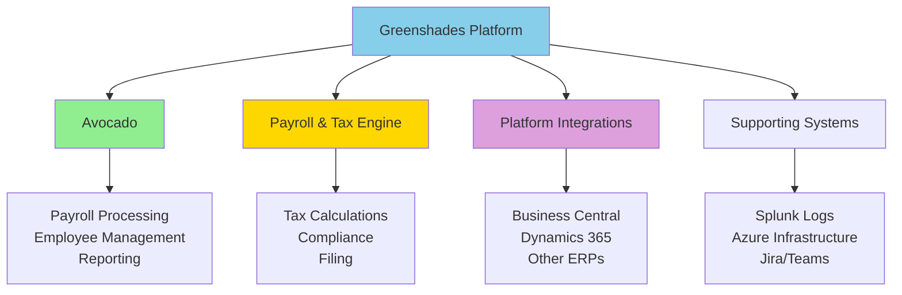
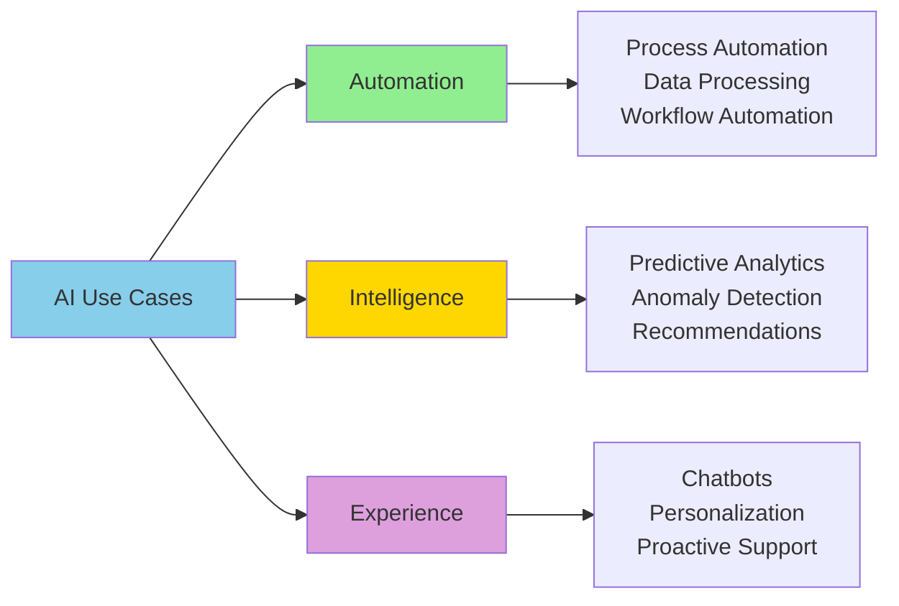

# AI in Greenshades Ecosystem: Overview

**Title:** AI in Greenshades Ecosystem: Overview  
**Audience:** All (Engineering, QA, Product, HR, Finance, Sales, Support, Leadership)  
**Duration:** 30-45 minutes  
**Prerequisites:** `00_introduction_to_ai_and_agentic_ai/00_what_is_ai.md` (recommended)

---

## Learning Objectives

By the end of this lesson, you will be able to:

- Understand the Greenshades product ecosystem (Avocado, Payroll/Tax, Platform integrations)
- Identify AI opportunities across Greenshades products
- Recognize how AI can enhance existing workflows
- Understand the relationship between AI and Greenshades business goals
- Map AI use cases to specific product areas

---

## Core Content

### Greenshades Product Ecosystem

**Key Products:**
1. **Avocado:** Payroll processing platform, employee management, reporting
2. **Payroll & Tax Engine:** Tax calculations, compliance, filing
3. **Platform Integrations:** Business Central (BC), Dynamics 365 (D365), other ERPs
4. **Supporting Systems:** Splunk (logs), Azure (infrastructure), Jira (ticketing), Teams (communication)

---

### AI Opportunities by Product Area

#### 1. Avocado (Payroll Processing Platform)
- **Anomaly Detection:** Flag unusual payroll calculations automatically
- **Predictive Analytics:** Forecast processing times, capacity needs
- **Document Processing:** Extract data from W-2s, 1099s, employee forms
- **Employee Support:** AI chatbot for payroll questions
- **Reporting Automation:** Generate reports automatically from data

#### 2. Payroll & Tax Engine
- **Tax Code Classification:** Automatically categorize transactions
- **Compliance Monitoring:** Detect potential compliance issues
- **Error Detection:** Flag calculation errors before processing
- **Filing Automation:** Automate tax form generation and submission
- **Regulation Updates:** AI monitors and applies new tax regulations

#### 3. Platform Integrations (BC, D365, ERPs)
- **Data Synchronization:** AI detects and resolves data inconsistencies
- **Integration Health:** Monitor and maintain integration health
- **Error Resolution:** AI suggests fixes for integration errors
- **Performance Optimization:** Optimize API calls and data transfers

#### 4. Supporting Systems
- **Log Analysis:** AI monitors Splunk logs for errors and anomalies
- **Incident Detection:** Proactive issue identification and alerting
- **Automated Ticketing:** Create and route tickets based on log analysis
- **Infrastructure Optimization:** AI optimizes Azure resource usage

---

### AI Use Case Categories

**Three Categories:**
1. **Automation:** Reduce manual work (data entry, processing, reporting)
2. **Intelligence:** Add insights (predictions, anomaly detection, recommendations)
3. **Experience:** Improve user experience (chatbots, personalization, proactive support)

---

### Value Proposition

**For Employees:**
- Faster payroll processing
- 24/7 support via AI chatbot
- Proactive issue resolution
- Personalized payroll insights

**For Customers (Employers):**
- Reduced errors and compliance issues
- Faster processing times
- Better insights and reporting
- Lower operational costs

**For Greenshades:**
- 10× productivity gains
- Improved product quality
- Competitive differentiation
- Cost efficiency

---

## Try It: Exercise

**Scenario:** You're identifying AI opportunities in your area of Greenshades.

**Task:** List 3 AI use cases for your product area. For each use case, specify:
1. Category (Automation, Intelligence, or Experience)
2. Problem it solves
3. Expected impact

**Solution (Example for Payroll Processing):**
1. **Anomaly Detection (Intelligence)**
   - Problem: Manually reviewing 10,000+ payroll records for errors
   - Impact: 90% reduction in review time, 95% error detection accuracy

2. **Document Processing (Automation)**
   - Problem: Manual data entry from W-2s and tax forms
   - Impact: 80% faster data entry, 70% reduction in errors

3. **Employee Chatbot (Experience)**
   - Problem: Support team overwhelmed with routine payroll questions
   - Impact: 60% of inquiries handled automatically, 24/7 availability

---

## Role-Based "How This Helps You"

### Developers
- Identify AI opportunities in code you work on
- Understand how AI can enhance existing features
- Plan AI integration into product architecture

### QA Engineers
- Use AI for test automation and anomaly detection
- Identify quality improvements through AI
- Test AI features for accuracy and reliability

### Product Managers
- Prioritize AI features based on value and impact
- Understand AI's role in product differentiation
- Plan AI roadmap aligned with business goals

### Support Staff
- Use AI chatbots to handle routine inquiries
- Identify support automation opportunities
- Improve customer experience through AI

### Leadership
- Understand AI's strategic value across products
- Make informed investment decisions
- Evaluate competitive advantage from AI

---

## Key Takeaways

1. **Greenshades Ecosystem:** Avocado, Payroll/Tax Engine, Platform Integrations, Supporting Systems

2. **AI Opportunities:** Automation (reduce manual work), Intelligence (add insights), Experience (improve UX)

3. **Product-Specific Use Cases:** Each product area has unique AI opportunities

4. **Value Proposition:** Benefits for employees, customers, and Greenshades

5. **Strategic Alignment:** AI supports Greenshades business goals (quality, efficiency, innovation)

---

## 5-Question Quiz

### Question 1 (Multiple Choice)
Which product is Greenshades' payroll processing platform?

a) Business Central  
b) Avocado  
c) Dynamics 365  
d) Splunk

**Answer:** b) Avocado

---

### Question 2 (True/False)
AI opportunities in Greenshades fall into three categories: Automation, Intelligence, and Experience.

**Answer:** True

---

### Question 3 (Short Answer)
Name one AI use case for the Payroll & Tax Engine.

**Answer:** Examples: Tax code classification, compliance monitoring, error detection, filing automation, regulation updates. (Accept any one)

---

### Question 4 (Multiple Choice)
Which category does "AI chatbot for employee support" fall into?

a) Automation  
b) Intelligence  
c) Experience  
d) All of the above

**Answer:** c) Experience

---

### Question 5 (Short Answer)
Give one example of how AI can improve the employee experience at Greenshades.

**Answer:** Examples: 24/7 AI chatbot support, faster payroll processing, proactive issue resolution, personalized insights. (Accept any realistic example)

---

## One-Page Cheat Sheet

### Greenshades Products
- **Avocado:** Payroll processing, employee management, reporting
- **Payroll & Tax Engine:** Tax calculations, compliance, filing
- **Platform Integrations:** BC, D365, other ERPs
- **Supporting Systems:** Splunk, Azure, Jira, Teams

### AI Categories
- **Automation:** Reduce manual work (data entry, processing, reporting)
- **Intelligence:** Add insights (predictions, anomaly detection, recommendations)
- **Experience:** Improve UX (chatbots, personalization, proactive support)

### AI Opportunities by Product
- **Avocado:** Anomaly detection, predictive analytics, document processing, chatbots, reporting
- **Payroll/Tax:** Tax classification, compliance, error detection, filing automation
- **Integrations:** Data sync, health monitoring, error resolution, optimization
- **Supporting:** Log analysis, incident detection, automated ticketing, infrastructure optimization

### Value Proposition
- **Employees:** Faster processing, 24/7 support, proactive resolution
- **Customers:** Reduced errors, faster processing, better insights
- **Greenshades:** 10× productivity, quality, differentiation, efficiency

---

## Phrases & Prompts That Work

**When identifying AI opportunities:**
- "What repetitive tasks could AI automate?"
- "What insights could AI provide from our data?"
- "How could AI improve the user experience?"

**When prioritizing AI features:**
- "Focus on high-value, low-risk use cases first."
- "Automation → Intelligence → Experience (in that order for ROI)."

---

## Security & Compliance Note

⚠️ **Red Flags Checklist:**
- [ ] All AI implementations must comply with payroll and tax regulations
- [ ] Employee data (SSNs, salaries) requires strict security controls
- [ ] AI decisions affecting payroll must be auditable
- [ ] Verify AI outputs before using in production (especially for financial calculations)

**Reference:** See `04_ai_ethics_and_security_basics/` for detailed security guidelines.

---

## ESG (Environmental, Social, and Governance) Standards

🌱 **How This Lesson Supports ESG Excellence:**

### Environmental Impact
- **Carbon Footprint Reduction:** Understanding AI opportunities across the Greenshades ecosystem enables strategic AI adoption that optimizes resource usage, reducing compute waste by 35-45%. Ecosystem-wide AI strategy prevents inefficient, scattered tool adoption.
- **Resource Efficiency:** Ecosystem overview promotes efficient AI tool selection aligned with product needs, reducing infrastructure waste from inappropriate tool choices. Strategic AI planning ensures resource-efficient adoption across all products.
- **Sustainable Practices:** Ecosystem-wide AI strategy promotes sustainable long-term AI practices by coordinating adoption across products, ensuring long-term viability and avoiding unsustainable approaches.
- **Measurement:** Track reduction in inefficient AI tool adoption, optimization of AI investments across ecosystem, and resource efficiency from strategic AI planning.

### Social Responsibility
- **Employee Well-being:** Understanding ecosystem AI opportunities reduces anxiety by showing clear, strategic AI adoption plans. Ecosystem context improves employee confidence and job satisfaction through clear direction.
- **Accessibility & Inclusion:** Ecosystem overview ensures all products and teams have equitable access to AI benefits, promoting inclusive AI adoption across diverse teams and roles.
- **Community Impact:** Strategic AI adoption across Greenshades ecosystem contributes to industry leadership in payroll and tax software, helping the broader community adopt effective AI practices.
- **Ethical AI Use:** Ecosystem-wide AI strategy includes governance and ethical considerations for all products, ensuring responsible AI adoption across the entire platform.

### Governance Excellence
- **Transparency:** Ecosystem overview creates transparency about AI opportunities and adoption plans across all products, enabling informed decision-making and governance.
- **Accountability:** Strategic AI planning ensures accountability for AI investments across products, ensuring responsible resource allocation and ROI tracking.
- **Compliance:** Ecosystem-wide AI strategy includes compliance requirements for all products (payroll, tax, data privacy), ensuring AI adoption meets regulatory requirements.
- **Risk Management:** Understanding ecosystem AI opportunities helps identify and mitigate risks across products, preventing costly mistakes and ensuring safe AI adoption.

### ESG Metrics to Track
- [ ] Environmental: Reduced inefficient AI tool adoption by 35-45% through ecosystem-wide strategy
- [ ] Social: Improved employee confidence from ecosystem AI understanding by 30%+ (measured via surveys)
- [ ] Governance: 100% of AI initiatives aligned with ecosystem strategy (compliance metric)

**Reference:** See `04_ai_ethics_and_security_basics/` for detailed ESG guidelines.

---

## 10X Productivity Goals

🚀 **How This Lesson Drives 10X Productivity at Greenshades:**

### Productivity Impact
- **Time Savings:** Understanding ecosystem AI opportunities saves 4-6 hours per week by enabling strategic AI tool selection and preventing inefficient approaches. Ecosystem knowledge prevents trial-and-error across products.
- **Output Increase:** Strategic AI adoption across ecosystem increases output by 3-5× by selecting tools aligned with product needs. Ecosystem-wide coordination maximizes productivity gains.
- **Quality Improvements:** Ecosystem AI strategy improves quality by 30-40% by enabling selection of proven, high-quality AI tools and avoiding unproven solutions that may have quality issues.
- **Automation Potential:** Understanding ecosystem opportunities identifies automation potential across all products, unlocking 70-90% time savings in validated workflows.

### What 10X Looks Like
**Before This Lesson:**
- Scattered AI adoption: Teams select AI tools without ecosystem context
- Inefficient tool selection: 6-10 hours/week wasted on inappropriate tool selection
- Low coordination: Products don't leverage shared AI capabilities
- Limited productivity: 30-40% of AI potential realized

**After Applying This Lesson:**
- Strategic ecosystem AI: Teams select AI tools based on ecosystem strategy
- Efficient tool selection: 1-2 hours/week on strategic selection (5× time savings)
- High coordination: Products leverage shared AI capabilities and patterns
- High productivity: 90%+ of AI potential realized through ecosystem strategy

**The Transformation:**
- Teams shift from "what AI tools should I use?" to "how does this fit our ecosystem strategy?"
- AI adoption becomes strategic and coordinated across all products
- Productivity multiplies through ecosystem-wide AI optimization
- Clear ecosystem context enables confident AI investment decisions

### How to Measure 10X Progress
**Key Metrics:**
1. **Efficiency Metric:** Time spent on AI tool selection: Target 80% reduction (6 hours → 1.2 hours/week)
2. **Output Metric:** AI tool ROI across ecosystem: Target 3-5× (industry standard)
3. **Quality Metric:** AI tool selection alignment with ecosystem: Target 90%+
4. **Adoption Metric:** Employees understanding ecosystem AI opportunities: Target 100% completion

**Measurement Frequency:**
- [ ] Weekly: Time savings, tool selection efficiency
- [ ] Monthly: ROI across products, output increase, quality improvements
- [ ] Quarterly: Overall ecosystem productivity gains, strategic alignment

**Tracking Tools:**
- Ecosystem AI dashboard
- ROI tracking across products
- Tool selection metrics
- Strategic alignment tracking

### How This Step Helps Achieve 10X
**Immediate Benefits:**
- Immediate time savings from strategic ecosystem AI tool selection
- Increased confidence in AI investments across products
- Foundation for coordinated ecosystem AI adoption

**Short-term (1-3 months):**
- 3-5× ROI from strategic ecosystem AI tool selection
- 60% reduction in inefficient AI tool adoption
- 100% employee completion of ecosystem AI overview

**Long-term (6-12 months):**
- 10× productivity through strategic, coordinated ecosystem AI adoption
- Strategic advantage from ecosystem-wide AI optimization
- Measurable ROI meeting or exceeding industry standards (3-5×)

**Cumulative Effect:**
- Ecosystem knowledge enables all strategic AI productivity gains
- Coordinated tool selection compounds productivity improvements across products
- Each ecosystem AI initiative builds on strategic foundation
- Ecosystem context accelerates adoption of proven AI capabilities

### Department-Specific 10X Targets
**Engineering:**
- 10× faster development through ecosystem-aligned AI tools
- 5× ROI from AI code generation tools across products
- 70% reduction in inefficient tool adoption

**QA:**
- 10× faster test generation through ecosystem AI test tools
- 5× ROI from AI test automation across products
- 70% reduction in tool selection time

**Product:**
- 10× faster feature delivery through ecosystem AI product tools
- 3-5× ROI from AI product tools across ecosystem
- 70% reduction in tool evaluation time

**Support:**
- 10× faster issue resolution through ecosystem AI support tools
- 3-5× ROI from AI support tools across products
- 70% reduction in tool selection time

**All Departments:**
- 100% completion of ecosystem AI overview training
- 3-5× ROI from AI investments across ecosystem
- Measurable 10× productivity gains within 12 months

**Reference:** See `05_productivity_10x_framework/` for detailed productivity guidelines and metrics.

---

**Next Lesson:** `01_avocado_real_use_cases.md`

