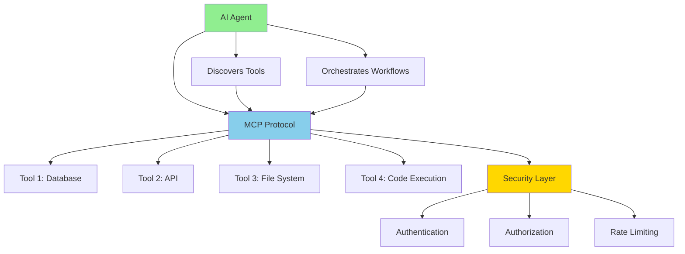

# What is MCP?

**Title:** What is MCP (Model Context Protocol)?  
**Audience:** Engineering, QA, Product, Leadership  
**Duration:** 45-60 minutes  
**Prerequisites:** `00_introduction_to_ai_and_agentic_ai/02_ai_vs_agentic_ai.md` (recommended)

---

## Learning Objectives

By the end of this lesson, you will be able to:

- Define Model Context Protocol (MCP) and understand its purpose
- Explain how MCP enables AI agents to use tools and services
- Understand MCP architecture and components
- Recognize MCP use cases in Greenshades
- Evaluate when to use MCP vs. other integration approaches
- Understand MCP security and governance considerations

---

## Core Content

### What is MCP?

**Model Context Protocol (MCP)** is a standardized protocol that enables AI agents to discover, connect to, and use tools and services (databases, APIs, file systems, code execution) in a consistent and secure way.

**Key Concepts:**
- **Standardized Interface:** Common way for agents to interact with tools
- **Tool Discovery:** Agents can discover available tools automatically
- **Security & Access Control:** Built-in authentication and authorization
- **Orchestration:** Agents can use multiple tools in workflows

**Analogy:** MCP is like a universal remote control that works with all your devices (databases, APIs, file systems) through a standard interface.

---

### Why MCP Matters

**Problem Without MCP:**
- Each AI agent needs custom code to connect to each tool
- No standard way to discover or use tools
- Security and access control implemented inconsistently
- Difficult to orchestrate multiple tools in workflows

**Solution With MCP:**
- Standard protocol for all tool interactions
- Automatic tool discovery
- Consistent security and access control
- Easy orchestration of multiple tools

---

### MCP Architecture



**Components:**
1. **AI Agent:** Uses MCP to interact with tools
2. **MCP Protocol:** Standardized communication layer
3. **Tools:** Databases, APIs, file systems, code execution
4. **Security Layer:** Authentication, authorization, rate limiting

---

### How MCP Works

**Step 1: Tool Discovery**
```
Agent: "What tools are available?"
MCP: "Available tools: Database, Jira API, Teams API, File System"
```

**Step 2: Tool Connection**
```
Agent: "Connect to payroll database"
MCP: "Connected. Available operations: query, insert, update"
```

**Step 3: Tool Use**
```
Agent: "Query employees with hours > 40"
MCP: "Executed. Results: [employee data]"
```

**Step 4: Orchestration**
```
Agent: "1. Query database for anomalies
        2. Create Jira ticket
        3. Send Teams notification"
MCP: "All steps completed successfully"
```

---

### MCP Use Cases in Greenshades

#### Use Case 1: Payroll Monitoring Agent
**Tools Used:**
- Database (MCP): Query payroll records
- Jira API (MCP): Create tickets for anomalies
- Teams API (MCP): Notify team
- File System (MCP): Generate reports

**Workflow:**
1. Agent uses MCP to connect to payroll database
2. Queries recent payroll runs
3. Detects anomalies
4. Uses MCP to create Jira ticket
5. Uses MCP to send Teams notification
6. Uses MCP to save report to file system

---

#### Use Case 2: Integration Health Agent
**Tools Used:**
- Splunk API (MCP): Query logs
- Azure Monitor (MCP): Check system metrics
- PagerDuty API (MCP): Create incidents
- Teams API (MCP): Alert team

**Workflow:**
1. Agent uses MCP to query Splunk logs
2. Checks Azure Monitor metrics
3. Detects integration issues
4. Uses MCP to create PagerDuty incident
5. Uses MCP to send Teams alert

---

#### Use Case 3: Test Automation Agent
**Tools Used:**
- Code Execution (MCP): Run tests
- File System (MCP): Read test files
- Jira API (MCP): Update test results
- Teams API (MCP): Notify on failures

**Workflow:**
1. Agent uses MCP to read test specifications
2. Uses MCP to execute tests
3. Analyzes results
4. Uses MCP to update Jira with results
5. Uses MCP to notify team on failures

---

### MCP vs. Other Integration Approaches

| Approach | Pros | Cons |
|----------|------|------|
| **MCP** | Standardized, secure, tool discovery, orchestration | Requires MCP infrastructure |
| **Custom APIs** | Full control, optimized | Custom code for each tool, no standardization |
| **Direct Integration** | Simple, fast | No security layer, difficult to orchestrate |

**When to Use MCP:**
- ✅ Building agentic AI systems
- ✅ Need to orchestrate multiple tools
- ✅ Want standardized, secure tool access
- ✅ Need tool discovery and dynamic connections

**When Not to Use MCP:**
- ⚠️ Simple, one-off integrations
- ⚠️ Performance-critical direct connections
- ⚠️ Tools that don't support MCP

---

### MCP Security and Governance

**Security Features:**
- **Authentication:** Agents authenticate before accessing tools
- **Authorization:** Role-based access control (RBAC)
- **Rate Limiting:** Prevent abuse and overload
- **Audit Trail:** Log all agent actions for compliance

**Governance:**
- **Approval Workflows:** Require human approval for sensitive actions
- **Access Policies:** Define what agents can and cannot do
- **Monitoring:** Track agent actions and tool usage
- **Compliance:** Ensure MCP usage meets regulatory requirements

**Greenshades Considerations:**
- Payroll data requires strict access controls
- All agent actions must be auditable
- Sensitive operations (data modifications) require approval
- Compliance with data privacy regulations (GDPR, CCPA)

---

## Try It: Exercise

**Scenario:** You're designing an AI agent that monitors payroll processing and creates tickets for issues.

**Task:** List the MCP tools the agent needs and describe the workflow.

**Solution:**
**MCP Tools Needed:**
1. Database (MCP): Query payroll records
2. Jira API (MCP): Create and update tickets
3. Teams API (MCP): Send notifications
4. File System (MCP): Generate reports

**Workflow:**
1. Agent uses MCP to connect to payroll database
2. Queries recent payroll runs for anomalies
3. If anomalies found:
   - Uses MCP to create Jira ticket with details
   - Uses MCP to send Teams notification to payroll team
   - Uses MCP to save analysis report to file system
4. Logs all actions for audit trail

---

## Role-Based "How This Helps You"

### Developers
- **Build Agentic Systems:** Use MCP to connect agents to tools
- **Standardize Integration:** MCP provides consistent tool access
- **Security:** MCP handles authentication and authorization
- **Orchestration:** Easily combine multiple tools in workflows

### QA Engineers
- **Test Agents:** Verify agents use MCP correctly
- **Security Testing:** Test MCP access controls and permissions
- **Integration Testing:** Test agent workflows with multiple tools

### Product Managers
- **Plan Features:** Understand MCP capabilities for product planning
- **Evaluate Tools:** Assess which tools need MCP integration
- **Roadmap:** Plan MCP adoption and agentic features

### Leadership
- **Strategic Planning:** Understand MCP's role in agentic AI strategy
- **Investment:** Evaluate MCP infrastructure requirements
- **Governance:** Establish MCP security and compliance policies

---

## Key Takeaways

1. **MCP Definition:** Standardized protocol for AI agents to use tools and services

2. **Key Benefits:** Tool discovery, standardized access, security, orchestration

3. **Architecture:** AI Agent → MCP Protocol → Tools (with security layer)

4. **Use Cases:** Payroll monitoring, integration health, test automation

5. **Security:** Authentication, authorization, rate limiting, audit trails

6. **Greenshades:** MCP enables agentic AI systems across Avocado, integrations, and supporting systems

---

## 5-Question Quiz

### Question 1 (Multiple Choice)
What does MCP stand for?

a) Model Communication Protocol  
b) Model Context Protocol  
c) Machine Context Protocol  
d) Multi-Context Protocol

**Answer:** b) Model Context Protocol

---

### Question 2 (True/False)
MCP enables AI agents to discover and use tools through a standardized interface.

**Answer:** True

---

### Question 3 (Short Answer)
Name one MCP tool that could be used in a payroll monitoring agent.

**Answer:** Examples: Database, Jira API, Teams API, File System, Splunk API. (Accept any realistic tool)

---

### Question 4 (Multiple Choice)
Which is a key benefit of MCP?

a) Faster tool connections  
b) Standardized, secure tool access with orchestration  
c) Free tool access  
d) No security required

**Answer:** b) Standardized, secure tool access with orchestration

---

### Question 5 (Short Answer)
Give one example of how MCP security features protect sensitive data.

**Answer:** Examples: Authentication (agents must authenticate), authorization (RBAC controls access), audit trails (log all actions), approval workflows (require human approval for sensitive actions). (Accept any one)

---

## One-Page Cheat Sheet

### MCP Definition
- **Model Context Protocol:** Standardized protocol for AI agents to use tools
- **Purpose:** Tool discovery, secure access, orchestration

### MCP Architecture
- AI Agent → MCP Protocol → Tools (Database, APIs, File System, Code Execution)
- Security Layer: Authentication, Authorization, Rate Limiting

### How MCP Works
1. Tool Discovery: Agent discovers available tools
2. Tool Connection: Agent connects to tools via MCP
3. Tool Use: Agent uses tools through MCP
4. Orchestration: Agent combines multiple tools in workflows

### MCP Use Cases
- Payroll monitoring (Database, Jira, Teams, File System)
- Integration health (Splunk, Azure, PagerDuty, Teams)
- Test automation (Code Execution, File System, Jira, Teams)

### MCP vs. Other Approaches
- **MCP:** Standardized, secure, orchestration
- **Custom APIs:** Full control, but custom code needed
- **Direct Integration:** Simple, but no security layer

### Security Features
- Authentication, Authorization, Rate Limiting, Audit Trails
- Approval Workflows, Access Policies, Monitoring, Compliance

### When to Use MCP
- Building agentic AI systems
- Need to orchestrate multiple tools
- Want standardized, secure access
- Need tool discovery

---

## Phrases & Prompts That Work

**When explaining MCP:**
- "MCP is a standardized protocol that lets AI agents use tools like databases and APIs."
- "MCP enables tool discovery, secure access, and orchestration of multiple tools."

**When discussing use cases:**
- "Agents use MCP to connect to databases, APIs, and file systems."
- "MCP makes it easy to orchestrate complex workflows across multiple tools."

**When addressing security:**
- "MCP includes built-in security: authentication, authorization, and audit trails."
- "All agent actions through MCP are logged for compliance."

---

## Security & Compliance Note

⚠️ **Red Flags Checklist:**
- [ ] MCP requires authentication and authorization—configure access controls properly
- [ ] All agent actions through MCP must be auditable (who did what, when)
- [ ] Sensitive operations (data modifications) should require human approval
- [ ] Monitor MCP usage for security and compliance
- [ ] Ensure MCP complies with data privacy regulations (GDPR, CCPA)

**Reference:** See `04_ai_ethics_and_security_basics/` for detailed security guidelines.

---

**Next Lesson:** `01_why_mcp_for_ai_agents.md`

