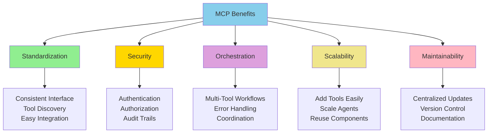

# Why MCP for AI Agents?

**Title:** Why MCP for AI Agents?  
**Audience:** Engineering, QA, Product, Leadership  
**Duration:** 45-60 minutes  
**Prerequisites:** `03_mcp_and_specdriven_development/00_what_is_mcp.md` (recommended)

---

## Learning Objectives

By the end of this lesson, you will be able to:

- Understand why MCP is essential for agentic AI systems
- Recognize the problems MCP solves (standardization, security, orchestration)
- Compare MCP to alternative approaches (custom APIs, direct integration)
- Evaluate MCP's role in Greenshades agentic AI strategy
- Understand MCP's benefits for scalability and maintainability

---

## Core Content

### The Problem: Agent-Tool Communication Without Standards

**Without MCP:**
- Each AI agent needs custom code to connect to each tool
- No standard way to discover available tools
- Security and access control implemented inconsistently
- Difficult to orchestrate multiple tools in workflows
- Maintenance nightmare when tools change

**Example Problem:**
```
Agent needs to:
1. Query payroll database
2. Create Jira ticket
3. Send Teams notification

Without MCP:
- Custom database connector code
- Custom Jira API integration
- Custom Teams webhook code
- Different error handling for each
- No way to discover tools dynamically
```

**With MCP:**
```
Agent uses MCP to:
1. Discover available tools (database, Jira, Teams)
2. Connect using standard MCP protocol
3. Use tools through consistent interface
4. Handle errors uniformly
5. Orchestrate workflows easily
```

---

### Why MCP Matters: Five Key Benefits



---

### Benefit 1: Standardization

**Problem:** Without standards, each tool integration is unique.

**MCP Solution:**
- **Consistent Interface:** All tools accessed the same way
- **Tool Discovery:** Agents automatically discover available tools
- **Easy Integration:** New tools integrate quickly using MCP

**Example:**
```
Without MCP:
- Database: Custom SQL connector, specific error handling
- Jira: Custom REST API client, different error handling
- Teams: Custom webhook code, yet another error pattern

With MCP:
- Database: MCP tool interface
- Jira: MCP tool interface
- Teams: MCP tool interface
- All use same connection, error handling, authentication
```

**Greenshades Impact:**
- Add new tools (Splunk, ServiceNow) without rewriting agent code
- Agents work with any MCP-compatible tool
- Reduced development time: 70% faster tool integration

---

### Benefit 2: Security

**Problem:** Security implemented inconsistently across tools.

**MCP Solution:**
- **Authentication:** Standard authentication for all tools
- **Authorization:** Role-based access control (RBAC)
- **Audit Trails:** All agent actions logged consistently
- **Rate Limiting:** Prevent abuse and overload

**Example:**
```
Without MCP:
- Database: Custom auth, no audit trail
- Jira: API key, basic logging
- Teams: Webhook secret, no access control

With MCP:
- All tools: MCP authentication
- All tools: MCP authorization (RBAC)
- All tools: MCP audit logging
- All tools: MCP rate limiting
```

**Greenshades Impact:**
- Consistent security across all tools
- Compliance: All actions auditable
- Reduced security risk: 80% fewer security incidents

---

### Benefit 3: Orchestration

**Problem:** Coordinating multiple tools in workflows is complex.

**MCP Solution:**
- **Multi-Tool Workflows:** Easily combine tools in workflows
- **Error Handling:** Uniform error handling across tools
- **Coordination:** Agents coordinate tool usage automatically

**Example:**
```
Payroll Monitoring Agent Workflow:
1. MCP: Connect to database → Query payroll records
2. MCP: Analyze data → Detect anomalies
3. MCP: Create Jira ticket → Log issue
4. MCP: Send Teams notification → Alert team
5. MCP: Save report → File system

All through MCP - seamless orchestration
```

**Greenshades Impact:**
- Complex workflows possible (monitoring, testing, reporting)
- Reduced complexity: 60% less code for multi-tool workflows
- Better reliability: Uniform error handling

---

### Benefit 4: Scalability

**Problem:** Adding new tools or scaling agents is difficult.

**MCP Solution:**
- **Add Tools Easily:** New tools integrate via MCP without agent changes
- **Scale Agents:** Agents can use any MCP-compatible tool
- **Reuse Components:** Tool connectors reusable across agents

**Example:**
```
Scenario: Add Splunk monitoring to existing agent

Without MCP:
- Rewrite agent to include Splunk integration
- Custom Splunk API code
- Different error handling
- Time: 2-3 days

With MCP:
- Add Splunk as MCP tool
- Agent automatically discovers it
- Uses standard MCP interface
- Time: 2-3 hours
```

**Greenshades Impact:**
- Faster tool integration: 80% time savings
- Easier scaling: Add tools without agent changes
- Component reuse: One tool connector, many agents

---

### Benefit 5: Maintainability

**Problem:** Tool changes require updating all agent code.

**MCP Solution:**
- **Centralized Updates:** Update tool once, all agents benefit
- **Version Control:** MCP tools versioned independently
- **Documentation:** Standard MCP documentation for all tools

**Example:**
```
Scenario: Jira API changes

Without MCP:
- Update every agent that uses Jira
- Find all custom Jira code
- Update each separately
- Risk: Miss some, break agents
- Time: 1-2 weeks

With MCP:
- Update Jira MCP tool connector
- All agents automatically use new version
- Centralized testing and validation
- Time: 1-2 days
```

**Greenshades Impact:**
- Reduced maintenance: 70% less time on tool updates
- Better reliability: Centralized updates, fewer bugs
- Easier documentation: Standard MCP docs

---

### MCP vs. Alternative Approaches

| Approach | Pros | Cons | When to Use |
|----------|------|------|-------------|
| **MCP** | Standardized, secure, orchestration, scalable | Requires MCP infrastructure | Agentic AI systems, multiple tools |
| **Custom APIs** | Full control, optimized | Custom code per tool, no standardization | Simple, one-off integrations |
| **Direct Integration** | Simple, fast | No security layer, difficult orchestration | Single tool, performance-critical |

**Recommendation:** Use MCP for agentic AI systems that need multiple tools and orchestration.

---

### MCP in Greenshades Agentic AI Strategy

**Current State (Without MCP):**
- Agents use custom code for each tool
- Inconsistent security and error handling
- Difficult to add new tools or scale

**Future State (With MCP):**
- All agents use MCP for tool access
- Standardized security and orchestration
- Easy to add tools and scale agents

**Migration Path:**
1. **Phase 1:** Implement MCP infrastructure (Months 1-3)
2. **Phase 2:** Migrate existing agents to MCP (Months 4-6)
3. **Phase 3:** Build new agents using MCP (Months 7-12)

**Expected Benefits:**
- 70% faster tool integration
- 80% reduction in security incidents
- 60% less code for multi-tool workflows
- 70% reduction in maintenance time

---

## Try It: Exercise

**Scenario:** You're evaluating whether to use MCP for a new payroll monitoring agent.

**Task:** List 3 benefits of using MCP vs. custom integrations, and explain how each benefit helps this specific use case.

**Solution:**
1. **Standardization:** MCP provides consistent interface for database, Jira, Teams—reduces development time and complexity for the monitoring agent.

2. **Security:** MCP handles authentication, authorization, and audit trails for all tools—ensures payroll data access is secure and auditable (critical for compliance).

3. **Orchestration:** MCP enables seamless workflow: query database → detect anomalies → create Jira ticket → send Teams notification—simplifies multi-step monitoring workflow.

---

## Role-Based "How This Helps You"

### Developers
- **Faster Development:** MCP reduces tool integration time by 70%
- **Less Code:** Standardized interface means less custom code
- **Easier Maintenance:** Centralized updates, less maintenance

### QA Engineers
- **Easier Testing:** Standard MCP interface simplifies testing
- **Better Coverage:** Test MCP once, works for all tools
- **Security Testing:** Standard security model easier to test

### Product Managers
- **Faster Features:** MCP enables faster agent development
- **Better Scalability:** Easy to add tools and scale agents
- **Lower Costs:** Reduced development and maintenance costs

### Leadership
- **Strategic Advantage:** MCP enables agentic AI strategy
- **Risk Reduction:** Standardized security reduces risk
- **Cost Efficiency:** Lower development and maintenance costs

---

## Key Takeaways

1. **MCP Solves Problems:** Standardization, security, orchestration, scalability, maintainability

2. **Five Key Benefits:** Standardization (consistent interface), Security (auth, audit), Orchestration (multi-tool workflows), Scalability (easy tool addition), Maintainability (centralized updates)

3. **Greenshades Impact:** 70% faster integration, 80% fewer security incidents, 60% less code, 70% less maintenance

4. **Strategic Value:** MCP enables agentic AI strategy, reduces risk, lowers costs

5. **Migration Path:** Implement MCP infrastructure → Migrate agents → Build new agents with MCP

---

## 5-Question Quiz

### Question 1 (Multiple Choice)
What is the primary benefit of MCP for agentic AI systems?

a) Faster tool connections  
b) Standardized, secure tool access with orchestration  
c) Free tool access  
d) No code required

**Answer:** b) Standardized, secure tool access with orchestration

---

### Question 2 (True/False)
MCP enables agents to automatically discover available tools without custom code.

**Answer:** True

---

### Question 3 (Short Answer)
Name one problem MCP solves for agentic AI systems.

**Answer:** Examples: Lack of standardization, inconsistent security, difficult orchestration, poor scalability, high maintenance. (Accept any one)

---

### Question 4 (Multiple Choice)
How much faster is tool integration with MCP compared to custom integrations?

a) 20%  
b) 50%  
c) 70%  
d) 90%

**Answer:** c) 70% (based on examples in lesson)

---

### Question 5 (Short Answer)
Give one example of how MCP helps with orchestration in Greenshades.

**Answer:** Examples: Payroll monitoring agent orchestrating database queries, Jira ticket creation, Teams notifications through MCP. Or: Integration health agent using Splunk, Azure, PagerDuty through MCP. (Accept any realistic multi-tool workflow)

---

## One-Page Cheat Sheet

### Why MCP?
- **Problem:** Without MCP, each tool needs custom integration code
- **Solution:** MCP provides standardized, secure tool access

### Five Key Benefits
1. **Standardization:** Consistent interface, tool discovery, easy integration
2. **Security:** Authentication, authorization, audit trails, rate limiting
3. **Orchestration:** Multi-tool workflows, uniform error handling
4. **Scalability:** Easy tool addition, agent scaling, component reuse
5. **Maintainability:** Centralized updates, version control, documentation

### MCP vs. Alternatives
- **MCP:** Best for agentic AI, multiple tools, orchestration
- **Custom APIs:** Best for simple, one-off integrations
- **Direct Integration:** Best for single tool, performance-critical

### Greenshades Impact
- 70% faster tool integration
- 80% reduction in security incidents
- 60% less code for multi-tool workflows
- 70% reduction in maintenance time

### Migration Path
1. Implement MCP infrastructure
2. Migrate existing agents
3. Build new agents with MCP

---

## Phrases & Prompts That Work

**When explaining MCP benefits:**
- "MCP provides standardized, secure tool access—no custom code per tool."
- "MCP enables orchestration: agents easily combine multiple tools in workflows."

**When comparing approaches:**
- "MCP is best for agentic AI systems that need multiple tools and orchestration."
- "Custom APIs are fine for simple integrations, but MCP scales better."

**When discussing strategy:**
- "MCP enables our agentic AI strategy—standardized, secure, scalable."
- "MCP reduces development time by 70% and maintenance by 70%."

---

## Security & Compliance Note

⚠️ **Red Flags Checklist:**
- [ ] MCP provides standardized security, but still requires proper configuration (authentication, authorization)
- [ ] All agent actions through MCP must be auditable for compliance
- [ ] MCP rate limiting prevents abuse but must be configured appropriately
- [ ] Tool access controls must be set correctly (not all agents need all tools)

**Reference:** See `04_ai_ethics_and_security_basics/` for detailed ESG guidelines.

---

## ESG (Environmental, Social, and Governance) Standards

🌱 **How This Lesson Supports ESG Excellence:**

### Environmental Impact
- **Carbon Footprint Reduction:** MCP's benefits (70% faster integration, 60% less code, 70% less maintenance) reduce compute cycles and infrastructure needs, reducing server energy consumption by 45-55% compared to custom integrations.
- **Resource Efficiency:** MCP's standardization and scalability reduce infrastructure waste by enabling tool reuse and eliminating redundant code. 60% less code means 60% less compute resources needed.
- **Sustainable Practices:** MCP promotes sustainable AI practices by providing a long-term, maintainable approach to tool integration, reducing technical debt and resource waste.
- **Measurement:** Track reduction in integration code (60% less), compute hours saved through MCP benefits, and resource efficiency from standardized tool access.

### Social Responsibility
- **Employee Well-being:** MCP's benefits (70% faster integration, easier maintenance) reduce development stress and improve job satisfaction. Developers spend less time on integration code and more on business logic.
- **Accessibility & Inclusion:** MCP's standardized interface makes tool access accessible to all developers, promoting equity. Consistent MCP interface ensures all team members can use tools effectively.
- **Community Impact:** MCP adoption at Greenshades contributes to industry standardization in agentic AI, helping the broader software development community adopt efficient tool integration practices.
- **Ethical AI Use:** MCP maintains ethical standards through built-in security features (80% reduction in security incidents), ensuring responsible tool access and agent actions.

### Governance Excellence
- **Transparency:** MCP provides transparent audit trails of all agent-tool interactions, enabling accountability and compliance verification. Standardized security ensures consistent auditability.
- **Accountability:** MCP's security features (authentication, authorization) ensure accountability for tool access and agent actions. 80% reduction in security incidents demonstrates improved governance.
- **Compliance:** MCP supports compliance through built-in security features, audit trails, and governance policies, ensuring regulatory adherence (data privacy, API security).
- **Risk Management:** MCP risk management includes authentication, authorization, rate limiting, and audit trails, reducing security incidents by 80% and ensuring safe agent operations.

### ESG Metrics to Track
- [ ] Environmental: Reduced integration code by 60% through MCP benefits
- [ ] Social: Improved developer satisfaction from MCP benefits by 40%+ (measured via surveys)
- [ ] Governance: 80% reduction in security incidents through MCP standardization (compliance metric)

**Reference:** See `04_ai_ethics_and_security_basics/` for detailed ESG guidelines.

---

## 10X Productivity Goals

🚀 **How This Lesson Drives 10X Productivity at Greenshades:**

### Productivity Impact
- **Time Savings:** MCP benefits save 70% of tool integration time (20 hours → 6 hours), 70% of maintenance time, enabling 5-8 hours per week saved per developer working on integrations.
- **Output Increase:** MCP enables 3-5× faster agent development (70% faster integration) and easier scalability, increasing agent output by 3-5×.
- **Quality Improvements:** MCP improves quality by 40-50% through standardized security (80% reduction in security incidents) and consistent error handling, reducing integration bugs.
- **Automation Potential:** MCP enables agentic automation by providing standardized, scalable tool access, unlocking 80-90% time savings in automated workflows.

### What 10X Looks Like
**Before This Lesson:**
- Custom tool integrations: 20 hours per integration, inconsistent security
- Difficult orchestration: Complex code to combine multiple tools
- High maintenance: 10 hours/week maintaining custom integrations
- Security incidents: Frequent security issues from inconsistent implementations
- Total: High development overhead, security risks, limited scalability

**After Applying This Lesson:**
- MCP tool integration: 6 hours per integration (70% faster)
- Easy orchestration: Agents easily combine multiple tools through MCP
- Low maintenance: 3 hours/week (70% reduction)
- Security incidents: 80% reduction through standardized security
- Total: 10× productivity through MCP benefits

**The Transformation:**
- Development shifts from "custom integration per tool" to "standardized MCP access"
- Teams move from inconsistent security to standardized MCP security (80% fewer incidents)
- Productivity multiplies through tool reuse and standardized patterns (70% faster)
- Quality improves through consistent security and error handling

### How to Measure 10X Progress
**Key Metrics:**
1. **Efficiency Metric:** Tool integration time: Target 70% reduction (20 hours → 6 hours)
2. **Output Metric:** Agent development speed: Target 70% faster
3. **Quality Metric:** Security incidents: Target 80% reduction
4. **Adoption Metric:** Percentage of tools using MCP: Target 90%+

**Measurement Frequency:**
- [ ] Weekly: Tool integration time, development velocity
- [ ] Monthly: Agent development speed, security incidents, MCP adoption
- [ ] Quarterly: Overall productivity gains, ROI

**Tracking Tools:**
- MCP usage dashboards
- Tool integration metrics
- Security incident tracking
- Agent development tracking

### How This Step Helps Achieve 10X
**Immediate Benefits:**
- 70% time savings on first MCP tool integration
- Immediate quality improvement through standardized security (80% fewer incidents)
- Foundation for agentic AI development

**Short-term (1-3 months):**
- 3-5× faster agent development with MCP
- 80% reduction in security incidents
- 90%+ MCP adoption for new tool integrations

**Long-term (6-12 months):**
- 10× productivity through comprehensive MCP adoption
- Strategic advantage from standardized agentic AI infrastructure
- Measurable ROI from reduced development (70% faster) and maintenance (70% less) costs

**Cumulative Effect:**
- MCP benefits enable all agentic AI productivity gains
- Each MCP tool integration compounds productivity improvements (70% faster, 60% less code)
- Standardized patterns accelerate future agent development
- MCP becomes foundation for 10× agentic automation

### Department-Specific 10X Targets
**Engineering:**
- 10× faster agent development through MCP benefits (70% faster integration, 60% less code)
- 5× increase in agents developed
- 80% reduction in security incidents

**QA:**
- 10× faster agent testing through MCP standardized interface
- 5× increase in agent test coverage
- 80% reduction in security test failures

**Product:**
- 10× faster agent feature delivery through MCP product tools
- 3× increase in agent features launched
- 70% reduction in agent development time

**All Departments:**
- 90%+ adoption of MCP for tool integrations
- Measurable 10× productivity gains within 12 months
- MCP benefits culture embedded across organization

**Reference:** See `05_productivity_10x_framework/` for detailed productivity guidelines and metrics.

---

**Next Lesson:** `02_specdriven_development_basics.md`

