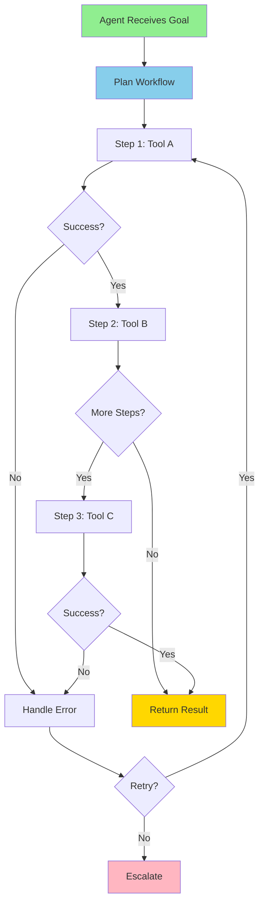
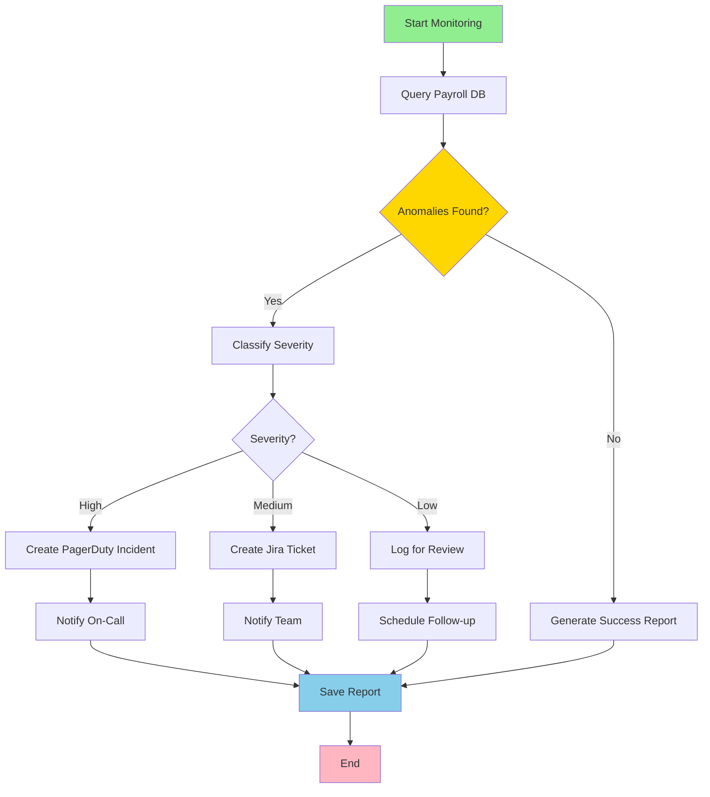

# AI Agents Orchestration Flow

**Title:** AI Agents Orchestration Flow  
**Audience:** Engineering, QA, Product  
**Duration:** 45-60 minutes  
**Prerequisites:** `03_mcp_and_specdriven_development/00_what_is_mcp.md`, `03_mcp_and_specdriven_development/01_why_mcp_for_ai_agents.md` (recommended)

---

## Learning Objectives

By the end of this lesson, you will be able to:

- Understand how AI agents orchestrate multi-step workflows
- Recognize orchestration patterns (sequential, parallel, conditional)
- Design agent workflows using MCP tools
- Handle errors and retries in orchestrated workflows
- Apply orchestration patterns to Greenshades use cases

---

## Core Content

### What is Agent Orchestration?

**Agent Orchestration** is the coordination of multiple tools and steps in a workflow to accomplish a goal. Agents break down complex tasks into steps, execute them in order (or parallel), and adapt based on results.

**Key Concepts:**
- **Workflow:** Sequence of steps to accomplish a goal
- **Tools:** MCP tools (databases, APIs, file systems) used in workflow
- **Coordination:** Managing step execution, dependencies, errors
- **Adaptation:** Adjusting workflow based on intermediate results

---

### Orchestration Flow Diagram



---

### Orchestration Patterns

#### Pattern 1: Sequential Orchestration

**Definition:** Steps execute one after another, each step depends on previous step's result.

**Use Case:** Payroll processing workflow

**Example:**
```
1. Query payroll database (MCP: Database)
   → Get payroll records
2. Analyze records for anomalies (MCP: Analysis)
   → Get anomaly list
3. Create Jira ticket for anomalies (MCP: Jira)
   → Get ticket ID
4. Send Teams notification (MCP: Teams)
   → Confirm notification sent
5. Save report to file system (MCP: File System)
   → Confirm file saved
```

**Flow:**
```
Step 1 → Step 2 → Step 3 → Step 4 → Step 5
(Each step waits for previous to complete)
```

---

#### Pattern 2: Parallel Orchestration

**Definition:** Multiple steps execute simultaneously when they don't depend on each other.

**Use Case:** Gathering data from multiple sources

**Example:**
```
Parallel Steps:
- Query payroll database (MCP: Database)
- Query Splunk logs (MCP: Splunk)
- Query Azure metrics (MCP: Azure)

All execute simultaneously, then:
Combine results → Analyze → Report
```

**Flow:**
```
     Step 1 (Database)
         ↓
Step 2 (Splunk) → Combine → Analyze → Report
         ↓
     Step 3 (Azure)
(All execute in parallel, then combine)
```

---

#### Pattern 3: Conditional Orchestration

**Definition:** Workflow branches based on conditions or step results.

**Use Case:** Error handling, escalation

**Example:**
```
1. Query database → Get results
2. If anomalies found:
   a. If severity = "high":
      - Create PagerDuty incident (MCP: PagerDuty)
      - Escalate to on-call engineer
   b. If severity = "medium":
      - Create Jira ticket (MCP: Jira)
      - Notify team (MCP: Teams)
   c. If severity = "low":
      - Log for review
      - Schedule follow-up
3. If no anomalies:
   - Generate success report
   - Save to file system
```

**Flow:**
```
Step 1 → Condition Check
         ├─ Anomalies? → Severity Check → Actions
         └─ No Anomalies → Success Report
```

---

#### Pattern 4: Retry and Error Handling

**Definition:** Retry failed steps with exponential backoff, handle errors gracefully.

**Use Case:** Network calls, API timeouts

**Example:**
```
1. Query database (MCP: Database)
   If fails:
   - Retry 1: Wait 1 second
   - Retry 2: Wait 2 seconds
   - Retry 3: Wait 4 seconds
   - If still fails: Escalate to human

2. Create Jira ticket (MCP: Jira)
   If fails:
   - Retry with exponential backoff
   - If fails after 3 retries: Log error, continue workflow
```

**Flow:**
```
Step → Error? → Retry (exponential backoff) → Success?
                                    ↓
                              Still Fails → Escalate/Log
```

---

### Complete Example: Payroll Monitoring Agent

**Goal:** Monitor payroll runs, detect anomalies, create tickets, notify team

**Workflow:**


**Step-by-Step:**
1. **Query Database (MCP: Database)**
   - Input: Last 24 hours of payroll runs
   - Output: Payroll records
   - Error Handling: Retry 3 times with exponential backoff

2. **Analyze for Anomalies (MCP: Analysis)**
   - Input: Payroll records
   - Output: Anomaly list with severity
   - Error Handling: Log error, continue with empty list

3. **Conditional Branch: Anomalies Found?**
   - If Yes: Proceed to classification
   - If No: Generate success report, end workflow

4. **Classify Severity (Internal Logic)**
   - High: Gross pay > $50K, negative deductions
   - Medium: Hours > 80, unusual patterns
   - Low: Minor discrepancies

5. **High Severity Path (MCP: PagerDuty)**
   - Create incident
   - Notify on-call engineer
   - Log action

6. **Medium Severity Path (MCP: Jira, Teams)**
   - Create Jira ticket
   - Send Teams notification
   - Log action

7. **Low Severity Path (MCP: File System)**
   - Log for review
   - Schedule follow-up task
   - Log action

8. **Generate Report (MCP: File System)**
   - Save report to shared drive
   - Log completion

---

### Error Handling Strategies

**Strategy 1: Retry with Exponential Backoff**
```
Attempt 1: Immediate
Attempt 2: Wait 1 second
Attempt 3: Wait 2 seconds
Attempt 4: Wait 4 seconds
If all fail: Escalate
```

**Strategy 2: Graceful Degradation**
```
If primary tool fails:
- Try backup tool
- Use cached data
- Continue with partial results
```

**Strategy 3: Circuit Breaker**
```
If tool fails repeatedly:
- Stop using tool temporarily
- Use alternative approach
- Retry after cooldown period
```

**Strategy 4: Human Escalation**
```
If automated handling fails:
- Create ticket for human review
- Notify team
- Log error details
```

---

## Try It: Exercise

**Scenario:** Design an orchestration workflow for a test automation agent.

**Goal:** Run tests, analyze results, create tickets for failures, notify team

**Task:** Design the workflow with:
1. Steps (use MCP tools)
2. Orchestration pattern (sequential, parallel, conditional)
3. Error handling strategy
4. Conditional branches (if tests pass/fail)

**Solution:**
```
Workflow: Test Automation Agent

1. Read Test Specifications (MCP: File System)
   - Error: Retry 3 times, then escalate

2. Execute Tests (MCP: Code Execution)
   - Error: Log error, continue with partial results

3. Analyze Results (MCP: Analysis)
   - Input: Test results
   - Output: Pass/fail summary, failure details

4. Conditional: Tests Pass?
   - If Pass:
     a. Update test dashboard (MCP: Dashboard API)
     b. Generate success report (MCP: File System)
     c. End workflow
   - If Fail:
     a. Classify failures (critical, high, medium, low)
     b. For critical failures:
        - Create PagerDuty incident (MCP: PagerDuty)
        - Notify on-call engineer (MCP: Teams)
     c. For high/medium failures:
        - Create Jira tickets (MCP: Jira)
        - Notify team (MCP: Teams)
     d. For low failures:
        - Log for review (MCP: File System)
     e. Generate failure report (MCP: File System)

Pattern: Sequential with conditional branching
Error Handling: Retry with exponential backoff, graceful degradation
```

---

## Role-Based "How This Helps You"

### Developers
- **Design Workflows:** Understand orchestration patterns for agent design
- **Error Handling:** Implement robust error handling in workflows
- **Tool Integration:** Use MCP tools effectively in orchestrated workflows

### QA Engineers
- **Test Workflows:** Test orchestrated agent workflows
- **Error Scenarios:** Test error handling and retry logic
- **Integration Testing:** Test multi-tool workflows

### Product Managers
- **Feature Planning:** Understand agent capabilities and limitations
- **User Experience:** Design workflows that provide good user experience
- **Reliability:** Ensure workflows handle errors gracefully

---

## Key Takeaways

1. **Agent Orchestration:** Coordination of multiple tools and steps to accomplish goals

2. **Orchestration Patterns:** Sequential (one after another), Parallel (simultaneous), Conditional (branching), Retry (error handling)

3. **Error Handling:** Retry with exponential backoff, graceful degradation, circuit breaker, human escalation

4. **Workflow Design:** Break down goals into steps, use MCP tools, handle errors, adapt based on results

5. **Greenshades Use Cases:** Payroll monitoring, test automation, integration health, documentation maintenance

---

## 5-Question Quiz

### Question 1 (Multiple Choice)
What is agent orchestration?

a) Running agents in parallel  
b) Coordination of multiple tools and steps in a workflow  
c) Using multiple AI models  
d) None of the above

**Answer:** b) Coordination of multiple tools and steps in a workflow

---

### Question 2 (True/False)
In sequential orchestration, steps execute one after another, with each step depending on the previous step's result.

**Answer:** True

---

### Question 3 (Short Answer)
Name one orchestration pattern.

**Answer:** Sequential, Parallel, Conditional, or Retry/Error Handling

---

### Question 4 (Multiple Choice)
Which error handling strategy waits progressively longer between retries?

a) Immediate retry  
b) Exponential backoff  
c) Circuit breaker  
d) Human escalation

**Answer:** b) Exponential backoff

---

### Question 5 (Short Answer)
Give one example of conditional orchestration in a payroll monitoring agent.

**Answer:** Examples: If anomalies found → classify severity → take different actions based on severity. Or: If tests pass → generate success report; if tests fail → create tickets. (Accept any realistic conditional branching)

---

## One-Page Cheat Sheet

### Agent Orchestration
- **Definition:** Coordination of multiple tools and steps in workflows
- **Key Concepts:** Workflow, tools, coordination, adaptation

### Orchestration Patterns
- **Sequential:** Steps execute one after another
- **Parallel:** Multiple steps execute simultaneously
- **Conditional:** Workflow branches based on conditions
- **Retry:** Error handling with exponential backoff

### Error Handling Strategies
- **Exponential Backoff:** Wait progressively longer between retries
- **Graceful Degradation:** Use backup tools or cached data
- **Circuit Breaker:** Stop using failing tool temporarily
- **Human Escalation:** Create ticket for human review

### Workflow Design Steps
1. Break down goal into steps
2. Identify MCP tools needed
3. Choose orchestration pattern
4. Design error handling
5. Add conditional branches
6. Test and iterate

### Greenshades Use Cases
- Payroll monitoring (sequential with conditionals)
- Test automation (sequential with conditionals)
- Integration health (parallel data gathering)
- Documentation maintenance (sequential)

---

## Phrases & Prompts That Work

**When designing workflows:**
- "Break down the goal into steps, identify MCP tools, choose orchestration pattern."
- "Use sequential for dependent steps, parallel for independent steps."

**When handling errors:**
- "Retry with exponential backoff: 1s, 2s, 4s, then escalate."
- "Use graceful degradation: backup tools, cached data, partial results."

**When discussing patterns:**
- "Sequential: Step 1 → Step 2 → Step 3 (each depends on previous)."
- "Conditional: If condition A → Path A, else → Path B."

---

## Security & Compliance Note

⚠️ **Red Flags Checklist:**
- [ ] Orchestrated workflows must handle errors securely (don't expose sensitive data in error messages)
- [ ] All workflow steps must be auditable (who did what, when)
- [ ] Conditional branches should have security checks (authorization before sensitive actions)
- [ ] Retry logic should respect rate limits to avoid abuse

**Reference:** See `04_ai_ethics_and_security_basics/` for detailed security guidelines.

---

**Next Lesson:** `04_case_study_payroll_analyzer_agent.md`

