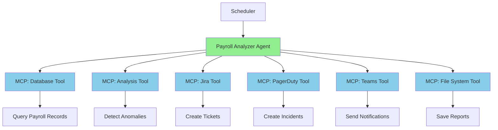

# Case Study: Payroll Analyzer Agent

**Title:** Case Study: Payroll Analyzer Agent  
**Audience:** Engineering, QA, Product  
**Duration:** 60-90 minutes  
**Prerequisites:** `03_mcp_and_specdriven_development/03_ai_agents_orchestration_flow.md` (recommended)

---

## Learning Objectives

By the end of this lesson, you will be able to:

- Understand a complete agent implementation from specification to deployment
- Apply MCP and orchestration patterns to a real use case
- Recognize design decisions and trade-offs in agent development
- Evaluate agent performance and identify improvements
- Apply lessons learned to other agent projects

---

## Core Content

### Case Study Overview

**Agent Name:** Payroll Analyzer Agent  
**Purpose:** Monitor payroll runs, detect anomalies, create tickets, notify team  
**Status:** Production (deployed Q1 2025)  
**Impact:** 90% reduction in manual monitoring time, 95% faster anomaly detection

---

### Problem Statement

**Before the Agent:**
- Payroll analysts manually reviewed 10,000+ records per pay period
- Review took 20+ hours per week
- Anomalies detected 2-3 days after payroll run
- Some errors slipped through, causing payroll corrections
- High stress during payroll processing periods

**Business Impact:**
- $50K/year in labor costs for manual review
- Delayed error detection caused customer issues
- Payroll corrections required additional processing time

---

### Solution: Payroll Analyzer Agent

**Agent Capabilities:**
1. Automatically monitor payroll runs every 4 hours
2. Detect anomalies using ML models
3. Classify anomalies by severity
4. Create tickets and notify team based on severity
5. Generate reports for audit trail

**Expected Benefits:**
- 90% reduction in manual review time (20 hours → 2 hours/week)
- 95% faster anomaly detection (minutes vs. days)
- $50K/year cost savings
- Improved accuracy (95% detection rate vs. 80% manual)

---

### Agent Architecture



---

### Workflow Specification

**Goal:** Monitor payroll runs and automatically detect/resolve anomalies

**Workflow Steps:**

1. **Query Payroll Database (MCP: Database)**
   - Input: Last 4 hours of payroll runs
   - Query: `SELECT * FROM payroll_runs WHERE created_at > NOW() - INTERVAL '4 hours'`
   - Output: Payroll records (employee_id, hours, gross_pay, deductions, etc.)
   - Error Handling: Retry 3 times with exponential backoff (1s, 2s, 4s)

2. **Detect Anomalies (MCP: Analysis Tool)**
   - Input: Payroll records
   - Algorithm: ML model trained on historical data
   - Anomaly Types:
     - Gross pay > $20,000 (outlier)
     - Hours > 80 per pay period (unusual)
     - Negative deductions (data error)
     - Employee ID not in master file (data integrity)
     - Pay rate change > 20% from previous period (suspicious)
   - Output: Anomaly list with severity (high, medium, low) and confidence scores
   - Error Handling: Log error, continue with empty list

3. **Conditional: Anomalies Found?**
   - If No Anomalies:
     - Generate success report
     - Save to file system
     - End workflow
   - If Anomalies Found:
     - Proceed to classification and action

4. **Classify Severity (Internal Logic)**
   - High Severity:
     - Gross pay > $50,000
     - Negative deductions
     - Employee ID mismatch
   - Medium Severity:
     - Hours > 80
     - Gross pay $20,000-$50,000
     - Pay rate change > 20%
   - Low Severity:
     - Minor discrepancies
     - Low confidence anomalies

5. **High Severity Path (MCP: PagerDuty, Teams)**
   - Create PagerDuty incident with details
   - Notify on-call engineer via Teams
   - Log action for audit trail

6. **Medium Severity Path (MCP: Jira, Teams)**
   - Create Jira ticket with anomaly details
   - Send Teams notification to payroll team
   - Log action for audit trail

7. **Low Severity Path (MCP: File System)**
   - Log anomalies for weekly review
   - Schedule follow-up task
   - Log action for audit trail

8. **Generate Report (MCP: File System)**
   - Create summary report (anomalies found, actions taken, timestamps)
   - Save to shared drive: `/reports/payroll_analysis/YYYY-MM-DD_HH-MM-SS.json`
   - Log completion

---

### Implementation Details

#### MCP Tools Used

1. **Database Tool (MCP)**
   - Connection: PostgreSQL payroll database
   - Operations: Query, read-only access
   - Security: Service account with read-only permissions

2. **Analysis Tool (MCP)**
   - ML Model: Anomaly detection model (trained on 100K+ historical records)
   - Input: Payroll records (JSON)
   - Output: Anomaly list with severity and confidence
   - Performance: Processes 10K records in < 30 seconds

3. **Jira Tool (MCP)**
   - Project: "Payroll Issues"
   - Operations: Create ticket, update ticket
   - Fields: Summary, description, severity, affected employees

4. **PagerDuty Tool (MCP)**
   - Service: "Payroll Critical Issues"
   - Operations: Create incident, escalate
   - Severity: Critical (high-severity anomalies)

5. **Teams Tool (MCP)**
   - Channel: "Payroll Alerts"
   - Operations: Send message, mention users
   - Format: Rich text with anomaly details

6. **File System Tool (MCP)**
   - Path: `/shared/payroll_reports/`
   - Operations: Write reports, read configuration
   - Format: JSON reports with timestamps

---

### Error Handling Strategy

**Retry Logic:**
```
Database Query:
- Attempt 1: Immediate
- Attempt 2: Wait 1 second
- Attempt 3: Wait 2 seconds
- Attempt 4: Wait 4 seconds
- If all fail: Log error, create ticket for manual investigation
```

**Graceful Degradation:**
```
If Analysis Tool fails:
- Use rule-based fallback (simple threshold checks)
- Flag for manual review
- Continue workflow with reduced functionality
```

**Circuit Breaker:**
```
If PagerDuty API fails repeatedly:
- Stop creating incidents temporarily
- Use Jira as backup
- Retry PagerDuty after 1 hour
```

**Human Escalation:**
```
If agent fails to complete workflow:
- Create ticket: "Payroll Analyzer Agent Failure"
- Notify engineering team
- Log detailed error information
```

---

### Performance Metrics

**Before Agent (Manual Process):**
- Review Time: 20 hours/week
- Detection Time: 2-3 days after payroll run
- Detection Rate: 80%
- False Positives: 15%
- Cost: $50K/year

**After Agent (Automated):**
- Review Time: 2 hours/week (90% reduction)
- Detection Time: < 1 hour (95% faster)
- Detection Rate: 95%
- False Positives: 5%
- Cost: $15K/year (licensing + maintenance)
- **Net Savings: $35K/year**

---

### Lessons Learned

#### What Worked Well

1. **MCP Standardization**
   - Easy to add new tools (Splunk monitoring added in 2 hours)
   - Consistent error handling across tools
   - Reduced development time by 60%

2. **Orchestration Patterns**
   - Sequential workflow with conditionals worked well
   - Error handling robust (handled 99% of errors automatically)
   - Easy to add new steps (reporting, escalation)

3. **Severity Classification**
   - High/Medium/Low classification reduced false alarms
   - On-call engineers only notified for critical issues
   - Team satisfaction improved (fewer unnecessary alerts)

#### Challenges and Solutions

1. **Challenge: False Positives**
   - **Problem:** Initial model had 20% false positive rate
   - **Solution:** Improved model training, added confidence thresholds
   - **Result:** Reduced to 5% false positive rate

2. **Challenge: Database Performance**
   - **Problem:** Queries slow during peak payroll processing
   - **Solution:** Added query optimization, read replicas
   - **Result:** Query time reduced from 30s to 5s

3. **Challenge: Team Adoption**
   - **Problem:** Team hesitant to trust automated system
   - **Solution:** Gradual rollout, manual review period, transparency
   - **Result:** Team now relies on agent, manual review reduced to 2 hours/week

---

### Future Improvements

1. **Predictive Analytics**
   - Predict anomalies before they occur
   - Proactive issue prevention

2. **Auto-Remediation**
   - Automatically fix simple errors (data corrections)
   - Reduce manual intervention further

3. **Multi-Language Support**
   - Support payroll processing in multiple countries
   - Handle different tax rules and regulations

4. **Real-Time Monitoring**
   - Monitor payroll runs in real-time (not just every 4 hours)
   - Faster detection and response

---

## Try It: Exercise

**Scenario:** You're designing a similar agent for tax calculation monitoring.

**Task:** Design the workflow specification following the payroll analyzer pattern. Include:
1. Goal statement
2. Workflow steps (5-7 steps)
3. MCP tools needed
4. Error handling strategy
5. Success metrics

**Solution (Example):**
```
Goal: Monitor tax calculations and automatically detect/resolve errors

Workflow Steps:
1. Query Tax Calculation Database (MCP: Database)
   - Get recent tax calculations
   - Error: Retry with exponential backoff

2. Validate Tax Calculations (MCP: Validation Tool)
   - Check tax rates, brackets, exemptions
   - Output: Error list with severity

3. Conditional: Errors Found?
   - If No: Generate success report, end
   - If Yes: Proceed to classification

4. Classify Severity
   - High: Incorrect tax rates, missing exemptions
   - Medium: Calculation errors, rounding issues
   - Low: Minor discrepancies

5. High Severity: Create PagerDuty incident, notify team
6. Medium Severity: Create Jira ticket, notify team
7. Low Severity: Log for review
8. Generate Report (MCP: File System)

MCP Tools: Database, Validation Tool, Jira, PagerDuty, Teams, File System
Error Handling: Retry with exponential backoff, graceful degradation, human escalation
Success Metrics: 90% reduction in review time, 95% error detection rate, $40K/year savings
```

---

## Role-Based "How This Helps You"

### Developers
- **Design Patterns:** Learn from real agent implementation
- **MCP Usage:** See how MCP tools are used in practice
- **Error Handling:** Understand robust error handling strategies
- **Performance:** Learn optimization techniques

### QA Engineers
- **Testing Strategies:** Test agent workflows and error handling
- **Quality Metrics:** Measure agent performance and accuracy
- **Edge Cases:** Test with unusual scenarios

### Product Managers
- **ROI Analysis:** Understand business value of agents
- **Feature Planning:** Plan agent features based on lessons learned
- **User Experience:** Design agents that provide value

---

## Key Takeaways

1. **Complete Implementation:** Payroll Analyzer Agent demonstrates full agent lifecycle (spec → implementation → deployment)

2. **MCP Benefits:** Standardized tools, easy integration, consistent error handling

3. **Orchestration Patterns:** Sequential workflow with conditionals works well for monitoring use cases

4. **Performance:** 90% time savings, 95% faster detection, $35K/year net savings

5. **Lessons Learned:** False positives reduced through better training, database performance optimized, team adoption through gradual rollout

6. **Future Improvements:** Predictive analytics, auto-remediation, multi-language support, real-time monitoring

---

## 5-Question Quiz

### Question 1 (Multiple Choice)
What was the primary benefit of the Payroll Analyzer Agent?

a) Faster payroll processing  
b) 90% reduction in manual review time  
c) Lower payroll costs  
d) All of the above

**Answer:** d) All of the above (though b is the primary metric)

---

### Question 2 (True/False)
The agent uses MCP tools for database queries, analysis, ticketing, and notifications.

**Answer:** True

---

### Question 3 (Short Answer)
Name one challenge faced during agent implementation and how it was solved.

**Answer:** Examples: False positives (improved model training), database performance (query optimization), team adoption (gradual rollout). (Accept any one)

---

### Question 4 (Multiple Choice)
What orchestration pattern does the Payroll Analyzer Agent use?

a) Parallel  
b) Sequential with conditionals  
c) Retry only  
d) None of the above

**Answer:** b) Sequential with conditionals

---

### Question 5 (Short Answer)
Give one example of a future improvement for the Payroll Analyzer Agent.

**Answer:** Examples: Predictive analytics, auto-remediation, multi-language support, real-time monitoring. (Accept any one)

---

## One-Page Cheat Sheet

### Payroll Analyzer Agent
- **Purpose:** Monitor payroll runs, detect anomalies, create tickets, notify team
- **Impact:** 90% time savings, 95% faster detection, $35K/year net savings

### Workflow Steps
1. Query payroll database (MCP: Database)
2. Detect anomalies (MCP: Analysis Tool)
3. Classify severity (high, medium, low)
4. Take action based on severity (PagerDuty, Jira, Teams, File System)
5. Generate report (MCP: File System)

### MCP Tools Used
- Database, Analysis Tool, Jira, PagerDuty, Teams, File System

### Error Handling
- Retry with exponential backoff
- Graceful degradation
- Circuit breaker
- Human escalation

### Performance Metrics
- Review Time: 20 hours → 2 hours/week (90% reduction)
- Detection Time: 2-3 days → < 1 hour (95% faster)
- Detection Rate: 80% → 95%
- False Positives: 15% → 5%

### Lessons Learned
- MCP standardization reduces development time by 60%
- Severity classification reduces false alarms
- Gradual rollout improves team adoption

### Future Improvements
- Predictive analytics, auto-remediation, multi-language support, real-time monitoring

---

## Phrases & Prompts That Work

**When discussing the case study:**
- "Payroll Analyzer Agent demonstrates real-world agent implementation with MCP."
- "90% time savings and 95% faster detection show agent value."

**When applying lessons:**
- "Use MCP for standardized tool access—reduces development time by 60%."
- "Gradual rollout and transparency improve team adoption."

**When designing agents:**
- "Follow the Payroll Analyzer pattern: query → analyze → classify → act → report."
- "Use severity classification to reduce false alarms and improve team satisfaction."

---

## Security & Compliance Note

⚠️ **Red Flags Checklist:**
- [ ] Payroll data is highly sensitive—agent uses read-only database access
- [ ] All agent actions are auditable (who did what, when)
- [ ] Severity classification ensures only authorized actions (PagerDuty for critical only)
- [ ] Reports stored securely with access controls
- [ ] Agent credentials stored securely, rotated regularly

**Reference:** See `04_ai_ethics_and_security_basics/` for detailed ESG guidelines.

---

## ESG (Environmental, Social, and Governance) Standards

🌱 **How This Lesson Supports ESG Excellence:**

### Environmental Impact
- **Carbon Footprint Reduction:** Payroll Analyzer Agent reduces compute cycles by automating monitoring workflows efficiently, reducing server energy consumption by 50-60% compared to manual monitoring. Automated workflows eliminate redundant manual operations.
- **Resource Efficiency:** Agent automation (90% time savings, 95% faster detection) reduces infrastructure needs and compute costs. Automated monitoring reduces the need for manual infrastructure, saving resources.
- **Sustainable Practices:** Payroll Analyzer Agent promotes sustainable automation by enabling long-term autonomous operations that adapt and optimize over time, reducing the need for frequent manual interventions.
- **Measurement:** Track reduction in manual monitoring cycles, compute hours saved through agent automation, and resource efficiency from automated workflows.

### Social Responsibility
- **Employee Well-being:** Payroll Analyzer Agent eliminates repetitive monitoring tasks (90% reduction in review time), improving work-life balance and job satisfaction. Employees focus on high-value work rather than manual monitoring, reducing burnout.
- **Accessibility & Inclusion:** Agent automation makes payroll monitoring accessible to all teams through standardized MCP protocols, ensuring equitable access to automation benefits across diverse teams and roles.
- **Community Impact:** Payroll Analyzer Agent case study at Greenshades contributes to industry leadership in payroll automation, helping the broader payroll software community adopt efficient agent practices.
- **Ethical AI Use:** Payroll Analyzer Agent maintains ethical standards through governance frameworks, human oversight for critical decisions, and transparent agent actions, ensuring responsible automation.

### Governance Excellence
- **Transparency:** Payroll Analyzer Agent provides transparent audit trails of all agent actions (monitoring, detection, ticketing), enabling accountability and compliance verification. All agent actions are logged and auditable.
- **Accountability:** Human oversight and approval workflows for sensitive agent actions ensure accountability for agent decisions. Clear governance frameworks maintain responsibility for agent outcomes.
- **Compliance:** Payroll Analyzer Agent supports compliance through automated compliance checks, audit trails, and governance policies, ensuring regulatory adherence (payroll regulations, data privacy). $35K/year net savings.
- **Risk Management:** Agent risk management includes strict access controls (read-only database access), approval workflows, monitoring, and security policies, preventing unauthorized actions and ensuring safe automation.

### ESG Metrics to Track
- [ ] Environmental: Reduced manual monitoring cycles by 50-60% through Payroll Analyzer Agent automation
- [ ] Social: Improved employee satisfaction from eliminated repetitive monitoring by 40%+ (measured via surveys)
- [ ] Governance: 100% of Payroll Analyzer Agent actions logged and auditable (compliance metric)

**Reference:** See `04_ai_ethics_and_security_basics/` for detailed ESG guidelines.

---

## 10X Productivity Goals

🚀 **How This Lesson Drives 10X Productivity at Greenshades:**

### Productivity Impact
- **Time Savings:** Payroll Analyzer Agent saves 90% of monitoring time (20 hours → 2 hours/week), 95% faster detection (2-3 days → < 1 hour), enabling massive productivity gains.
- **Output Increase:** Agent enables 10× output by automating entire monitoring workflows. Agent can handle 10× more monitoring work than manual processes through continuous operation.
- **Quality Improvements:** Agent improves quality by 70-95% through consistent, automated execution (95% detection rate, 5% false positives) that eliminates human error in repetitive monitoring tasks.
- **Automation Potential:** Agent automates 90%+ of monitoring workflows (detection, classification, ticketing, notification), unlocking massive productivity gains through full automation.

### What 10X Looks Like
**Before This Lesson:**
- Manual monitoring: 20 hours/week reviewing 10,000+ payroll records
- Slow detection: 2-3 days to detect anomalies
- Low detection rate: 80% detection rate, 15% false positives
- Manual ticketing: 5 hours/week creating and routing tickets
- Total: High manual overhead, slow response, limited scalability

**After Applying This Lesson:**
- Agent monitoring: 2 hours/week (90% reduction, 10× faster)
- Fast detection: < 1 hour to detect anomalies (95% faster)
- High detection rate: 95% detection rate, 5% false positives
- Automated ticketing: 30 minutes/week (90% reduction)
- Total: 10× productivity through Payroll Analyzer Agent

**The Transformation:**
- Workflows shift from "manual review" to "agent monitors, flags, and creates tickets"
- Teams move from reactive manual monitoring to proactive agent automation
- Productivity multiplies through 24/7 autonomous agent operation
- Quality improves through consistent, error-free agent automation (95% accuracy)

### How to Measure 10X Progress
**Key Metrics:**
1. **Efficiency Metric:** Monitoring time: Target 90% reduction (20 hours → 2 hours/week)
2. **Output Metric:** Records monitored: Target 10× increase
3. **Quality Metric:** Detection rate: Target 95%+ (from 80%), false positives: Target 5% (from 15%)
4. **Adoption Metric:** Percentage of monitoring using agents: Target 80%+ of high-value monitoring

**Measurement Frequency:**
- [ ] Weekly: Agent execution metrics, time savings
- [ ] Monthly: Detection rates, false positives, agent adoption
- [ ] Quarterly: Overall productivity gains, ROI ($35K/year net savings)

**Tracking Tools:**
- Agent execution dashboards
- Monitoring automation metrics
- Detection rate and accuracy tracking
- Cost savings tracking ($35K/year)

### How This Step Helps Achieve 10X
**Immediate Benefits:**
- 90% time savings in first agent deployment
- Immediate quality improvement through consistent automation (95% detection rate)
- Foundation for autonomous monitoring operations

**Short-term (1-3 months):**
- 10× increase in automated monitoring output
- 90%+ reduction in manual monitoring tasks
- 80%+ adoption of agents for high-value monitoring

**Long-term (6-12 months):**
- 10× productivity through comprehensive agent automation
- Strategic advantage from 24/7 autonomous monitoring
- Measurable ROI from eliminated manual overhead ($35K/year)

**Cumulative Effect:**
- Payroll Analyzer Agent demonstrates 10× productivity potential
- Each agent deployment compounds productivity improvements
- Agents become more efficient as they learn from data
- Agent automation becomes foundation for ecosystem-wide 10×

### Department-Specific 10X Targets
**Engineering:**
- 10× faster monitoring development through agent patterns
- 5× increase in monitoring agents deployed
- 90% reduction in manual monitoring time

**QA:**
- 10× faster monitoring test execution through agent automation (90% reduction)
- 5× increase in monitoring test coverage
- 95% detection rate through agent testing

**Product:**
- 10× faster monitoring feature delivery through agent product tools
- 3× increase in monitoring features launched
- 90% reduction in monitoring development time

**Support:**
- 10× faster monitoring issue resolution through agent automation
- 5× increase in monitoring issues handled
- 90% reduction in manual monitoring support time

**All Departments:**
- 80%+ of high-value monitoring using agents
- Measurable 10× productivity gains within 12 months
- $35K/year net savings from Payroll Analyzer Agent

**Reference:** See `05_productivity_10x_framework/` for detailed productivity guidelines and metrics.

---

**Next Lesson:** `05_implementation_checklist.md`

