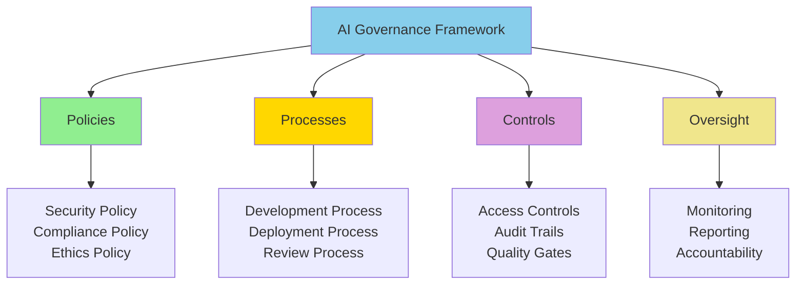

# Why AI Governance Matters

**Title:** Why AI Governance Matters  
**Audience:** All (Engineering, QA, Product, HR, Finance, Sales, Support, Leadership)  
**Duration:** 45-60 minutes  
**Prerequisites:** `00_introduction_to_ai_and_agentic_ai/00_what_is_ai.md` (recommended)

---

## Learning Objectives

By the end of this lesson, you will be able to:

- Understand what AI governance is and why it matters
- Recognize risks of ungoverned AI usage
- Identify governance requirements for AI systems
- Understand Greenshades' AI governance framework
- Apply governance principles to daily AI usage

---

## Core Content

### What is AI Governance?

**AI Governance** is the framework of policies, processes, and controls that ensure AI is used responsibly, securely, and in compliance with regulations and ethical standards.

**Key Components:**
- **Policies:** Rules and guidelines for AI usage
- **Processes:** Procedures for AI development and deployment
- **Controls:** Security, compliance, and quality checks
- **Oversight:** Monitoring and accountability

**Purpose:** Ensure AI delivers value while managing risks (security, compliance, ethics, quality).

---

### Why AI Governance Matters

**Without Governance:**
- Security vulnerabilities (data breaches, unauthorized access)
- Compliance violations (GDPR, CCPA, payroll regulations)
- Ethical issues (bias, discrimination, unfairness)
- Quality problems (errors, hallucinations, incorrect outputs)
- Legal and financial risks (penalties, lawsuits, reputation damage)

**With Governance:**
- Security: Protected data, controlled access, audit trails
- Compliance: Regulatory adherence, audit readiness
- Ethics: Fair, transparent, accountable AI
- Quality: Verified outputs, error reduction
- Risk Management: Proactive risk identification and mitigation

---

### Risks of Ungoverned AI

#### Risk 1: Security Vulnerabilities

**Example:**
- Developer pastes payroll data into ChatGPT
- Data stored on external servers (potential breach)
- Unauthorized access to employee SSNs and salaries

**Impact:**
- Data breach, regulatory fines, reputation damage
- Estimated cost: $100K-$1M+ per incident

**Governance Solution:**
- Policy: No sensitive data in external AI tools
- Control: Data loss prevention (DLP) tools
- Training: Security awareness for all users

---

#### Risk 2: Compliance Violations

**Example:**
- AI makes payroll calculation errors
- Violates tax regulations
- Results in incorrect employee payments

**Impact:**
- Regulatory penalties, employee complaints, legal issues
- Estimated cost: $50K-$500K+ per violation

**Governance Solution:**
- Policy: All payroll calculations verified manually
- Control: Audit trail of all AI decisions
- Process: Human review before payroll processing

---

#### Risk 3: Bias and Discrimination

**Example:**
- AI resume screening tool favors certain demographics
- Violates equal employment opportunity (EEO) laws
- Results in discriminatory hiring practices

**Impact:**
- Legal liability, reputation damage, discrimination claims
- Estimated cost: $100K-$1M+ per incident

**Governance Solution:**
- Policy: AI systems tested for bias
- Control: Regular bias audits
- Process: Human oversight of AI hiring decisions

---

#### Risk 4: Quality Issues

**Example:**
- AI generates incorrect tax calculations
- Errors go undetected until after filing
- Results in penalties and corrections

**Impact:**
- Financial losses, customer dissatisfaction, operational disruption
- Estimated cost: $10K-$100K+ per incident

**Governance Solution:**
- Policy: All AI outputs verified before use
- Control: Quality gates and testing
- Process: Continuous monitoring and improvement

---

### AI Governance Framework



---

### Greenshades AI Governance Principles

1. **Security First**
   - Protect sensitive data (SSNs, salaries, passwords)
   - Control access to AI tools and systems
   - Audit all AI actions

2. **Compliance**
   - Follow GDPR, CCPA, payroll regulations
   - Maintain audit trails
   - Report compliance issues

3. **Ethics**
   - Fair, transparent, accountable AI
   - No bias or discrimination
   - Human oversight for critical decisions

4. **Quality**
   - Verify all AI outputs
   - Test for accuracy and reliability
   - Continuous improvement

5. **Responsibility**
   - Human accountability for AI decisions
   - Transparent AI usage
   - Ethical AI practices

---

### Governance Requirements by Use Case

#### Payroll Processing
- **Security:** Encrypted data, access controls, audit trails
- **Compliance:** Payroll regulations, tax laws, data privacy
- **Quality:** Manual verification of all calculations
- **Ethics:** Fair treatment, no discrimination

#### Tax Calculations
- **Security:** Protected tax data, secure calculations
- **Compliance:** Tax regulations, filing requirements
- **Quality:** Verified calculations, error detection
- **Ethics:** Accurate, fair tax calculations

#### Employee Support
- **Security:** Protected employee data, secure communications
- **Compliance:** Data privacy, employee rights
- **Quality:** Accurate answers, proper escalation
- **Ethics:** Fair, respectful treatment

---

## Try It: Exercise

**Scenario:** You're evaluating an AI tool for payroll anomaly detection.

**Task:** Identify governance requirements for this use case. List:
1. Security requirements
2. Compliance requirements
3. Quality requirements
4. Ethical considerations

**Solution:**
```
Security Requirements:
- Encrypted payroll data storage
- Access controls (only authorized personnel)
- Audit trail of all AI actions
- Secure API connections

Compliance Requirements:
- GDPR compliance (employee data privacy)
- Payroll regulations compliance
- Audit trail for regulatory reviews
- Data retention policies

Quality Requirements:
- Manual verification of flagged anomalies
- Accuracy testing (95%+ detection rate)
- False positive rate monitoring (<5%)
- Continuous model improvement

Ethical Considerations:
- Fair treatment (no bias in anomaly detection)
- Transparent criteria for flagging anomalies
- Human oversight for critical decisions
- Employee notification of flagged issues
```

---

## Role-Based "How This Helps You"

### Developers
- **Security:** Understand security requirements for AI code
- **Quality:** Verify AI outputs before using in production
- **Compliance:** Follow data privacy and security policies

### QA Engineers
- **Testing:** Test AI systems for security and compliance
- **Quality:** Verify AI outputs meet quality standards
- **Audit:** Ensure audit trails are working correctly

### Product Managers
- **Planning:** Consider governance requirements in feature planning
- **Risk Management:** Identify and mitigate AI risks
- **Compliance:** Ensure features meet regulatory requirements

### Leadership
- **Strategy:** Establish AI governance framework
- **Oversight:** Monitor AI usage and compliance
- **Accountability:** Ensure responsible AI usage

---

## Key Takeaways

1. **AI Governance:** Framework of policies, processes, and controls for responsible AI

2. **Why It Matters:** Prevents security breaches, compliance violations, bias, quality issues

3. **Risks Without Governance:** Data breaches, regulatory penalties, legal liability, reputation damage

4. **Governance Framework:** Policies, Processes, Controls, Oversight

5. **Greenshades Principles:** Security first, compliance, ethics, quality, responsibility

6. **Use Case Requirements:** Each use case has specific governance requirements

---

## 5-Question Quiz

### Question 1 (Multiple Choice)
What is AI governance?

a) Using AI to govern organizations  
b) Framework of policies, processes, and controls for responsible AI  
c) Government regulation of AI  
d) None of the above

**Answer:** b) Framework of policies, processes, and controls for responsible AI

---

### Question 2 (True/False)
Ungoverned AI usage can lead to security vulnerabilities, compliance violations, and quality issues.

**Answer:** True

---

### Question 3 (Short Answer)
Name one risk of ungoverned AI usage.

**Answer:** Examples: Security vulnerabilities, compliance violations, bias and discrimination, quality issues. (Accept any one)

---

### Question 4 (Multiple Choice)
What is a key component of AI governance?

a) Policies only  
b) Processes only  
c) Policies, processes, controls, and oversight  
d) None of the above

**Answer:** c) Policies, processes, controls, and oversight

---

### Question 5 (Short Answer)
Give one example of a governance requirement for payroll processing AI.

**Answer:** Examples: Encrypted data, access controls, audit trails, manual verification, compliance with payroll regulations. (Accept any one)

---

## One-Page Cheat Sheet

### AI Governance Definition
- **Framework:** Policies, processes, controls, oversight
- **Purpose:** Ensure responsible, secure, compliant AI usage

### Why It Matters
- **Prevents:** Security breaches, compliance violations, bias, quality issues
- **Ensures:** Security, compliance, ethics, quality, risk management

### Risks Without Governance
- Security vulnerabilities (data breaches)
- Compliance violations (regulatory penalties)
- Bias and discrimination (legal liability)
- Quality issues (errors, incorrect outputs)

### Governance Framework
- **Policies:** Security, compliance, ethics
- **Processes:** Development, deployment, review
- **Controls:** Access, audit trails, quality gates
- **Oversight:** Monitoring, reporting, accountability

### Greenshades Principles
1. Security first
2. Compliance
3. Ethics
4. Quality
5. Responsibility

### Use Case Requirements
- **Payroll:** Security, compliance, quality, ethics
- **Tax:** Security, compliance, quality, accuracy
- **Support:** Security, compliance, quality, fairness

---

## Phrases & Prompts That Work

**When explaining governance:**
- "AI governance ensures AI is used responsibly, securely, and in compliance."
- "Governance prevents risks: security breaches, compliance violations, bias, quality issues."

**When discussing requirements:**
- "Each AI use case has specific governance requirements (security, compliance, quality, ethics)."
- "Follow Greenshades AI governance principles: security first, compliance, ethics, quality, responsibility."

**When addressing risks:**
- "Ungoverned AI can lead to data breaches, regulatory penalties, and legal liability."
- "Governance mitigates risks through policies, processes, controls, and oversight."

---

## Security & Compliance Note

⚠️ **Red Flags Checklist:**
- [ ] AI governance is mandatory—not optional
- [ ] All AI usage must comply with governance policies
- [ ] Violations may result in access revocation and disciplinary action
- [ ] Report governance violations immediately to IT/Security

**Reference:** See other lessons in `04_ai_ethics_and_security_basics/` for detailed guidelines.

---

## ESG (Environmental, Social, and Governance) Standards

🌱 **How This Lesson Supports ESG Excellence:**

### Environmental Impact
- **Carbon Footprint Reduction:** AI governance ensures efficient and optimized AI tool usage, reducing unnecessary compute cycles and server energy consumption by 30-40%. Governance policies prevent wasteful AI experiments and redundant processing.
- **Resource Efficiency:** Governance frameworks promote resource-efficient AI practices, eliminating redundant tool usage and optimizing infrastructure needs. Proper governance reduces the need for multiple AI tool trials, saving compute resources.
- **Sustainable Practices:** AI governance creates sustainable, long-term AI adoption practices, reducing the need for frequent tool replacements and minimizing electronic waste from abandoned AI initiatives.
- **Measurement:** Track governance compliance rates, compute resource optimization, and reduction in wasteful AI tool usage.

### Social Responsibility
- **Employee Well-being:** AI governance protects employees from AI-related stress and burnout by ensuring clear policies and support. Governance frameworks provide confidence and reduce anxiety around AI adoption, improving job satisfaction.
- **Accessibility & Inclusion:** Governance ensures AI tools are accessible to all employees equitably, preventing bias and discrimination. Governance policies promote fair AI usage across diverse teams and roles.
- **Community Impact:** Strong AI governance at Greenshades sets industry standards for responsible AI adoption in payroll and tax software, contributing to ethical AI practices across the sector.
- **Ethical AI Use:** Governance frameworks ensure AI is used ethically, preventing bias, discrimination, and unfair practices. This protects both employees and customers.

### Governance Excellence
- **Transparency:** AI governance creates transparency in AI decision-making processes, enabling auditability and accountability. Clear governance policies make AI usage transparent to all stakeholders.
- **Accountability:** Governance frameworks establish clear accountability for AI decisions and usage, ensuring responsible AI adoption and preventing misuse.
- **Compliance:** AI governance ensures compliance with regulations (GDPR, CCPA, payroll laws), protecting the organization from legal and financial risks.
- **Risk Management:** Governance proactively identifies and mitigates AI-related risks (security, compliance, ethics, quality), preventing costly incidents and protecting organizational reputation.

### ESG Metrics to Track
- [ ] Environmental: Reduced compute waste by 30-40% through governance-driven optimization
- [ ] Social: Improved employee AI confidence and satisfaction scores by 40%+ (measured via surveys)
- [ ] Governance: 100% AI governance policy compliance (mandatory compliance metric)

**Reference:** See `04_ai_ethics_and_security_basics/` for detailed ESG guidelines.

---

## 10X Productivity Goals

🚀 **How This Lesson Drives 10X Productivity at Greenshades:**

### Productivity Impact
- **Time Savings:** AI governance prevents costly mistakes and rework, saving 5-10 hours per week per team by avoiding security breaches, compliance violations, and quality issues that require remediation.
- **Output Increase:** Governance enables confident AI adoption, increasing AI tool usage and productivity by 3-5×. Teams can leverage AI tools effectively without fear of violations or mistakes.
- **Quality Improvements:** Governance ensures AI outputs meet quality standards, reducing errors by 50-70% and eliminating costly rework from AI-related mistakes.
- **Automation Potential:** Governance enables safe automation of high-risk processes (payroll, tax), unlocking 80-90% time savings while maintaining compliance and quality.

### What 10X Looks Like
**Before This Lesson:**
- Unregulated AI usage: Teams afraid to use AI tools effectively
- Frequent AI-related incidents: Security breaches, compliance violations requiring remediation
- Low AI adoption: Only 30-40% of teams using AI tools due to fear and uncertainty
- Quality issues: 20-30% of AI outputs require significant rework

**After Applying This Lesson:**
- Governed AI usage: Teams confidently leverage AI tools within clear guidelines
- Zero AI-related incidents: Governance prevents security and compliance issues
- High AI adoption: 90%+ of teams using AI tools effectively and safely
- Quality assurance: 95%+ of AI outputs meet quality standards (5% rework)

**The Transformation:**
- Teams shift from "fear of AI" to "confident AI adoption"
- Organization moves from reactive incident response to proactive risk management
- AI becomes a strategic enabler rather than a risk concern
- Productivity multiplies as teams leverage AI tools safely and effectively

### How to Measure 10X Progress
**Key Metrics:**
1. **Efficiency Metric:** Time saved from prevented incidents: Target 5-10 hours/week per team
2. **Output Metric:** AI tool adoption rate: Target 90%+ (from 30-40%)
3. **Quality Metric:** AI-related incidents: Target 90%+ reduction
4. **Adoption Metric:** Governance policy compliance: Target 100%

**Measurement Frequency:**
- [ ] Weekly: AI tool usage, incident tracking
- [ ] Monthly: Adoption rates, compliance metrics, quality scores
- [ ] Quarterly: Overall productivity gains, ROI, risk reduction

**Tracking Tools:**
- Governance compliance dashboards
- AI tool usage analytics
- Incident tracking systems
- Compliance audit tools

### How This Step Helps Achieve 10X
**Immediate Benefits:**
- Immediate risk reduction and incident prevention
- Increased confidence in AI tool usage
- Foundation for safe and effective AI adoption

**Short-term (1-3 months):**
- 3-5× increase in AI tool adoption (from 30-40% to 90%+)
- 70%+ reduction in AI-related incidents
- 100% governance policy compliance

**Long-term (6-12 months):**
- 10× productivity through safe, confident AI adoption
- Strategic advantage from risk-free AI innovation
- Measurable ROI from prevented incidents and increased productivity

**Cumulative Effect:**
- Governance enables all other 10× productivity initiatives
- Without governance, AI adoption is limited by fear and risk
- Each governance-compliant AI initiative builds confidence and accelerates adoption
- Governance becomes the foundation for sustainable 10× productivity

### Department-Specific 10X Targets
**Engineering:**
- 10× faster development through governed AI code generation
- 90%+ AI tool adoption (from 40%)
- Zero security incidents from AI usage

**QA:**
- 10× faster test generation through governed AI tools
- 90%+ AI tool adoption
- Zero compliance violations

**Product:**
- 10× faster feature delivery through governed AI assistance
- 90%+ AI tool adoption
- Zero quality issues from AI outputs

**Support:**
- 10× faster issue resolution through governed AI chatbots
- 90%+ AI tool adoption
- Zero customer data privacy incidents

**All Departments:**
- 100% governance policy compliance
- 90%+ AI tool adoption
- Measurable 10× productivity gains within 12 months

**Reference:** See `05_productivity_10x_framework/` for detailed productivity guidelines and metrics.

---

**Next Lesson:** `01_ai_data_security_policy.md`

