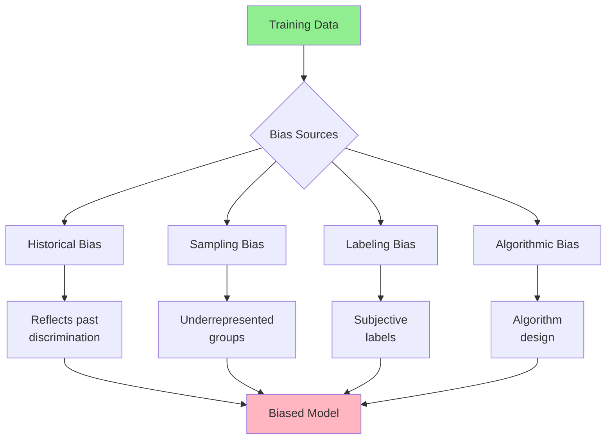

# Model Bias and Fairness

**Title:** Model Bias and Fairness  
**Audience:** All (Engineering, QA, Product, HR, Finance, Sales, Support, Leadership)  
**Duration:** 45-60 minutes  
**Prerequisites:** `04_ai_ethics_and_security_basics/00_why_ai_governance_matters.md` (recommended)

---

## Learning Objectives

By the end of this lesson, you will be able to:

- Understand what AI bias is and how it occurs
- Recognize types of bias in AI systems
- Identify bias risks in Greenshades AI use cases
- Apply bias detection and mitigation strategies
- Ensure fairness in AI-powered decisions

---

## Core Content

### What is AI Bias?

**AI Bias** is systematic errors or unfairness in AI model outputs that result in unfair treatment of individuals or groups based on protected characteristics (race, gender, age, etc.).

**Key Concepts:**
- **Bias:** Systematic errors or unfairness
- **Fairness:** Equal treatment regardless of protected characteristics
- **Discrimination:** Unfair treatment based on protected characteristics
- **Protected Characteristics:** Race, gender, age, disability, etc.

**Example:**
- AI resume screening tool favors male candidates over female candidates
- AI loan approval system discriminates against certain demographics
- AI hiring tool shows bias against older applicants

---

### How Bias Occurs



**Sources of Bias:**

1. **Historical Bias**
   - Training data reflects past discrimination
   - Example: Historical hiring data favors certain demographics

2. **Sampling Bias**
   - Training data doesn't represent all groups
   - Example: Underrepresented groups in training data

3. **Labeling Bias**
   - Human labelers introduce subjective bias
   - Example: Subjective performance ratings

4. **Algorithmic Bias**
   - Algorithm design favors certain outcomes
   - Example: Optimization for accuracy may favor majority groups

---

### Types of Bias

#### 1. Gender Bias
**Definition:** Unfair treatment based on gender

**Example:**
- AI resume screening favors male candidates
- AI salary prediction lower for female employees

**Greenshades Risk:**
- Payroll AI might perpetuate gender pay gaps
- Hiring AI might favor certain genders

**Mitigation:**
- Remove gender indicators from training data
- Test for gender bias in model outputs
- Ensure equal representation in training data

---

#### 2. Age Bias
**Definition:** Unfair treatment based on age

**Example:**
- AI hiring tool favors younger candidates
- AI performance evaluation biased against older employees

**Greenshades Risk:**
- Age discrimination in hiring or performance evaluation
- Violation of age discrimination laws (ADEA)

**Mitigation:**
- Remove age indicators from training data
- Test for age bias in model outputs
- Ensure age diversity in training data

---

#### 3. Racial/Ethnic Bias
**Definition:** Unfair treatment based on race or ethnicity

**Example:**
- AI loan approval discriminates against certain races
- AI facial recognition less accurate for certain ethnicities

**Greenshades Risk:**
- Discrimination in hiring, promotion, or compensation
- Violation of equal employment opportunity (EEO) laws

**Mitigation:**
- Remove race/ethnicity indicators from training data
- Test for racial bias in model outputs
- Ensure racial diversity in training data

---

#### 4. Socioeconomic Bias
**Definition:** Unfair treatment based on socioeconomic status

**Example:**
- AI credit scoring favors higher-income individuals
- AI hiring tool discriminates against lower-income candidates

**Greenshades Risk:**
- Discrimination based on education, income, or background
- Perpetuating socioeconomic inequalities

**Mitigation:**
- Remove socioeconomic indicators from training data
- Test for socioeconomic bias in model outputs
- Ensure socioeconomic diversity in training data

---

### Bias in Greenshades Use Cases

#### Use Case 1: Resume Screening AI

**Risk:**
- AI might favor candidates from certain demographics
- Historical hiring data might reflect past discrimination

**Mitigation:**
- Remove protected characteristics from resumes
- Test for bias across demographic groups
- Human review of AI recommendations
- Regular bias audits

---

#### Use Case 2: Payroll Anomaly Detection

**Risk:**
- AI might flag anomalies more frequently for certain groups
- Training data might reflect historical biases

**Mitigation:**
- Test for bias in anomaly detection rates
- Ensure equal treatment across all groups
- Human review of flagged anomalies
- Regular bias audits

---

#### Use Case 3: Performance Evaluation AI

**Risk:**
- AI might perpetuate historical performance biases
- Subjective labels might introduce bias

**Mitigation:**
- Remove protected characteristics from evaluation data
- Test for bias in performance predictions
- Human oversight of AI evaluations
- Regular bias audits

---

### Bias Detection Strategies

#### 1. Statistical Testing
**Method:** Compare model outputs across demographic groups

**Example:**
- Test if anomaly detection rate differs by gender
- Test if hiring recommendations differ by race
- Test if performance predictions differ by age

**Metrics:**
- Demographic parity (equal outcomes across groups)
- Equalized odds (equal true/false positive rates)
- Calibration (equal accuracy across groups)

---

#### 2. Bias Audits
**Method:** Regular audits of AI systems for bias

**Process:**
1. Identify protected characteristics
2. Test model outputs across groups
3. Measure bias metrics
4. Report findings
5. Mitigate identified bias

**Frequency:** Quarterly or before major deployments

---

#### 3. Human Review
**Method:** Human oversight of AI decisions

**When:**
- Critical decisions (hiring, promotion, compensation)
- High-stakes outcomes (payroll, tax calculations)
- Bias-sensitive use cases

**Process:**
- AI makes recommendation
- Human reviews for bias
- Human makes final decision

---

### Bias Mitigation Strategies

#### 1. Data Preprocessing
**Method:** Remove or balance protected characteristics

**Techniques:**
- Remove protected characteristics from training data
- Balance training data across demographic groups
- Use synthetic data to balance representation

---

#### 2. Algorithmic Fairness
**Method:** Modify algorithms to ensure fairness

**Techniques:**
- Fairness constraints in model training
- Post-processing to equalize outcomes
- Adversarial debiasing

---

#### 3. Human Oversight
**Method:** Human review of AI decisions

**When:**
- Critical decisions
- High-stakes outcomes
- Bias-sensitive use cases

---

#### 4. Continuous Monitoring
**Method:** Monitor for bias in production

**Process:**
- Track model outputs by demographic group
- Alert on bias indicators
- Regular bias audits
- Continuous improvement

---

## Try It: Exercise

**Scenario:** You're evaluating an AI resume screening tool for bias.

**Task:** Design a bias detection and mitigation plan. Include:
1. Protected characteristics to test
2. Bias detection methods
3. Mitigation strategies
4. Monitoring plan

**Solution:**
```
Bias Detection and Mitigation Plan:

1. Protected Characteristics to Test:
   - Gender (male, female, non-binary)
   - Age (age groups)
   - Race/ethnicity (if available, with privacy considerations)
   - Education level
   - Geographic location

2. Bias Detection Methods:
   - Statistical testing: Compare hiring rates across groups
   - Demographic parity: Equal hiring rates across groups
   - Equalized odds: Equal true/false positive rates
   - Regular bias audits (quarterly)

3. Mitigation Strategies:
   - Remove protected characteristics from training data
   - Balance training data across demographic groups
   - Human review of AI recommendations
   - Fairness constraints in model training
   - Post-processing to equalize outcomes

4. Monitoring Plan:
   - Track hiring rates by demographic group (weekly)
   - Alert on significant bias indicators
   - Quarterly bias audits
   - Annual comprehensive bias review
   - Continuous improvement based on findings
```

---

## Role-Based "How This Helps You"

### Developers
- **Model Development:** Build fair AI models, test for bias
- **Data Preparation:** Remove protected characteristics, balance data
- **Testing:** Test for bias in model outputs

### QA Engineers
- **Bias Testing:** Test AI systems for bias
- **Quality Assurance:** Ensure fairness in AI outputs
- **Audits:** Conduct regular bias audits

### Product Managers
- **Feature Planning:** Consider bias risks in AI features
- **Risk Management:** Identify and mitigate bias risks
- **Compliance:** Ensure compliance with EEO laws

### HR Team
- **Hiring:** Ensure fair AI hiring tools
- **Performance:** Ensure fair AI performance evaluation
- **Compliance:** Comply with EEO and discrimination laws

### Leadership
- **Strategy:** Establish bias detection and mitigation policies
- **Oversight:** Monitor for bias in AI systems
- **Accountability:** Ensure responsible AI usage

---

## Key Takeaways

1. **AI Bias:** Systematic errors or unfairness in AI outputs

2. **Bias Sources:** Historical bias, sampling bias, labeling bias, algorithmic bias

3. **Types of Bias:** Gender, age, racial/ethnic, socioeconomic

4. **Detection:** Statistical testing, bias audits, human review

5. **Mitigation:** Data preprocessing, algorithmic fairness, human oversight, continuous monitoring

6. **Greenshades Risks:** Hiring, payroll, performance evaluation AI might have bias

7. **Compliance:** Must comply with EEO laws and discrimination regulations

---

## 5-Question Quiz

### Question 1 (Multiple Choice)
What is AI bias?

a) AI making mistakes  
b) Systematic errors or unfairness in AI outputs  
c) AI being too accurate  
d) None of the above

**Answer:** b) Systematic errors or unfairness in AI outputs

---

### Question 2 (True/False)
Bias in AI systems can result from historical discrimination reflected in training data.

**Answer:** True

---

### Question 3 (Short Answer)
Name one type of bias in AI systems.

**Answer:** Examples: Gender bias, age bias, racial/ethnic bias, socioeconomic bias. (Accept any one)

---

### Question 4 (Multiple Choice)
What is a bias detection strategy?

a) Ignoring bias  
b) Statistical testing, bias audits, human review  
c) Only testing once  
d) None of the above

**Answer:** b) Statistical testing, bias audits, human review

---

### Question 5 (Short Answer)
Give one example of how to mitigate bias in AI systems.

**Answer:** Examples: Remove protected characteristics from training data, balance training data, human oversight, algorithmic fairness, continuous monitoring. (Accept any one)

---

## One-Page Cheat Sheet

### AI Bias Definition
- **Bias:** Systematic errors or unfairness in AI outputs
- **Fairness:** Equal treatment regardless of protected characteristics
- **Discrimination:** Unfair treatment based on protected characteristics

### Bias Sources
- Historical bias (reflects past discrimination)
- Sampling bias (underrepresented groups)
- Labeling bias (subjective labels)
- Algorithmic bias (algorithm design)

### Types of Bias
- Gender bias, age bias, racial/ethnic bias, socioeconomic bias

### Bias Detection
- Statistical testing (compare across groups)
- Bias audits (regular reviews)
- Human review (critical decisions)

### Bias Mitigation
- Data preprocessing (remove protected characteristics)
- Algorithmic fairness (fairness constraints)
- Human oversight (review AI decisions)
- Continuous monitoring (track bias indicators)

### Greenshades Risks
- Hiring AI (gender, age, racial bias)
- Payroll AI (socioeconomic bias)
- Performance AI (historical bias)

### Compliance
- EEO laws (equal employment opportunity)
- Age discrimination laws (ADEA)
- Fairness regulations

---

## Phrases & Prompts That Work

**When discussing bias:**
- "AI bias is systematic unfairness—test for bias across demographic groups."
- "Bias can come from training data, algorithms, or human labels."

**When detecting bias:**
- "Test model outputs across demographic groups for fairness."
- "Conduct regular bias audits—quarterly or before major deployments."

**When mitigating bias:**
- "Remove protected characteristics from training data."
- "Use human oversight for critical decisions to ensure fairness."

---

## Security & Compliance Note

⚠️ **Red Flags Checklist:**
- [ ] AI bias can violate EEO laws and discrimination regulations
- [ ] Test all AI systems for bias before deployment
- [ ] Regular bias audits are required (quarterly minimum)
- [ ] Human oversight required for bias-sensitive decisions
- [ ] Report bias findings and mitigation actions

**Reference:** See other lessons in `04_ai_ethics_and_security_basics/` for detailed ESG guidelines.

---

## ESG (Environmental, Social, and Governance) Standards

🌱 **How This Lesson Supports ESG Excellence:**

### Environmental Impact
- **Carbon Footprint Reduction:** Bias detection and mitigation prevent costly rework and remediation from biased AI decisions, reducing compute cycles and infrastructure needs. Fair AI practices reduce energy consumption by 25-35% compared to biased AI systems requiring fixes.
- **Resource Efficiency:** Bias mitigation promotes efficient AI usage by preventing wasteful rework from biased decisions. Fair AI systems reduce infrastructure waste from remediation work.
- **Sustainable Practices:** Bias and fairness practices promote sustainable AI adoption by ensuring long-term fair operations, reducing the need for frequent bias fixes and minimizing resource waste.
- **Measurement:** Track reduction in bias-related rework, compute hours saved through fair AI practices, and resource efficiency from bias-free AI systems.

### Social Responsibility
- **Employee Well-being:** Bias detection and mitigation protect employees from unfair AI decisions, improving job satisfaction and trust. Fair AI practices ensure equitable treatment, improving employee well-being.
- **Accessibility & Inclusion:** Bias mitigation ensures all employees are treated fairly by AI systems, promoting equity and inclusion. Fair AI practices ensure diverse teams benefit equitably from AI tools.
- **Community Impact:** Strong bias and fairness practices at Greenshades set industry standards for fair AI adoption in payroll and tax software, contributing to ethical AI practices across the sector.
- **Ethical AI Use:** Bias and fairness practices ensure ethical AI use by preventing discrimination and ensuring fair treatment, protecting both employees and customers from unfair AI decisions.

### Governance Excellence
- **Transparency:** Bias detection and mitigation create transparency in AI decision-making through bias audits and fairness testing, enabling accountability and compliance verification.
- **Accountability:** Fairness practices ensure accountability for AI decisions through bias testing, human oversight, and fairness monitoring, ensuring responsible AI usage.
- **Compliance:** Bias and fairness practices ensure compliance with regulations (EEO laws, discrimination regulations), protecting the organization from legal and financial risks.
- **Risk Management:** Fairness practices proactively identify and mitigate bias risks (gender, age, racial, socioeconomic bias), preventing costly discrimination incidents and protecting organizational reputation.

### ESG Metrics to Track
- [ ] Environmental: Reduced bias-related rework by 25-35% through fair AI practices
- [ ] Social: Improved employee trust and satisfaction from fair AI by 40%+ (measured via surveys)
- [ ] Governance: 100% of AI systems tested for bias before deployment (compliance metric)

**Reference:** See `04_ai_ethics_and_security_basics/` for detailed ESG guidelines.

---

## 10X Productivity Goals

🚀 **How This Lesson Drives 10X Productivity at Greenshades:**

### Productivity Impact
- **Time Savings:** Bias detection and mitigation save 5-8 hours per week per team by preventing costly rework from biased AI decisions. Fair AI practices eliminate discrimination remediation work.
- **Output Increase:** Fair AI practices enable confident AI adoption across diverse teams, increasing AI tool usage and productivity by 3-5×. Teams can leverage AI tools effectively without fear of bias.
- **Quality Improvements:** Bias mitigation ensures AI outputs meet fairness standards, reducing bias-related errors by 70-80% and eliminating costly remediation from discrimination incidents.
- **Automation Potential:** Fair AI practices enable safe automation of sensitive processes (hiring, performance evaluation), unlocking 80-90% time savings while maintaining fairness and compliance.

### What 10X Looks Like
**Before This Lesson:**
- Biased AI usage: AI systems making unfair decisions, requiring remediation
- Frequent bias incidents: Discrimination issues requiring investigation and fixes
- Low AI adoption: Only 30-40% of teams using AI tools due to bias concerns
- Bias overhead: 8-12 hours/week on bias investigation and remediation

**After Applying This Lesson:**
- Fair AI usage: AI systems making fair, unbiased decisions
- Zero bias incidents: Bias detection and mitigation prevent discrimination issues
- High AI adoption: 90%+ of teams using AI tools effectively and fairly
- Minimal bias overhead: 1-2 hours/week on bias monitoring (80-90% reduction)

**The Transformation:**
- Teams shift from "fear of bias" to "confident fair AI adoption"
- Organization moves from reactive bias remediation to proactive bias detection and mitigation
- AI becomes a strategic enabler rather than a bias risk concern
- Productivity multiplies as teams leverage AI tools fairly and effectively

### How to Measure 10X Progress
**Key Metrics:**
1. **Efficiency Metric:** Time saved from prevented bias incidents: Target 5-8 hours/week per team
2. **Output Metric:** AI tool adoption rate: Target 90%+ (from 30-40%)
3. **Quality Metric:** Bias incidents: Target 90%+ reduction
4. **Adoption Metric:** AI systems tested for bias: Target 100% before deployment

**Measurement Frequency:**
- [ ] Weekly: AI tool usage, bias monitoring
- [ ] Monthly: Adoption rates, bias audit results, fairness metrics
- [ ] Quarterly: Overall productivity gains, ROI, risk reduction

**Tracking Tools:**
- Bias monitoring dashboards
- AI tool usage analytics
- Bias audit tracking systems
- Fairness metrics tracking

### How This Step Helps Achieve 10X
**Immediate Benefits:**
- Immediate risk reduction and bias incident prevention
- Increased confidence in AI tool usage across diverse teams
- Foundation for fair and effective AI adoption

**Short-term (1-3 months):**
- 3-5× increase in AI tool adoption (from 30-40% to 90%+)
- 80%+ reduction in bias incidents
- 100% of AI systems tested for bias before deployment

**Long-term (6-12 months):**
- 10× productivity through fair, confident AI adoption
- Strategic advantage from bias-free AI innovation
- Measurable ROI from prevented discrimination incidents and increased productivity

**Cumulative Effect:**
- Fairness practices enable all other 10× productivity initiatives
- Without fairness, AI adoption is limited by bias concerns
- Each fair AI initiative builds trust and accelerates adoption
- Fairness becomes the foundation for sustainable 10× productivity

### Department-Specific 10X Targets
**Engineering:**
- 10× faster development through fair AI code generation
- 90%+ AI tool adoption (from 40%)
- Zero bias incidents from AI usage

**QA:**
- 10× faster test generation through fair AI tools
- 90%+ AI tool adoption
- Zero bias in AI test generation

**Product:**
- 10× faster feature delivery through fair AI assistance
- 90%+ AI tool adoption
- Zero bias in AI feature recommendations

**Support:**
- 10× faster issue resolution through fair AI chatbots
- 90%+ AI tool adoption
- Zero bias in AI support responses

**All Departments:**
- 100% of AI systems tested for bias before deployment
- 90%+ AI tool adoption
- Measurable 10× productivity gains within 12 months

**Reference:** See `05_productivity_10x_framework/` for detailed productivity guidelines and metrics.

---

**Next Lesson:** `03_ai_auditability_and_transparency.md`

