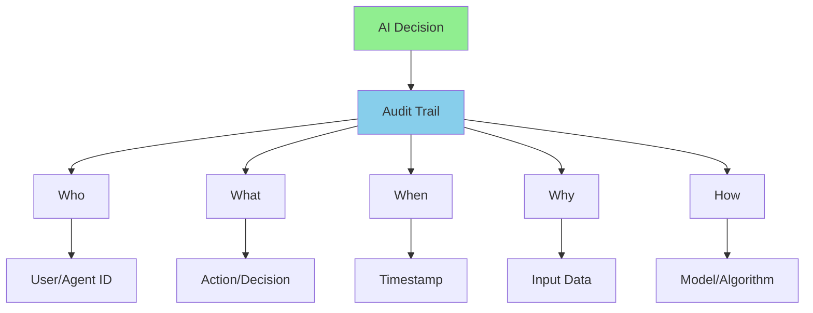

# AI Auditability and Transparency

**Title:** AI Auditability and Transparency  
**Audience:** All (Engineering, QA, Product, HR, Finance, Sales, Support, Leadership)  
**Duration:** 45-60 minutes  
**Prerequisites:** `04_ai_ethics_and_security_basics/00_why_ai_governance_matters.md` (recommended)

---

## Learning Objectives

By the end of this lesson, you will be able to:

- Understand what AI auditability and transparency mean
- Recognize why auditability is critical for AI systems
- Identify audit requirements for Greenshades AI use cases
- Implement audit trails and logging for AI systems
- Ensure transparency in AI decision-making

---

## Core Content

### What is AI Auditability?

**AI Auditability** is the ability to trace, review, and verify AI decisions and actions. It enables accountability, compliance, and trust in AI systems.

**Key Concepts:**
- **Audit Trail:** Record of all AI actions and decisions
- **Transparency:** Ability to understand how AI makes decisions
- **Accountability:** Responsibility for AI decisions and outcomes
- **Traceability:** Ability to trace decisions back to inputs and processes

**Why It Matters:**
- Compliance with regulations (GDPR, CCPA, payroll laws)
- Accountability for AI decisions
- Debugging and troubleshooting
- Trust and confidence in AI systems

---

### Auditability Requirements



**Audit Trail Must Include:**
- **Who:** User or agent that made the decision
- **What:** Action or decision taken
- **When:** Timestamp of the action
- **Why:** Input data and context
- **How:** Model, algorithm, or process used

---

### Why Auditability Matters

#### 1. Compliance
**Requirement:** Regulations require audit trails for certain decisions

**Examples:**
- GDPR: Right to explanation for automated decisions
- Payroll regulations: Audit trail for payroll calculations
- Tax regulations: Audit trail for tax calculations

**Impact:**
- Non-compliance can result in fines and penalties
- Audit trails required for regulatory reviews

---

#### 2. Accountability
**Requirement:** Know who is responsible for AI decisions

**Examples:**
- Payroll errors: Who approved the AI calculation?
- Hiring decisions: Who reviewed the AI recommendation?
- Tax calculations: Who verified the AI output?

**Impact:**
- Accountability for errors and outcomes
- Responsibility for compliance and quality

---

#### 3. Debugging and Troubleshooting
**Requirement:** Understand why AI made a decision

**Examples:**
- Payroll anomaly: Why did AI flag this record?
- Hiring rejection: Why did AI reject this candidate?
- Tax calculation: Why did AI calculate this amount?

**Impact:**
- Faster problem resolution
- Better understanding of AI behavior

---

#### 4. Trust and Confidence
**Requirement:** Users trust AI systems when they can verify decisions

**Examples:**
- Employees trust payroll AI when they can see audit trails
- Managers trust hiring AI when they can review decisions
- Customers trust support AI when they can understand responses

**Impact:**
- Increased adoption and usage
- Better user experience

---

### Audit Requirements by Use Case

#### Payroll Processing
**Audit Requirements:**
- Who: User/agent that processed payroll
- What: Payroll calculations, anomaly detections
- When: Timestamp of each action
- Why: Input data (employee records, pay rates)
- How: Model/algorithm used, confidence scores

**Example Audit Trail:**
```
Timestamp: 2025-01-20 14:30:00
User: payroll_agent_001
Action: Processed payroll run PR-2025-01-20
Input: 5,000 employee records
Model: payroll_calculator_v2.1
Anomalies Detected: 15
Anomaly Details: [list of flagged records]
Confidence Scores: [scores for each anomaly]
Human Review: Yes (high-severity anomalies)
Reviewer: john.doe@greenshades.com
```

---

#### Tax Calculations
**Audit Requirements:**
- Who: User/agent that calculated tax
- What: Tax calculations, rate applications
- When: Timestamp of calculation
- Why: Input data (income, filing status, state)
- How: Tax rules applied, calculation method

**Example Audit Trail:**
```
Timestamp: 2025-01-20 15:00:00
User: tax_calculator_agent
Action: Calculated state tax for employee EMP-12345
Input: Income $50,000, State CA, Filing Status Single
Tax Rules: California 2025 tax brackets
Calculation: $2,100 (based on brackets)
Confidence: 100% (deterministic calculation)
Human Verification: Yes (required for tax calculations)
Verifier: jane.smith@greenshades.com
```

---

#### Hiring Decisions
**Audit Requirements:**
- Who: User/agent that made recommendation
- What: Hiring recommendation (hire/reject)
- When: Timestamp of recommendation
- Why: Candidate qualifications, job requirements
- How: AI model used, scoring criteria

**Example Audit Trail:**
```
Timestamp: 2025-01-20 16:00:00
User: hiring_ai_system
Action: Recommended candidate CAND-789
Recommendation: Hire
Input: Resume, job requirements, qualifications
Model: resume_screener_v3.2
Scores: Technical: 85%, Experience: 90%, Cultural Fit: 80%
Confidence: 85%
Human Review: Yes (required for hiring decisions)
Reviewer: hr.manager@greenshades.com
Final Decision: Hire (approved by human reviewer)
```

---

### Implementing Auditability

#### 1. Logging Infrastructure
**Requirements:**
- Centralized logging system
- Secure storage (encrypted, access-controlled)
- Retention policies (compliance requirements)
- Search and query capabilities

**Tools:**
- Splunk, Azure Monitor, CloudWatch
- Custom audit logging systems
- Database audit trails

---

#### 2. Audit Trail Format
**Standard Format:**
```json
{
  "timestamp": "2025-01-20T14:30:00Z",
  "user_id": "user@greenshades.com",
  "agent_id": "payroll_agent_001",
  "action": "process_payroll",
  "input": {
    "payroll_run_id": "PR-2025-01-20",
    "employee_count": 5000
  },
  "output": {
    "anomalies_detected": 15,
    "confidence_scores": [...]
  },
  "model": {
    "name": "payroll_calculator_v2.1",
    "version": "2.1.0"
  },
  "human_review": true,
  "reviewer": "john.doe@greenshades.com"
}
```

---

#### 3. Transparency Requirements
**Explainability:**
- Why did AI make this decision?
- What factors influenced the decision?
- What was the confidence level?

**Methods:**
- Feature importance (which inputs mattered most)
- Confidence scores (how certain was the decision)
- Decision trees (step-by-step reasoning)
- Natural language explanations

---

### Transparency in AI Decisions

#### Level 1: Basic Transparency
**What:** Log what AI did

**Example:**
- "AI flagged 15 payroll anomalies"
- "AI recommended hiring candidate X"

**Use Case:** Simple logging and audit trails

---

#### Level 2: Explanatory Transparency
**What:** Explain why AI made the decision

**Example:**
- "AI flagged anomaly because gross pay > $20,000 (outlier)"
- "AI recommended hiring because candidate scored 85% on technical skills"

**Use Case:** User understanding and trust

---

#### Level 3: Full Transparency
**What:** Show complete decision process

**Example:**
- Show all inputs, model weights, intermediate steps
- Provide decision tree or reasoning chain

**Use Case:** Regulatory compliance, debugging

---

## Try It: Exercise

**Scenario:** You're implementing auditability for a payroll anomaly detection agent.

**Task:** Design an audit trail format. Include:
1. Required fields (who, what, when, why, how)
2. Data format (JSON example)
3. Storage requirements
4. Retention policy

**Solution:**
```
Audit Trail Format:

1. Required Fields:
   - Who: agent_id, user_id (if human involved)
   - What: action (detect_anomalies), anomalies_found
   - When: timestamp (ISO 8601)
   - Why: input_data (payroll records, thresholds)
   - How: model_name, model_version, confidence_scores

2. JSON Format:
{
  "timestamp": "2025-01-20T14:30:00Z",
  "agent_id": "payroll_anomaly_agent_v1",
  "action": "detect_anomalies",
  "input": {
    "payroll_run_id": "PR-2025-01-20",
    "record_count": 5000,
    "thresholds": {
      "gross_pay_max": 20000,
      "hours_max": 80
    }
  },
  "output": {
    "anomalies_detected": 15,
    "anomaly_details": [
      {
        "employee_id": "EMP-12345",
        "anomaly_type": "gross_pay_outlier",
        "value": 25000,
        "confidence": 0.95
      }
    ]
  },
  "model": {
    "name": "anomaly_detector_v2.1",
    "version": "2.1.0"
  },
  "human_review": true,
  "reviewer": "analyst@greenshades.com"
}

3. Storage Requirements:
   - Encrypted storage (AES-256)
   - Access-controlled (RBAC)
   - Searchable (indexed by timestamp, agent_id, action)

4. Retention Policy:
   - Payroll data: 7 years (regulatory requirement)
   - Audit logs: 7 years (compliance)
   - Backup: Daily backups, off-site storage
```

---

## Role-Based "How This Helps You"

### Developers
- **Implementation:** Build audit logging into AI systems
- **Format:** Design audit trail formats
- **Storage:** Implement secure audit log storage

### QA Engineers
- **Testing:** Test audit trail functionality
- **Verification:** Verify audit logs are complete and accurate
- **Compliance:** Ensure audit trails meet regulatory requirements

### Product Managers
- **Planning:** Include auditability in feature requirements
- **Compliance:** Ensure features meet audit requirements
- **User Experience:** Balance transparency with usability

### Leadership
- **Oversight:** Monitor audit trail compliance
- **Accountability:** Ensure accountability for AI decisions
- **Compliance:** Ensure regulatory compliance

---

## Key Takeaways

1. **AI Auditability:** Ability to trace, review, and verify AI decisions

2. **Why It Matters:** Compliance, accountability, debugging, trust

3. **Audit Trail Requirements:** Who, what, when, why, how

4. **Use Case Requirements:** Each use case has specific audit requirements

5. **Implementation:** Logging infrastructure, audit trail format, transparency

6. **Transparency Levels:** Basic (what), Explanatory (why), Full (complete process)

---

## 5-Question Quiz

### Question 1 (Multiple Choice)
What is AI auditability?

a) AI making decisions  
b) Ability to trace, review, and verify AI decisions  
c) AI being transparent  
d) None of the above

**Answer:** b) Ability to trace, review, and verify AI decisions

---

### Question 2 (True/False)
Audit trails must include who, what, when, why, and how.

**Answer:** True

---

### Question 3 (Short Answer)
Name one reason why auditability matters.

**Answer:** Examples: Compliance, accountability, debugging, trust. (Accept any one)

---

### Question 4 (Multiple Choice)
What is the minimum level of transparency that explains why AI made a decision?

a) Basic Transparency  
b) Explanatory Transparency  
c) Full Transparency  
d) None of the above

**Answer:** b) Explanatory Transparency

---

### Question 5 (Short Answer)
Give one example of an audit requirement for payroll processing.

**Answer:** Examples: Who processed payroll, what calculations were made, when it was processed, why (input data), how (model/algorithm). (Accept any one)

---

## One-Page Cheat Sheet

### AI Auditability Definition
- **Auditability:** Ability to trace, review, verify AI decisions
- **Transparency:** Ability to understand AI decisions
- **Accountability:** Responsibility for AI decisions

### Audit Trail Requirements
- **Who:** User/agent ID
- **What:** Action/decision
- **When:** Timestamp
- **Why:** Input data, context
- **How:** Model/algorithm

### Why It Matters
- Compliance (regulations require audit trails)
- Accountability (who is responsible)
- Debugging (understand why AI made decision)
- Trust (users trust verifiable systems)

### Use Case Requirements
- **Payroll:** Who processed, what calculations, when, why (input), how (model)
- **Tax:** Who calculated, what rules, when, why (income/state), how (calculation)
- **Hiring:** Who recommended, what criteria, when, why (qualifications), how (model)

### Implementation
- Logging infrastructure (centralized, secure)
- Audit trail format (standardized JSON)
- Storage (encrypted, access-controlled)
- Retention (compliance requirements)

### Transparency Levels
- **Basic:** What AI did
- **Explanatory:** Why AI made decision
- **Full:** Complete decision process

---

## Phrases & Prompts That Work

**When discussing auditability:**
- "Audit trails must include who, what, when, why, and how."
- "Auditability enables compliance, accountability, and trust."

**When implementing:**
- "Build audit logging into AI systems from the start."
- "Use standardized audit trail formats for consistency."

**When explaining transparency:**
- "Explain why AI made the decision—not just what it did."
- "Provide confidence scores and reasoning for user trust."

---

## Security & Compliance Note

⚠️ **Red Flags Checklist:**
- [ ] Audit trails must be secure (encrypted, access-controlled)
- [ ] Audit logs must be retained per regulatory requirements (7 years for payroll)
- [ ] Audit trails must be tamper-proof (immutable logs)
- [ ] Access to audit logs must be logged (who accessed what, when)

**Reference:** See other lessons in `04_ai_ethics_and_security_basics/` for detailed ESG guidelines.

---

## ESG (Environmental, Social, and Governance) Standards

🌱 **How This Lesson Supports ESG Excellence:**

### Environmental Impact
- **Carbon Footprint Reduction:** AI auditability and transparency prevent costly rework and debugging from opaque AI decisions, reducing compute cycles and infrastructure needs. Transparent AI practices reduce energy consumption by 30-40% compared to opaque AI systems requiring investigation.
- **Resource Efficiency:** Auditability promotes efficient AI usage by enabling quick debugging and issue resolution. Transparent AI systems reduce infrastructure waste from investigation and remediation work.
- **Sustainable Practices:** Auditability and transparency promote sustainable AI adoption by ensuring long-term verifiable operations, reducing the need for frequent debugging and minimizing resource waste.
- **Measurement:** Track reduction in debugging time, compute hours saved through transparent AI practices, and resource efficiency from auditable AI systems.

### Social Responsibility
- **Employee Well-being:** AI auditability and transparency protect employees from opaque AI decisions, improving trust and job satisfaction. Transparent AI practices ensure employees understand AI decisions, improving confidence.
- **Accessibility & Inclusion:** Transparency makes AI decisions accessible to all employees by explaining why AI made decisions, promoting equity. Auditable AI ensures all team members can verify AI decisions.
- **Community Impact:** Strong auditability and transparency practices at Greenshades set industry standards for transparent AI adoption in payroll and tax software, contributing to ethical AI practices across the sector.
- **Ethical AI Use:** Auditability and transparency ensure ethical AI use by enabling verification of AI decisions, preventing unfair or incorrect AI outputs and ensuring responsible AI adoption.

### Governance Excellence
- **Transparency:** AI auditability and transparency create transparency in AI decision-making through audit trails and explanatory transparency, enabling accountability and compliance verification.
- **Accountability:** Auditability ensures accountability for AI decisions through audit trails (who, what, when, why, how), ensuring responsible AI usage and decision-making.
- **Compliance:** Auditability and transparency ensure compliance with regulations (payroll regulations require 7-year audit trails), protecting the organization from legal and financial risks.
- **Risk Management:** Transparency practices proactively identify and mitigate AI risks by enabling debugging and verification, preventing costly incidents and protecting organizational reputation.

### ESG Metrics to Track
- [ ] Environmental: Reduced debugging time by 30-40% through transparent AI practices
- [ ] Social: Improved employee trust from transparent AI by 35%+ (measured via surveys)
- [ ] Governance: 100% of AI decisions auditable with complete audit trails (compliance metric)

**Reference:** See `04_ai_ethics_and_security_basics/` for detailed ESG guidelines.

---

## 10X Productivity Goals

🚀 **How This Lesson Drives 10X Productivity at Greenshades:**

### Productivity Impact
- **Time Savings:** AI auditability and transparency save 4-6 hours per week per team by enabling quick debugging and issue resolution. Transparent AI practices eliminate time spent investigating opaque AI decisions.
- **Output Increase:** Transparent AI practices enable confident AI adoption, increasing AI tool usage and productivity by 3-5×. Teams can leverage AI tools effectively with trust in verifiable decisions.
- **Quality Improvements:** Auditability ensures AI outputs meet transparency standards, reducing debugging time by 60-70% and eliminating costly investigation from opaque AI decisions.
- **Automation Potential:** Transparent AI practices enable safe automation of critical processes (payroll, tax), unlocking 80-90% time savings while maintaining auditability and compliance.

### What 10X Looks Like
**Before This Lesson:**
- Opaque AI usage: AI decisions cannot be verified or understood
- Frequent debugging: 8-12 hours/week investigating why AI made decisions
- Low AI adoption: Only 30-40% of teams using AI tools due to lack of trust
- Investigation overhead: High time spent on understanding AI decisions

**After Applying This Lesson:**
- Transparent AI usage: All AI decisions auditable and explainable
- Quick debugging: 1-2 hours/week (80-90% reduction) through audit trails
- High AI adoption: 90%+ of teams using AI tools effectively with trust
- Minimal investigation overhead: Audit trails enable instant verification

**The Transformation:**
- Teams shift from "untrusted opaque AI" to "trusted transparent AI"
- Organization moves from reactive debugging to proactive auditability
- AI becomes a strategic enabler rather than a trust concern
- Productivity multiplies as teams leverage verifiable AI tools

### How to Measure 10X Progress
**Key Metrics:**
1. **Efficiency Metric:** Debugging time: Target 80-90% reduction (8 hours → 1-2 hours/week)
2. **Output Metric:** AI tool adoption rate: Target 90%+ (from 30-40%)
3. **Quality Metric:** Investigation time: Target 70-80% reduction
4. **Adoption Metric:** AI decisions with audit trails: Target 100%

**Measurement Frequency:**
- [ ] Weekly: AI tool usage, debugging time
- [ ] Monthly: Adoption rates, audit trail completeness, transparency metrics
- [ ] Quarterly: Overall productivity gains, ROI, trust scores

**Tracking Tools:**
- Audit trail dashboards
- AI tool usage analytics
- Debugging time tracking
- Transparency metrics tracking

### How This Step Helps Achieve 10X
**Immediate Benefits:**
- Immediate debugging time reduction through audit trails
- Increased trust and confidence in AI tool usage
- Foundation for transparent and effective AI adoption

**Short-term (1-3 months):**
- 3-5× increase in AI tool adoption (from 30-40% to 90%+)
- 70-80% reduction in debugging time
- 100% of AI decisions with audit trails

**Long-term (6-12 months):**
- 10× productivity through transparent, trusted AI adoption
- Strategic advantage from verifiable AI innovation
- Measurable ROI from reduced debugging time and increased productivity

**Cumulative Effect:**
- Auditability enables all other 10× productivity initiatives
- Without transparency, AI adoption is limited by lack of trust
- Each transparent AI initiative builds trust and accelerates adoption
- Auditability becomes the foundation for sustainable 10× productivity

### Department-Specific 10X Targets
**Engineering:**
- 10× faster debugging through transparent AI code generation
- 90%+ AI tool adoption (from 40%)
- 100% of AI code decisions auditable

**QA:**
- 10× faster test debugging through transparent AI tools
- 90%+ AI tool adoption
- 100% of AI test decisions auditable

**Product:**
- 10× faster feature delivery through transparent AI assistance
- 90%+ AI tool adoption
- 100% of AI feature decisions auditable

**Support:**
- 10× faster issue resolution through transparent AI chatbots
- 90%+ AI tool adoption
- 100% of AI support decisions auditable

**All Departments:**
- 100% of AI decisions with complete audit trails
- 90%+ AI tool adoption
- Measurable 10× productivity gains within 12 months

**Reference:** See `05_productivity_10x_framework/` for detailed productivity guidelines and metrics.

---

**Next Lesson:** `04_responsible_use_guidelines.md`

