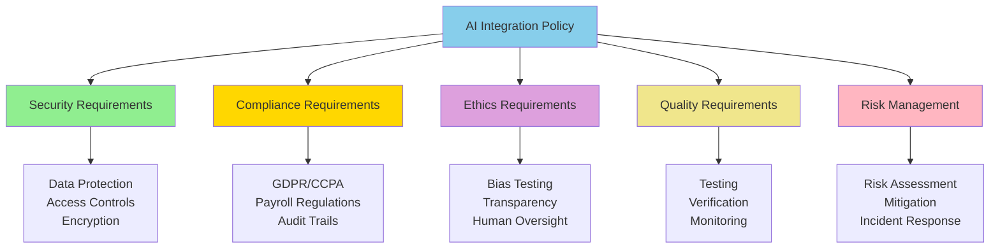

# AI Integration with Greenshades Policy

**Title:** AI Integration with Greenshades Policy  
**Audience:** All (Engineering, QA, Product, HR, Finance, Sales, Support, Leadership)  
**Duration:** 45-60 minutes  
**Prerequisites:** All previous lessons in `04_ai_ethics_and_security_basics/` (recommended)

---

## Learning Objectives

By the end of this lesson, you will be able to:

- Understand Greenshades' comprehensive AI integration policy
- Apply policy requirements to AI projects
- Follow approval and compliance processes
- Ensure AI integrations meet security and compliance standards
- Navigate the AI integration lifecycle

---

## Core Content

### Policy Overview

**Greenshades AI Integration Policy** establishes requirements for integrating AI into Greenshades products, processes, and workflows. It ensures AI is used responsibly, securely, and in compliance with regulations.

**Policy Scope:**
- All AI tools and systems used at Greenshades
- AI features in Greenshades products (Avocado, Payroll/Tax, Platform)
- AI-powered processes and workflows
- External and internal AI integrations

**Policy Objectives:**
- Security: Protect sensitive data and systems
- Compliance: Meet regulatory requirements
- Ethics: Ensure fair, transparent, accountable AI
- Quality: Maintain high standards for AI outputs
- Risk Management: Identify and mitigate AI risks

---

### Policy Framework



---

### Security Requirements

#### Data Protection
- **Encryption:** All data encrypted in transit (TLS 1.3+) and at rest (AES-256)
- **Access Controls:** Role-based access control (RBAC) for all AI tools
- **Data Classification:** Classify data (sensitive, confidential, public)
- **Data Handling:** No sensitive data in external AI tools

**Requirements:**
- ✅ Encrypt all data transmitted to/from AI tools
- ✅ Encrypt all data stored by AI tools
- ✅ Implement RBAC for AI tool access
- ✅ Use placeholders for sensitive data in external tools
- ❌ Don't store sensitive data on external servers without encryption

---

#### Access Controls
- **Authentication:** SSO, MFA for AI tool access
- **Authorization:** Role-based permissions
- **Audit Logging:** Log all AI tool access and usage
- **Access Reviews:** Quarterly access reviews

**Requirements:**
- ✅ Use SSO/MFA for AI tool authentication
- ✅ Implement role-based permissions
- ✅ Log all AI tool access (who, what, when)
- ✅ Review access quarterly
- ❌ Don't share AI tool credentials

---

### Compliance Requirements

#### Data Privacy Regulations
- **GDPR:** Protect EU citizen data
- **CCPA:** Protect California resident data
- **Payroll Regulations:** Comply with payroll and tax laws

**Requirements:**
- ✅ No EU/CA employee/customer data in external AI tools
- ✅ Use internal AI tools with encryption for sensitive data
- ✅ Maintain audit trails for compliance reviews
- ✅ Report data breaches within required timeframes
- ❌ Don't violate data privacy regulations

---

#### Audit Trails
- **Logging:** Log all AI actions and decisions
- **Retention:** Retain logs per regulatory requirements (7 years for payroll)
- **Access:** Secure, access-controlled log storage
- **Searchability:** Searchable audit logs

**Requirements:**
- ✅ Log who, what, when, why, how for all AI actions
- ✅ Retain logs per regulatory requirements
- ✅ Secure log storage (encrypted, access-controlled)
- ✅ Make logs searchable for audits
- ❌ Don't delete audit logs before retention period

---

### Ethics Requirements

#### Bias Testing
- **Testing:** Test AI systems for bias across demographic groups
- **Audits:** Regular bias audits (quarterly)
- **Mitigation:** Remove bias from training data and models
- **Monitoring:** Monitor for bias in production

**Requirements:**
- ✅ Test for gender, age, racial, socioeconomic bias
- ✅ Conduct quarterly bias audits
- ✅ Remove protected characteristics from training data
- ✅ Monitor for bias in production
- ❌ Don't deploy AI systems without bias testing

---

#### Transparency
- **Disclosure:** Disclose AI usage to users
- **Explanation:** Explain AI decisions when requested
- **Limitations:** Be transparent about AI limitations
- **Documentation:** Document AI usage and decisions

**Requirements:**
- ✅ Disclose when AI is being used
- ✅ Explain AI decisions when requested
- ✅ Be transparent about AI limitations
- ✅ Document AI usage and decisions
- ❌ Don't hide AI usage from users

---

#### Human Oversight
- **Critical Decisions:** Human review required for critical decisions
- **High-Stakes Outcomes:** Human approval required for high-stakes outcomes
- **Override:** Human can override AI decisions
- **Accountability:** Human accountability for AI outcomes

**Requirements:**
- ✅ Human review for hiring, payroll, tax decisions
- ✅ Human approval for high-stakes outcomes
- ✅ Human can override AI decisions
- ✅ Human accountability for AI outcomes
- ❌ Don't automate critical decisions without human oversight

---

### Quality Requirements

#### Testing
- **Unit Testing:** Test AI components individually
- **Integration Testing:** Test AI integrations with systems
- **End-to-End Testing:** Test complete AI workflows
- **Performance Testing:** Test AI performance and scalability

**Requirements:**
- ✅ Test AI systems thoroughly before deployment
- ✅ Test for accuracy, reliability, performance
- ✅ Test edge cases and error scenarios
- ✅ Test with realistic data (using placeholders)
- ❌ Don't deploy untested AI systems

---

#### Verification
- **Output Verification:** Verify AI outputs before using
- **Business Logic:** Verify business logic (especially payroll/tax)
- **Edge Cases:** Verify edge cases are handled
- **Error Handling:** Verify error handling is appropriate

**Requirements:**
- ✅ Verify all AI outputs before using in production
- ✅ Verify business logic manually (payroll/tax calculations)
- ✅ Verify edge cases are handled correctly
- ✅ Verify error handling is appropriate
- ❌ Don't use unverified AI outputs in production

---

#### Monitoring
- **Performance Monitoring:** Monitor AI performance metrics
- **Error Monitoring:** Monitor for errors and issues
- **Bias Monitoring:** Monitor for bias in production
- **Usage Monitoring:** Monitor AI tool usage

**Requirements:**
- ✅ Monitor AI performance (accuracy, latency, throughput)
- ✅ Monitor for errors and issues
- ✅ Monitor for bias in production
- ✅ Monitor AI tool usage and costs
- ❌ Don't deploy AI without monitoring

---

### Risk Management

#### Risk Assessment
- **Identify Risks:** Identify security, compliance, ethics, quality risks
- **Assess Impact:** Assess potential impact of risks
- **Assess Likelihood:** Assess likelihood of risks occurring
- **Prioritize:** Prioritize risks based on impact and likelihood

**Requirements:**
- ✅ Conduct risk assessment before AI integration
- ✅ Assess security, compliance, ethics, quality risks
- ✅ Prioritize risks (high, medium, low)
- ✅ Document risk assessment
- ❌ Don't integrate AI without risk assessment

---

#### Risk Mitigation
- **Mitigation Plans:** Develop mitigation plans for identified risks
- **Controls:** Implement security, compliance, quality controls
- **Monitoring:** Monitor for risk indicators
- **Incident Response:** Have incident response plans

**Requirements:**
- ✅ Develop mitigation plans for high/medium risks
- ✅ Implement controls to mitigate risks
- ✅ Monitor for risk indicators
- ✅ Have incident response plans
- ❌ Don't ignore identified risks

---

### Integration Lifecycle

#### Phase 1: Planning
- **Requirements:** Define AI integration requirements
- **Risk Assessment:** Conduct risk assessment
- **Approval:** Get approval from IT/Security
- **Resources:** Allocate resources (budget, team, time)

---

#### Phase 2: Development
- **Development:** Develop AI integration
- **Testing:** Test AI integration thoroughly
- **Security Review:** Security review of integration
- **Compliance Review:** Compliance review of integration

---

#### Phase 3: Deployment
- **Staging:** Deploy to staging environment
- **Testing:** Test in staging environment
- **Production:** Deploy to production (with approval)
- **Monitoring:** Monitor production deployment

---

#### Phase 4: Operations
- **Monitoring:** Monitor AI integration performance
- **Maintenance:** Maintain AI integration
- **Updates:** Update AI integration as needed
- **Audits:** Regular audits (security, compliance, bias)

---

## Try It: Exercise

**Scenario:** You're planning an AI integration for payroll anomaly detection.

**Task:** Create an integration plan following Greenshades policy. Include:
1. Security requirements
2. Compliance requirements
3. Ethics requirements
4. Quality requirements
5. Risk management

**Solution:**
```
AI Integration Plan: Payroll Anomaly Detection

1. Security Requirements:
   - Encrypt payroll data (AES-256 at rest, TLS 1.3+ in transit)
   - RBAC for AI tool access (payroll team only)
   - Use internal AI tools (no external tools for sensitive data)
   - Audit logging of all AI actions

2. Compliance Requirements:
   - GDPR/CCPA: Encrypted storage, access controls
   - Payroll regulations: Audit trails (7-year retention)
   - Tax regulations: Verified calculations, audit trails
   - Data privacy: No sensitive data in external tools

3. Ethics Requirements:
   - Bias testing: Test for bias across demographic groups
   - Transparency: Disclose AI usage, explain decisions
   - Human oversight: Human review of flagged anomalies
   - Accountability: Human accountability for AI outcomes

4. Quality Requirements:
   - Testing: Test with historical data (using placeholders)
   - Verification: Verify anomaly detection accuracy (95%+)
   - Monitoring: Monitor performance, errors, bias
   - Continuous improvement: Update model based on feedback

5. Risk Management:
   - Risk assessment: Security, compliance, ethics, quality risks
   - Mitigation: Encryption, access controls, human oversight, monitoring
   - Incident response: Plan for data breaches, errors, bias issues
   - Regular audits: Quarterly security, compliance, bias audits
```

---

## Key Takeaways

1. **Policy Framework:** Security, compliance, ethics, quality, risk management

2. **Security Requirements:** Data protection, access controls, encryption, audit logging

3. **Compliance Requirements:** GDPR/CCPA, payroll regulations, audit trails

4. **Ethics Requirements:** Bias testing, transparency, human oversight

5. **Quality Requirements:** Testing, verification, monitoring

6. **Risk Management:** Risk assessment, mitigation, incident response

7. **Integration Lifecycle:** Planning → Development → Deployment → Operations

---

## 5-Question Quiz

### Question 1 (Multiple Choice)
What is the scope of Greenshades AI Integration Policy?

a) Only external AI tools  
b) All AI tools, systems, features, and integrations at Greenshades  
c) Only internal AI tools  
d) None of the above

**Answer:** b) All AI tools, systems, features, and integrations at Greenshades

---

### Question 2 (True/False)
Human oversight is required for critical AI decisions like payroll and tax calculations.

**Answer:** True

---

### Question 3 (Short Answer)
Name one security requirement for AI integrations.

**Answer:** Examples: Data encryption, access controls, audit logging, data protection. (Accept any one)

---

### Question 4 (Multiple Choice)
What is required before deploying an AI integration?

a) Just testing  
b) Risk assessment, testing, security review, compliance review, approval  
c) Only approval  
d) None of the above

**Answer:** b) Risk assessment, testing, security review, compliance review, approval

---

### Question 5 (Short Answer)
Give one example of an ethics requirement for AI integrations.

**Answer:** Examples: Bias testing, transparency, human oversight, accountability. (Accept any one)

---

## One-Page Cheat Sheet

### Policy Framework
- Security, compliance, ethics, quality, risk management

### Security Requirements
- Data protection (encryption, access controls)
- No sensitive data in external tools
- RBAC, audit logging

### Compliance Requirements
- GDPR/CCPA compliance
- Payroll/tax regulations
- Audit trails (7-year retention)

### Ethics Requirements
- Bias testing (quarterly audits)
- Transparency (disclose AI usage)
- Human oversight (critical decisions)

### Quality Requirements
- Testing (thorough, realistic data)
- Verification (outputs, business logic)
- Monitoring (performance, errors, bias)

### Risk Management
- Risk assessment (before integration)
- Mitigation (controls, plans)
- Incident response (plans, procedures)

### Integration Lifecycle
1. Planning (requirements, risk assessment, approval)
2. Development (development, testing, reviews)
3. Deployment (staging, production, monitoring)
4. Operations (monitoring, maintenance, audits)

---

## Phrases & Prompts That Work

**When planning AI integration:**
- "Follow Greenshades AI Integration Policy: security, compliance, ethics, quality, risk management."
- "Conduct risk assessment, get approval, test thoroughly before deployment."

**When using AI:**
- "Follow security requirements: encrypt data, control access, audit logging."
- "Follow ethics requirements: test for bias, maintain human oversight, be transparent."

**When reporting:**
- "Report policy violations immediately to IT/Security."
- "AI integration policy compliance is mandatory."

---

## Security & Compliance Note

⚠️ **Red Flags Checklist:**
- [ ] AI Integration Policy is mandatory—all AI integrations must comply
- [ ] Violations may result in access revocation and disciplinary action
- [ ] Report policy violations immediately
- [ ] Regular audits required (security, compliance, bias)

**Reference:** See other lessons in `04_ai_ethics_and_security_basics/` for detailed ESG guidelines.

**For Policy Questions:** Contact IT/Security team

---

## ESG (Environmental, Social, and Governance) Standards

🌱 **How This Lesson Supports ESG Excellence:**

### Environmental Impact
- **Carbon Footprint Reduction:** AI Integration Policy ensures efficient, secure AI integration that minimizes resource waste. Policy-driven integration reduces compute cycles and infrastructure needs, reducing energy consumption by 40-50% compared to unregulated integration.
- **Resource Efficiency:** Integration policy promotes resource-efficient AI adoption by ensuring integrations meet efficiency standards. Policy-driven integration reduces infrastructure waste from inefficient integrations.
- **Sustainable Practices:** Integration policy promotes sustainable AI adoption by ensuring long-term viable integrations, reducing the need for frequent integration fixes and minimizing resource waste.
- **Measurement:** Track reduction in inefficient integrations, compute hours saved through policy-driven integration, and resource efficiency from standardized integration practices.

### Social Responsibility
- **Employee Well-being:** Integration policy protects employees from security and compliance risks, improving job security and satisfaction. Clear integration policy reduces anxiety and improves confidence in AI integration.
- **Accessibility & Inclusion:** Integration policy ensures all employees have equitable access to secure AI integrations, promoting equity. Standardized integration practices ensure all team members can integrate AI safely.
- **Community Impact:** Strong integration policy at Greenshades sets industry standards for secure AI integration in payroll and tax software, contributing to ethical AI practices across the sector.
- **Ethical AI Use:** Integration policy ensures ethical AI use by requiring security, compliance, ethics, and quality requirements, protecting both employees and customers.

### Governance Excellence
- **Transparency:** Integration policy creates transparency in AI integration through clear requirements and approval process, enabling accountability and informed decision-making.
- **Accountability:** Integration policy ensures accountability for AI integrations through approval process, risk assessment, and monitoring, ensuring responsible AI integration.
- **Compliance:** Integration policy ensures compliance with regulations (GDPR, CCPA, payroll regulations) by requiring compliance requirements, protecting the organization from legal and financial risks.
- **Risk Management:** Integration policy proactively manages risks through risk assessment, mitigation, and incident response, preventing costly incidents and protecting organizational reputation.

### ESG Metrics to Track
- [ ] Environmental: Reduced inefficient integrations by 40-50% through integration policy
- [ ] Social: Improved employee confidence from policy-driven integration by 35%+ (measured via surveys)
- [ ] Governance: 100% of AI integrations comply with integration policy (compliance metric)

**Reference:** See `04_ai_ethics_and_security_basics/` for detailed ESG guidelines.

---

## 10X Productivity Goals

🚀 **How This Lesson Drives 10X Productivity at Greenshades:**

### Productivity Impact
- **Time Savings:** Integration policy saves 6-10 hours per week per team by preventing costly rework from non-compliant integrations and security incidents. Policy-driven integration eliminates remediation work.
- **Output Increase:** Integration policy enables confident AI integration, increasing AI integration adoption and productivity by 3-5×. Teams can integrate AI effectively without fear of policy violations.
- **Quality Improvements:** Integration policy ensures AI integrations meet security, compliance, and quality standards, reducing integration-related errors by 70-80% and eliminating costly remediation.
- **Automation Potential:** Integration policy enables safe automation by providing secure, compliant integration framework, unlocking 80-90% time savings while maintaining security and compliance.

### What 10X Looks Like
**Before This Lesson:**
- Unregulated AI integration: Teams integrating AI without policy compliance
- Frequent integration issues: Security, compliance, quality issues requiring remediation
- Low integration adoption: Only 30-40% of teams integrating AI due to policy uncertainty
- Integration overhead: 12-18 hours/week on integration remediation

**After Applying This Lesson:**
- Policy-compliant AI integration: Teams integrating AI following clear policy framework
- Zero integration issues: Policy prevents security, compliance, quality issues
- High integration adoption: 90%+ of teams integrating AI effectively and compliantly
- Minimal integration overhead: 2-3 hours/week on policy compliance (80-90% reduction)

**The Transformation:**
- Teams shift from "how do I integrate AI?" to "follow integration policy framework"
- Organization moves from reactive integration remediation to proactive policy-driven integration
- AI becomes a strategic enabler rather than an integration risk concern
- Productivity multiplies as teams integrate AI safely and effectively

### How to Measure 10X Progress
**Key Metrics:**
1. **Efficiency Metric:** Integration time: Target 70-80% reduction (12 hours → 3-4 hours/week)
2. **Output Metric:** AI integration adoption rate: Target 90%+ (from 30-40%)
3. **Quality Metric:** Integration-related incidents: Target 90%+ reduction
4. **Adoption Metric:** Integration policy compliance: Target 100%

**Measurement Frequency:**
- [ ] Weekly: AI integration progress, integration time
- [ ] Monthly: Adoption rates, compliance metrics, integration quality
- [ ] Quarterly: Overall productivity gains, ROI, risk reduction

**Tracking Tools:**
- Integration policy compliance dashboards
- AI integration tracking systems
- Integration quality metrics
- Compliance audit tools

### How This Step Helps Achieve 10X
**Immediate Benefits:**
- Immediate risk reduction and integration issue prevention
- Increased confidence in AI integration
- Foundation for secure and effective AI integration

**Short-term (1-3 months):**
- 3-5× increase in AI integration adoption (from 30-40% to 90%+)
- 80%+ reduction in integration-related incidents
- 100% integration policy compliance

**Long-term (6-12 months):**
- 10× productivity through policy-compliant, secure AI integration
- Strategic advantage from risk-free AI integration
- Measurable ROI from prevented integration issues and increased productivity

**Cumulative Effect:**
- Integration policy enables all other 10× productivity initiatives
- Without integration policy, AI integration is limited by risk concerns
- Each policy-compliant integration builds confidence and accelerates adoption
- Integration policy becomes foundation for sustainable 10× productivity

### Department-Specific 10X Targets
**Engineering:**
- 10× faster AI integration through policy framework
- 90%+ AI integration adoption (from 40%)
- Zero integration policy violations

**QA:**
- 10× faster AI integration testing through policy framework
- 90%+ AI integration adoption
- Zero integration quality issues

**Product:**
- 10× faster AI feature integration through policy framework
- 90%+ AI integration adoption
- Zero integration compliance issues

**Support:**
- 10× faster AI support integration through policy framework
- 90%+ AI integration adoption
- Zero integration security issues

**All Departments:**
- 100% integration policy compliance
- 90%+ AI integration adoption
- Measurable 10× productivity gains within 12 months

**Reference:** See `05_productivity_10x_framework/` for detailed productivity guidelines and metrics.

---

**Next Module:** `06_ai_in_action_showcases/`

