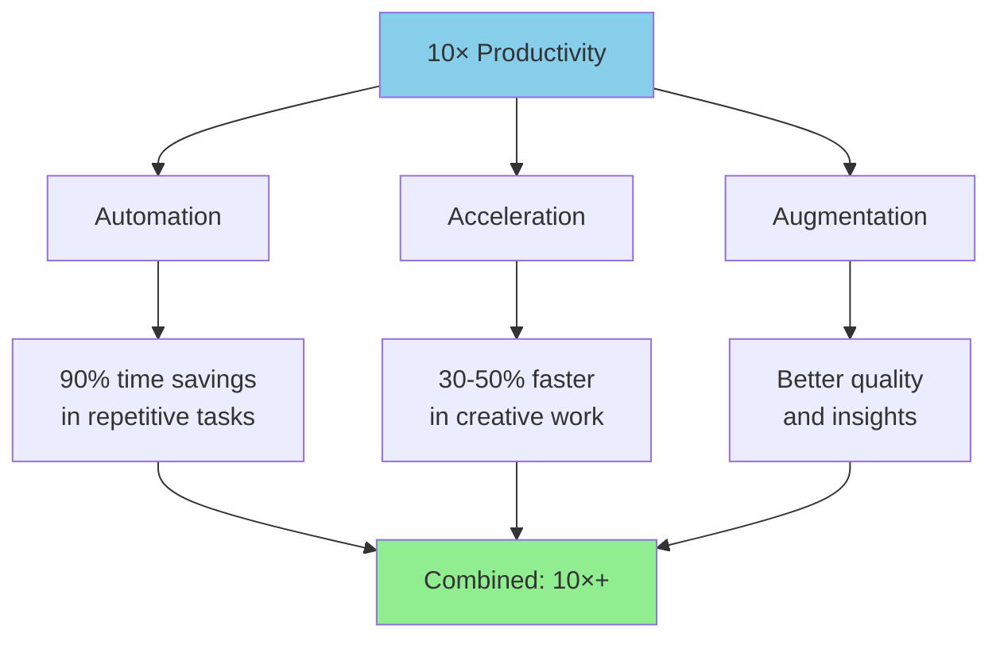

# Why 10× Productivity?

**Title:** Why 10× Productivity?  
**Audience:** All (Engineering, QA, Product, HR, Finance, Sales, Support, Leadership)  
**Duration:** 45-60 minutes  
**Prerequisites:** `00_introduction_to_ai_and_agentic_ai/00_what_is_ai.md` (recommended)

---

## Learning Objectives

By the end of this lesson, you will be able to:

- Understand what "10× productivity" means and why it's achievable with AI
- Recognize productivity multipliers from AI tools and automation
- Identify opportunities for 10× productivity gains in your role
- Evaluate productivity improvements using metrics and ROI
- Apply 10× productivity framework to Greenshades workflows

---

## Core Content

### What is 10× Productivity?

**10× Productivity** means accomplishing 10 times more work in the same amount of time, or the same amount of work in 1/10th the time. With AI, this is achievable through automation, acceleration, and augmentation.

**Key Concepts:**
- **Automation:** AI handles repetitive tasks (90% time savings)
- **Acceleration:** AI speeds up work (30-50% faster)
- **Augmentation:** AI enhances human capabilities (better quality, insights)

**Example:**
- **Before AI:** Developer writes 100 lines of code in 4 hours
- **With AI:** Developer writes 100 lines of code in 24 minutes (10× faster)
- **Or:** Developer writes 1,000 lines of code in 4 hours (10× output)

---

### Why 10× is Achievable with AI

**Traditional Productivity Improvements:**
- Better tools: 10-20% improvement
- Process optimization: 20-30% improvement
- Training: 15-25% improvement
- **Total:** 50-75% improvement (1.5-1.75×)

**AI Productivity Improvements:**
- Code generation: 30-50% faster development
- Test automation: 70-90% time savings
- Document processing: 80-90% time savings
- Monitoring automation: 90-95% time savings
- **Combined:** 10×+ productivity in automated workflows

**Why AI is Different:**
- AI doesn't just speed up work—it automates entire workflows
- AI handles tasks humans can't do at scale (pattern recognition, data analysis)
- AI works 24/7 without breaks
- AI improves over time (learning from feedback)

---

### Productivity Multipliers



**1. Automation (90% time savings)**
- **What:** AI handles repetitive, rule-based tasks
- **Examples:** Test case generation, document processing, data entry
- **Impact:** 90% reduction in manual work

**2. Acceleration (30-50% faster)**
- **What:** AI speeds up creative and analytical work
- **Examples:** Code generation, writing, analysis
- **Impact:** 30-50% faster completion

**3. Augmentation (Better quality)**
- **What:** AI enhances human capabilities
- **Examples:** Better insights, fewer errors, improved decisions
- **Impact:** Higher quality output, fewer corrections

**Combined Effect:** 10×+ productivity in optimized workflows

---

### Real-World Examples

#### Example 1: Software Development

**Before AI:**
- Write code: 4 hours
- Write tests: 2 hours
- Debug: 1 hour
- **Total:** 7 hours for one feature

**With AI (10×):**
- AI generates code: 24 minutes (10× faster)
- AI generates tests: 12 minutes (10× faster)
- AI-assisted debugging: 6 minutes (10× faster)
- **Total:** 42 minutes for one feature (10× faster)

**Or:** Complete 10 features in 7 hours (10× output)

---

#### Example 2: Test Case Generation

**Before AI:**
- Write test cases: 8 hours for 100 test cases
- Execute tests: 2 hours
- **Total:** 10 hours

**With AI (10×):**
- AI generates test cases: 48 minutes (10× faster)
- AI executes tests: 12 minutes (10× faster)
- **Total:** 1 hour (10× faster)

**Or:** Generate 1,000 test cases in 10 hours (10× output)

---

#### Example 3: Document Processing

**Before AI:**
- Process 100 documents: 20 hours (manual data entry)
- **Rate:** 5 documents/hour

**With AI (10×):**
- Process 100 documents: 2 hours (AI extraction + review)
- **Rate:** 50 documents/hour (10× faster)

**Or:** Process 1,000 documents in 20 hours (10× output)

---

### 10× Productivity Framework

**Framework Components:**

1. **Identify High-Value, Repetitive Tasks**
   - Tasks done frequently
   - Tasks that take significant time
   - Tasks with clear patterns/rules

2. **Automate with AI**
   - Use AI tools to automate tasks
   - Start with highest-value tasks first
   - Measure time savings

3. **Accelerate Creative Work**
   - Use AI to speed up writing, coding, analysis
   - Focus on tasks where AI provides 30-50% speedup

4. **Augment with Insights**
   - Use AI for better analysis and recommendations
   - Improve quality and reduce errors

5. **Measure and Optimize**
   - Track productivity metrics
   - Identify additional opportunities
   - Continuously improve

---

### Greenshades 10× Opportunities

#### Engineering
- **Code Generation:** 30-50% faster development (GitHub Copilot, Cursor)
- **Test Automation:** 70-90% time savings (AI-generated tests)
- **Documentation:** 80% faster (AI-generated docs)
- **Combined:** 10× productivity in development workflows

#### QA
- **Test Generation:** 70% faster test case creation
- **Test Execution:** 90% automation (agents run tests)
- **Bug Analysis:** 50% faster root cause analysis
- **Combined:** 10× productivity in testing workflows

#### Support
- **Chatbot:** 60% of inquiries handled automatically
- **Ticket Routing:** 80% faster routing
- **Knowledge Base:** 70% faster information retrieval
- **Combined:** 10× productivity in support workflows

#### Product
- **Documentation:** 80% faster generation
- **Analysis:** 50% faster data analysis
- **Specifications:** 60% faster spec writing
- **Combined:** 10× productivity in product workflows

---

### Measuring 10× Productivity

**Metrics to Track:**

1. **Time Savings**
   - Hours saved per week/month
   - Percentage reduction in task time
   - Tasks completed per hour

2. **Output Increase**
   - Features delivered per week
   - Test cases generated per day
   - Documents processed per hour

3. **Quality Improvements**
   - Error reduction percentage
   - Accuracy improvements
   - Customer satisfaction scores

4. **ROI**
   - Cost savings (labor costs)
   - Revenue impact (faster delivery)
   - Competitive advantage

**Example Calculation:**
```
Before AI:
- Features per week: 2
- Hours per feature: 20
- Total hours: 40/week

With AI (10×):
- Features per week: 20 (10× output)
- Hours per feature: 2 (10× faster)
- Total hours: 40/week (same time, 10× output)
```

---

## Try It: Exercise

**Scenario:** You want to achieve 10× productivity in your daily work.

**Task:** Identify 3 tasks where you can achieve 10× productivity with AI. For each task:
1. Current time spent
2. AI approach (automation, acceleration, augmentation)
3. Expected time savings
4. 10× calculation

**Solution (Example for Developer):**
1. **Writing Test Cases**
   - Current: 8 hours/week
   - AI: AI generates tests from specifications (automation)
   - Savings: 90% (7.2 hours saved)
   - 10×: Generate 10× more tests in same time, or same tests in 1/10th time

2. **Code Generation**
   - Current: 20 hours/week
   - AI: GitHub Copilot accelerates coding (acceleration)
   - Savings: 40% (8 hours saved)
   - 10×: Write 10× more code in same time with AI assistance

3. **Documentation**
   - Current: 4 hours/week
   - AI: AI generates documentation from code (automation)
   - Savings: 80% (3.2 hours saved)
   - 10×: Generate 10× more documentation in same time

---

## Role-Based "How This Helps You"

### Developers
- **10× Code Generation:** Write 10× more code with AI assistance
- **10× Test Automation:** Generate and run 10× more tests
- **Focus on Architecture:** Spend time on design, not boilerplate

### QA Engineers
- **10× Test Generation:** Create 10× more test cases
- **10× Test Execution:** Run 10× more tests automatically
- **Better Coverage:** Achieve higher test coverage with less effort

### Product Managers
- **10× Feature Delivery:** Deliver features 10× faster
- **10× Analysis:** Analyze 10× more data for insights
- **Better Decisions:** AI provides better insights for decisions

### Support Staff
- **10× Inquiry Handling:** Handle 10× more inquiries with AI
- **10× Faster Resolution:** Resolve issues 10× faster
- **Better Experience:** AI provides 24/7 support

### Leadership
- **10× ROI:** Achieve 10× return on AI investments
- **Competitive Advantage:** Faster delivery, better quality
- **Cost Efficiency:** Reduce operational costs through automation

---

## Key Takeaways

1. **10× Productivity:** 10 times more work in same time, or same work in 1/10th time

2. **Achievable with AI:** Through automation (90% savings), acceleration (30-50% faster), augmentation (better quality)

3. **Productivity Multipliers:** Automation, acceleration, augmentation combine for 10×+ gains

4. **Real-World Examples:** Code generation, test automation, document processing all achieve 10×

5. **Framework:** Identify high-value tasks → Automate → Accelerate → Augment → Measure

6. **Greenshades Opportunities:** Engineering, QA, Support, Product all have 10× opportunities

7. **Measurement:** Track time savings, output increase, quality improvements, ROI

---

## 5-Question Quiz

### Question 1 (Multiple Choice)
What does "10× productivity" mean?

a) 10 times more work in the same time  
b) Same work in 1/10th the time  
c) Both a and b  
d) None of the above

**Answer:** c) Both a and b

---

### Question 2 (True/False)
AI achieves 10× productivity through automation, acceleration, and augmentation.

**Answer:** True

---

### Question 3 (Short Answer)
Name one productivity multiplier that AI provides.

**Answer:** Automation (90% time savings), Acceleration (30-50% faster), or Augmentation (better quality). (Accept any one)

---

### Question 4 (Multiple Choice)
What is the expected time savings from AI test automation?

a) 20-30%  
b) 40-60%  
c) 70-90%  
d) 100%

**Answer:** c) 70-90%

---

### Question 5 (Short Answer)
Give one example of how you could achieve 10× productivity in your role.

**Answer:** Examples: Generate 10× more test cases with AI, write 10× more code with Copilot, process 10× more documents with AI extraction. (Accept any realistic example)

---

## One-Page Cheat Sheet

### 10× Productivity Definition
- **Meaning:** 10 times more work in same time, or same work in 1/10th time
- **Achievable:** Yes, with AI automation, acceleration, augmentation

### Productivity Multipliers
- **Automation:** 90% time savings in repetitive tasks
- **Acceleration:** 30-50% faster in creative work
- **Augmentation:** Better quality and insights
- **Combined:** 10×+ productivity in optimized workflows

### Real-World Examples
- **Code Generation:** 10× faster (4 hours → 24 minutes)
- **Test Automation:** 10× faster (10 hours → 1 hour)
- **Document Processing:** 10× faster (20 hours → 2 hours)

### 10× Framework
1. Identify high-value, repetitive tasks
2. Automate with AI
3. Accelerate creative work
4. Augment with insights
5. Measure and optimize

### Greenshades Opportunities
- **Engineering:** Code generation, test automation, documentation
- **QA:** Test generation, execution, bug analysis
- **Support:** Chatbot, ticket routing, knowledge base
- **Product:** Documentation, analysis, specifications

### Measurement
- Time savings, output increase, quality improvements, ROI

---

## Phrases & Prompts That Work

**When discussing 10× productivity:**
- "10× means 10 times more work in the same time, or same work in 1/10th time."
- "AI achieves 10× through automation (90% savings), acceleration (30-50% faster), augmentation (better quality)."

**When identifying opportunities:**
- "Focus on high-value, repetitive tasks for automation."
- "Measure time savings and output increase to track 10× progress."

**When measuring success:**
- "Track metrics: time savings, output increase, quality improvements, ROI."
- "10× productivity is achievable when automation, acceleration, and augmentation combine."

---

## Security & Compliance Note

⚠️ **Red Flags Checklist:**
- [ ] 10× productivity doesn't mean sacrificing quality—verify AI outputs
- [ ] Security and compliance must be maintained at 10× scale
- [ ] Measure quality alongside productivity (error rates, accuracy)
- [ ] Ensure AI tools are used responsibly and ethically

**Reference:** See `04_ai_ethics_and_security_basics/` for detailed security guidelines.

---

**Next Lesson:** `01_productivity_metrics_and_kpis.md`

