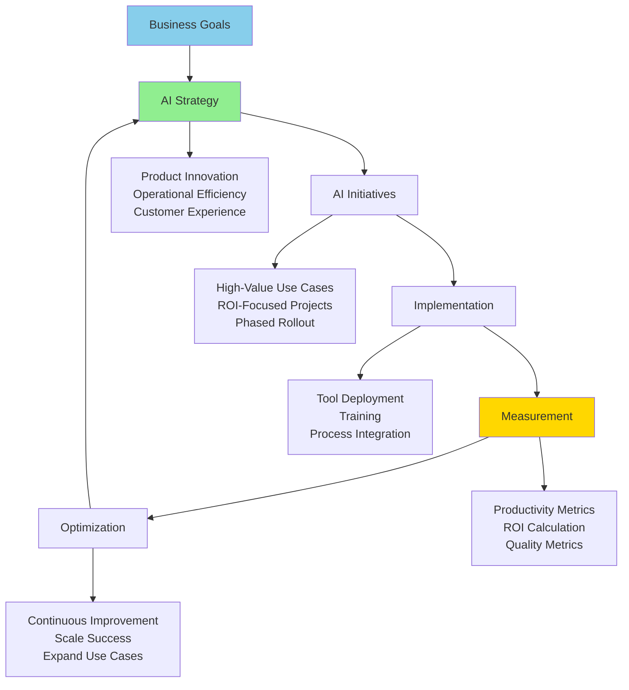

# AI as Business Strategy

**Title:** AI as Business Strategy  
**Audience:** Leadership, Product, Department Managers  
**Duration:** 60-90 minutes  
**Prerequisites:** `00_introduction_to_ai_and_agentic_ai/00_what_is_ai.md`, `05_productivity_10x_framework/00_why_10x_productivity.md` (recommended)

---

## Learning Objectives

By the end of this lesson, you will be able to:

- Understand AI as a strategic business imperative
- Recognize AI's role in competitive advantage
- Develop AI strategy aligned with business goals
- Evaluate AI investment priorities
- Communicate AI strategy to stakeholders

---

## Core Content

### Why AI is a Business Strategy

**AI is Not Just a Technology—It's a Strategic Business Imperative**

**Strategic Reasons:**
1. **Competitive Advantage:** AI enables faster innovation, better products, superior customer experience
2. **Cost Efficiency:** 10× productivity gains reduce operational costs
3. **Market Differentiation:** AI-powered features differentiate products
4. **Risk Mitigation:** AI improves quality, reduces errors, ensures compliance
5. **Future Readiness:** AI is the future—companies that don't adopt will fall behind

**Business Impact:**
- **Revenue:** AI features drive customer acquisition and retention
- **Costs:** 20-40% reduction in operational costs
- **Quality:** 50-80% reduction in errors
- **Speed:** 25-40% faster time-to-market

---

### AI Strategy Framework



---

### Aligning AI Strategy with Business Goals

#### Business Goal 1: Increase Revenue
**AI Strategy:**
- AI-powered features that attract customers
- Predictive analytics for sales optimization
- Personalized customer experiences

**Example:**
- AI chatbot improves customer satisfaction → higher retention
- AI recommendations increase upsell/cross-sell → higher revenue
- AI analytics optimize pricing → maximize revenue

---

#### Business Goal 2: Reduce Costs
**AI Strategy:**
- Automate repetitive tasks (90% time savings)
- Optimize operations (20-40% cost reduction)
- Reduce errors (50-80% error reduction)

**Example:**
- Payroll automation: $50K/year savings
- Support automation: $60K/year savings
- Development acceleration: $400K/year savings

---

#### Business Goal 3: Improve Quality
**AI Strategy:**
- AI-powered quality assurance
- Predictive maintenance
- Error detection and prevention

**Example:**
- Anomaly detection: 95% accuracy vs. 80% manual
- Test automation: 85% coverage vs. 60% manual
- Error reduction: 70% fewer production bugs

---

#### Business Goal 4: Accelerate Innovation
**AI Strategy:**
- Faster development cycles (30-50% faster)
- Rapid prototyping with AI
- AI-powered research and analysis

**Example:**
- Feature delivery: 50% faster (spec to production)
- Prototyping: 70% faster with AI
- Research: 50% faster analysis and insights

---

### AI Investment Priorities

#### Priority 1: High-Value, Low-Risk Use Cases
**Criteria:**
- Clear business value
- Measurable ROI
- Low implementation risk
- Quick time-to-value

**Examples:**
- Code generation (Engineering)
- Test automation (QA)
- Anomaly detection (Payroll)
- Chatbot (Support)

**Expected ROI:** 300-1,200%

---

#### Priority 2: Strategic Differentiators
**Criteria:**
- Competitive advantage
- Market differentiation
- Customer value
- Long-term impact

**Examples:**
- AI-powered payroll features
- Predictive analytics
- Intelligent automation
- Personalized experiences

**Expected ROI:** 200-500% (plus competitive advantage)

---

#### Priority 3: Foundation and Infrastructure
**Criteria:**
- Enables other initiatives
- Scalable platform
- Long-term value
- Strategic importance

**Examples:**
- MCP infrastructure
- AI governance framework
- Training and enablement
- Tool standardization

**Expected ROI:** Enables 10× productivity gains

---

### AI Strategy Communication

#### Executive Summary Template
```
AI Strategy for Greenshades

Vision: Leverage AI to achieve 10× productivity, enhance product quality, 
and create exceptional customer experiences.

Goals:
- 10× productivity in automated workflows
- 3-5× ROI on AI investments
- Industry leadership in AI-powered payroll solutions

Key Initiatives:
1. Code generation and test automation (Engineering)
2. Payroll anomaly detection (Payroll)
3. Support chatbot (Support)
4. MCP infrastructure (Platform)

Investment: $500K/year
Expected ROI: 500%+ (3-year)
Timeline: 24-month phased rollout
```

---

#### Stakeholder Communication

**For Board/Executives:**
- Strategic value and competitive advantage
- ROI and business impact
- Risk mitigation and governance
- Timeline and milestones

**For Department Heads:**
- Department-specific benefits
- Productivity gains and cost savings
- Implementation timeline
- Resource requirements

**For Teams:**
- How AI helps daily work
- Training and support
- Tools and resources
- Success stories and examples

---

## Try It: Exercise

**Scenario:** You're developing AI strategy for your department.

**Task:** Create an AI strategy document. Include:
1. Business goals alignment
2. Key initiatives (3-5)
3. Investment and ROI
4. Timeline and milestones
5. Success metrics

**Solution (Example for Engineering):**
```
AI Strategy: Engineering Department

1. Business Goals Alignment:
   - Increase development velocity (50% faster)
   - Reduce costs (30% reduction in development time)
   - Improve quality (40% reduction in bugs)
   - Accelerate innovation (faster feature delivery)

2. Key Initiatives:
   - Code generation (GitHub Copilot/Cursor)
   - Test automation (AI test generators)
   - Spec-driven development (SpecKit)
   - Documentation automation

3. Investment and ROI:
   - Investment: $150K/year (tools, training, infrastructure)
   - Expected ROI: 1,200% ($1.8M productivity gains)
   - Payback: 3 months

4. Timeline:
   - Q1: Tool deployment and training
   - Q2: Spec-driven development adoption
   - Q3: Test automation deployment
   - Q4: Full productivity gains

5. Success Metrics:
   - Development velocity: 50% faster
   - Code quality: 40% fewer bugs
   - Test coverage: 85%+
   - ROI: 1,200%+
```

---

## Role-Based "How This Helps You"

### Leadership
- **Strategic Planning:** Develop AI strategy aligned with business goals
- **Investment Decisions:** Evaluate AI investments and ROI
- **Risk Management:** Identify and mitigate AI risks
- **Communication:** Communicate AI strategy to stakeholders

### Product Managers
- **Feature Planning:** Plan AI features that drive business value
- **ROI Analysis:** Calculate and communicate AI ROI
- **Roadmap:** Integrate AI into product roadmap
- **Metrics:** Track AI feature success

### Department Managers
- **Department Strategy:** Develop department-specific AI strategy
- **Resource Planning:** Plan AI adoption resources
- **Team Enablement:** Enable teams with AI tools and training
- **Success Measurement:** Track department AI success

---

## Key Takeaways

1. **AI as Strategy:** Not just technology—strategic business imperative

2. **Business Alignment:** Align AI strategy with business goals (revenue, costs, quality, innovation)

3. **Investment Priorities:** High-value/low-risk → Strategic differentiators → Foundation

4. **Communication:** Tailor message to audience (executives, departments, teams)

5. **Measurement:** Track ROI, productivity, quality, business impact

---

## 5-Question Quiz

### Question 1 (Multiple Choice)
Why is AI a business strategy, not just a technology?

a) It's expensive  
b) It provides competitive advantage, cost efficiency, market differentiation  
c) It's new  
d) None of the above

**Answer:** b) It provides competitive advantage, cost efficiency, market differentiation

---

### Question 2 (True/False)
AI strategy should be aligned with business goals like revenue, costs, quality, and innovation.

**Answer:** True

---

### Question 3 (Short Answer)
Name one AI investment priority.

**Answer:** Examples: High-value/low-risk use cases, strategic differentiators, foundation and infrastructure. (Accept any one)

---

### Question 4 (Multiple Choice)
What is the expected ROI range for high-value, low-risk AI use cases?

a) 50-100%  
b) 100-200%  
c) 300-1,200%  
d) 1,200%+

**Answer:** c) 300-1,200%

---

### Question 5 (Short Answer)
Give one example of how AI strategy aligns with a business goal.

**Answer:** Examples: Revenue → AI features attract customers; Costs → Automation reduces operational costs; Quality → AI improves accuracy; Innovation → Faster development cycles. (Accept any one)

---

## One-Page Cheat Sheet

### AI as Business Strategy
- **Strategic Imperative:** Competitive advantage, cost efficiency, differentiation
- **Business Impact:** Revenue, costs, quality, speed

### Strategy Framework
- Business Goals → AI Strategy → Initiatives → Implementation → Measurement → Optimization

### Business Goal Alignment
- **Revenue:** AI features, predictive analytics, personalization
- **Costs:** Automation, optimization, error reduction
- **Quality:** QA, predictive maintenance, error detection
- **Innovation:** Faster cycles, rapid prototyping, research

### Investment Priorities
1. High-value, low-risk (300-1,200% ROI)
2. Strategic differentiators (200-500% ROI + competitive advantage)
3. Foundation and infrastructure (enables 10× productivity)

### Communication
- **Executives:** Strategic value, ROI, risk, timeline
- **Departments:** Benefits, gains, timeline, resources
- **Teams:** Daily work help, training, tools, examples

### Measurement
- ROI, productivity, quality, business impact

---

## Phrases & Prompts That Work

**When discussing AI strategy:**
- "AI is a strategic business imperative—not just a technology."
- "Align AI strategy with business goals: revenue, costs, quality, innovation."

**When prioritizing:**
- "Start with high-value, low-risk use cases for quick wins."
- "Invest in foundation and infrastructure to enable 10× productivity."

**When communicating:**
- "Tailor message to audience—executives need strategy, teams need tools."
- "Show ROI and business impact—numbers tell the story."

---

## Security & Compliance Note

⚠️ **Red Flags Checklist:**
- [ ] AI strategy must include security and compliance requirements
- [ ] Risk management is part of AI strategy
- [ ] Governance framework required for AI initiatives
- [ ] All AI investments must meet security and compliance standards

**Reference:** See `04_ai_ethics_and_security_basics/` for detailed security guidelines.

---

**Next Lesson:** `01_ai_maturity_model.md`

