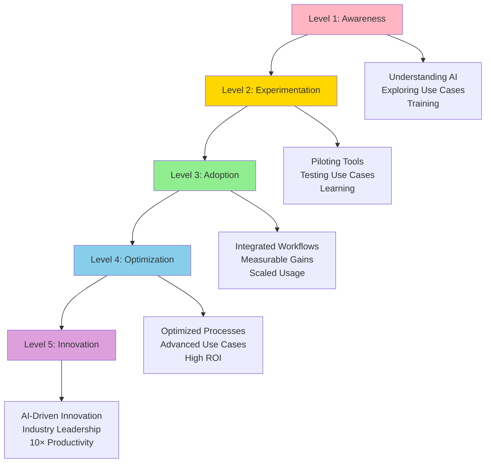

# AI Maturity Model

**Title:** AI Maturity Model  
**Audience:** Leadership, Product, Department Managers  
**Duration:** 45-60 minutes  
**Prerequisites:** `08_ai_leadership_and_strategy/00_ai_as_business_strategy.md` (recommended)

---

## Learning Objectives

By the end of this lesson, you will be able to:

- Understand the AI maturity model and its levels
- Assess your organization's current AI maturity
- Identify gaps and improvement opportunities
- Plan progression to higher maturity levels
- Measure AI maturity progress

---

## Core Content

### AI Maturity Model Overview

**Five Levels of AI Maturity:**
1. **Level 1: Awareness** - Understanding AI, exploring possibilities
2. **Level 2: Experimentation** - Piloting AI tools and use cases
3. **Level 3: Adoption** - AI integrated into workflows, measurable gains
4. **Level 4: Optimization** - AI optimized, advanced use cases, high ROI
5. **Level 5: Innovation** - AI-driven innovation, industry leadership



---

### Level 1: Awareness

**Characteristics:**
- Understanding what AI is and its potential
- Exploring AI use cases and opportunities
- Training team on AI fundamentals
- No active AI usage in production

**Key Activities:**
- Complete AI training curriculum
- Research AI tools and vendors
- Identify potential use cases
- Build AI knowledge and awareness

**Metrics:**
- Training completion: 80%+ of team
- Use case identification: 10+ potential use cases
- Tool evaluation: 3+ tools evaluated

**Greenshades Status:** ✅ Complete (this curriculum)

---

### Level 2: Experimentation

**Characteristics:**
- Piloting AI tools in limited scope
- Testing AI use cases
- Learning from experiments
- Some successful pilots, some failures

**Key Activities:**
- Deploy AI tools to pilot teams
- Run proof-of-concept projects
- Measure pilot results
- Learn and iterate

**Metrics:**
- Pilot projects: 3-5 active pilots
- Tool adoption: 20-40% of team using tools
- Success rate: 60%+ of pilots successful

**Greenshades Status:** 🔄 In Progress (Q1 2025)

---

### Level 3: Adoption

**Characteristics:**
- AI integrated into daily workflows
- Measurable productivity gains
- Scaled usage across teams
- Established processes and governance

**Key Activities:**
- Scale successful pilots
- Integrate AI into workflows
- Establish governance and processes
- Measure and track ROI

**Metrics:**
- Tool adoption: 80%+ of team using tools
- Productivity gains: 30-50% improvement
- ROI: 300%+ demonstrated
- Process integration: AI in daily workflows

**Greenshades Target:** Q2-Q3 2025

---

### Level 4: Optimization

**Characteristics:**
- AI processes optimized for maximum value
- Advanced use cases deployed
- High ROI across initiatives
- Continuous improvement culture

**Key Activities:**
- Optimize AI processes and workflows
- Deploy advanced use cases (agentic AI)
- Maximize ROI and productivity
- Continuous improvement and innovation

**Metrics:**
- Productivity: 10× in automated workflows
- ROI: 500%+ across initiatives
- Advanced use cases: 5+ agentic systems
- Optimization: Continuous improvement

**Greenshades Target:** Q4 2025 - Q1 2026

---

### Level 5: Innovation

**Characteristics:**
- AI-driven innovation and new business models
- Industry leadership in AI capabilities
- 10× productivity achieved
- AI as core competitive advantage

**Key Activities:**
- Innovate with AI (new products, services)
- Lead industry in AI capabilities
- Achieve 10× productivity goals
- AI as strategic differentiator

**Metrics:**
- Innovation: AI-driven new products/services
- Leadership: Industry recognition
- Productivity: 10× achieved
- Competitive advantage: AI differentiates products

**Greenshades Vision:** 2026+

---

### Maturity Assessment

#### Assessment Dimensions

**1. Technology**
- Level 1: Understanding AI tools
- Level 2: Piloting tools
- Level 3: Tools integrated
- Level 4: Tools optimized
- Level 5: Cutting-edge tools

**2. People**
- Level 1: AI awareness and training
- Level 2: Some team members using AI
- Level 3: Most team members using AI
- Level 4: AI expertise across team
- Level 5: AI innovation culture

**3. Process**
- Level 1: Exploring use cases
- Level 2: Piloting processes
- Level 3: Processes integrated
- Level 4: Processes optimized
- Level 5: AI-driven processes

**4. Governance**
- Level 1: Basic policies
- Level 2: Pilot governance
- Level 3: Governance framework
- Level 4: Optimized governance
- Level 5: Industry-leading governance

**5. Business Impact**
- Level 1: No measurable impact
- Level 2: Pilot results
- Level 3: Measurable ROI
- Level 4: High ROI (500%+)
- Level 5: Strategic competitive advantage

---

### Progression Roadmap

#### From Level 1 to Level 2
**Timeline:** 3-6 months  
**Key Activities:**
- Complete training
- Identify pilot use cases
- Deploy tools to pilot teams
- Run proof-of-concept projects

**Success Criteria:**
- 3-5 successful pilots
- 20-40% tool adoption
- Measurable pilot results

---

#### From Level 2 to Level 3
**Timeline:** 6-12 months  
**Key Activities:**
- Scale successful pilots
- Integrate AI into workflows
- Establish governance
- Measure ROI

**Success Criteria:**
- 80%+ tool adoption
- 30-50% productivity gains
- 300%+ ROI
- Governance framework in place

---

#### From Level 3 to Level 4
**Timeline:** 12-18 months  
**Key Activities:**
- Optimize AI processes
- Deploy advanced use cases
- Maximize ROI
- Continuous improvement

**Success Criteria:**
- 10× productivity in automated workflows
- 500%+ ROI
- 5+ advanced use cases
- Optimization culture

---

#### From Level 4 to Level 5
**Timeline:** 18-24 months  
**Key Activities:**
- AI-driven innovation
- Industry leadership
- Achieve 10× productivity
- AI as competitive advantage

**Success Criteria:**
- AI-driven new products/services
- Industry recognition
- 10× productivity achieved
- Strategic competitive advantage

---

## Try It: Exercise

**Scenario:** You're assessing your department's AI maturity.

**Task:** Complete a maturity assessment. Rate each dimension (1-5) and identify:
1. Current maturity level
2. Gaps and improvement opportunities
3. Progression plan to next level

**Solution (Example for Engineering):**
```
AI Maturity Assessment: Engineering Department

Dimensions:
- Technology: 3 (Tools integrated, Copilot/Cursor in use)
- People: 3 (80% using AI tools, trained)
- Process: 2 (Some processes integrated, not all)
- Governance: 3 (Governance framework in place)
- Business Impact: 3 (Measurable ROI, 40% productivity gain)

Current Level: Level 3 (Adoption)

Gaps:
- Process: Not all workflows integrated
- Optimization: Can improve further

Improvement Opportunities:
- Integrate AI into all development workflows
- Optimize AI usage for maximum productivity
- Deploy advanced use cases (spec-driven dev)

Progression Plan to Level 4:
- Timeline: 6-12 months
- Activities: Optimize processes, deploy advanced use cases
- Success Criteria: 10× productivity, 500%+ ROI, 5+ advanced use cases
```

---

## Key Takeaways

1. **Five Maturity Levels:** Awareness → Experimentation → Adoption → Optimization → Innovation

2. **Assessment Dimensions:** Technology, People, Process, Governance, Business Impact

3. **Current Status:** Level 1 (Awareness) complete, Level 2 (Experimentation) in progress

4. **Progression:** 3-6 months per level, with clear success criteria

5. **Vision:** Level 5 (Innovation) by 2026+ with 10× productivity and industry leadership

---

## 5-Question Quiz

### Question 1 (Multiple Choice)
What is the highest level of AI maturity?

a) Level 3: Adoption  
b) Level 4: Optimization  
c) Level 5: Innovation  
d) None of the above

**Answer:** c) Level 5: Innovation

---

### Question 2 (True/False)
Level 3 (Adoption) is characterized by AI integrated into daily workflows with measurable productivity gains.

**Answer:** True

---

### Question 3 (Short Answer)
Name one dimension of AI maturity assessment.

**Answer:** Examples: Technology, People, Process, Governance, Business Impact. (Accept any one)

---

### Question 4 (Multiple Choice)
What level is characterized by 10× productivity in automated workflows?

a) Level 2  
b) Level 3  
c) Level 4  
d) Level 5

**Answer:** c) Level 4 (Optimization)

---

### Question 5 (Short Answer)
Give one example of a key activity for progressing from Level 2 to Level 3.

**Answer:** Examples: Scale successful pilots, integrate AI into workflows, establish governance, measure ROI. (Accept any one)

---

## One-Page Cheat Sheet

### AI Maturity Levels
1. **Awareness:** Understanding AI, exploring use cases
2. **Experimentation:** Piloting tools, testing use cases
3. **Adoption:** Integrated workflows, measurable gains
4. **Optimization:** Optimized processes, high ROI
5. **Innovation:** AI-driven innovation, industry leadership

### Assessment Dimensions
- Technology, People, Process, Governance, Business Impact

### Level Characteristics
- **Level 1:** Training, exploration
- **Level 2:** Pilots, learning
- **Level 3:** Integration, ROI
- **Level 4:** Optimization, 10× productivity
- **Level 5:** Innovation, leadership

### Progression Timeline
- Level 1→2: 3-6 months
- Level 2→3: 6-12 months
- Level 3→4: 12-18 months
- Level 4→5: 18-24 months

### Success Criteria
- **Level 2:** 3-5 pilots, 20-40% adoption
- **Level 3:** 80%+ adoption, 300%+ ROI
- **Level 4:** 10× productivity, 500%+ ROI
- **Level 5:** Innovation, industry leadership

---

## Phrases & Prompts That Work

**When assessing maturity:**
- "Assess across five dimensions: technology, people, process, governance, business impact."
- "Identify current level and gaps to plan progression."

**When planning progression:**
- "Follow progression roadmap—3-6 months per level with clear success criteria."
- "Focus on gaps to advance to next level."

**When communicating:**
- "We're at Level 2 (Experimentation), targeting Level 3 (Adoption) in 6-12 months."
- "Level 5 (Innovation) is our vision—AI-driven competitive advantage."

---

## Security & Compliance Note

⚠️ **Red Flags Checklist:**
- [ ] Governance maturity is critical—ensure security and compliance at all levels
- [ ] Higher maturity levels require stronger governance frameworks
- [ ] Risk management increases with AI maturity
- [ ] Regular maturity assessments help identify governance gaps

**Reference:** See `04_ai_ethics_and_security_basics/` for detailed security guidelines.

---

**Next Lesson:** `02_investment_vs_impact_matrix.md`

