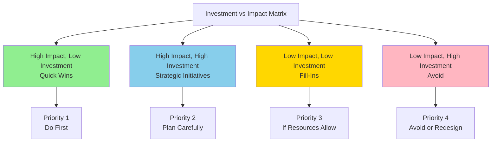

# Investment vs. Impact Matrix

**Title:** Investment vs. Impact Matrix for AI Initiatives  
**Audience:** Leadership, Product, Department Managers  
**Duration:** 45-60 minutes  
**Prerequisites:** `08_ai_leadership_and_strategy/00_ai_as_business_strategy.md` (recommended)

---

## Learning Objectives

By the end of this lesson, you will be able to:

- Use the Investment vs. Impact Matrix to prioritize AI initiatives
- Evaluate AI projects based on investment and impact
- Make data-driven decisions about AI investments
- Allocate resources effectively
- Balance quick wins with strategic initiatives

---

## Core Content

### Investment vs. Impact Matrix

**Framework:** Evaluate AI initiatives on two dimensions:
- **Investment:** Cost, time, resources required (Low to High)
- **Impact:** Business value, ROI, strategic importance (Low to High)



---

### Matrix Quadrants

#### Quadrant 1: Quick Wins (High Impact, Low Investment)
**Characteristics:**
- High business value
- Low cost and time
- Fast implementation
- High ROI

**Examples:**
- GitHub Copilot for developers ($200/year, 40% productivity gain)
- ChatGPT for writing/analysis (Free tier, 50% time savings)
- AI test generation (Low cost, 70% time savings)

**Strategy:** Do First
- Implement immediately
- Fast ROI
- Build momentum
- Low risk

**Expected ROI:** 500-1,200%

---

#### Quadrant 2: Strategic Initiatives (High Impact, High Investment)
**Characteristics:**
- High business value
- Significant cost and time
- Long-term impact
- Strategic importance

**Examples:**
- MCP infrastructure ($100-200K, enables agentic AI)
- AI-powered product features ($500K+, competitive advantage)
- Comprehensive AI training program ($200K+, foundation for all)

**Strategy:** Plan Carefully
- Strategic planning required
- Phased implementation
- Long-term investment
- High potential ROI

**Expected ROI:** 200-500% (plus strategic value)

---

#### Quadrant 3: Fill-Ins (Low Impact, Low Investment)
**Characteristics:**
- Moderate business value
- Low cost and time
- Nice to have
- Incremental improvements

**Examples:**
- AI-powered code formatting (Low cost, minor time savings)
- AI email summarization (Free, small time savings)
- AI meeting notes (Low cost, convenience)

**Strategy:** If Resources Allow
- Implement when resources available
- Low priority
- Incremental value
- Can defer

**Expected ROI:** 100-300%

---

#### Quadrant 4: Avoid (Low Impact, High Investment)
**Characteristics:**
- Low business value
- High cost and time
- Poor ROI
- Not strategic

**Examples:**
- Custom AI model for low-value use case ($500K+, minimal benefit)
- Over-engineered AI solution ($200K+, simple solution sufficient)
- AI for non-critical processes ($100K+, manual process adequate)

**Strategy:** Avoid or Redesign
- Don't invest
- Redesign to reduce investment or increase impact
- Reassess value proposition

**Expected ROI:** <100% (negative or minimal)

---

### Evaluating Investment

**Investment Factors:**
- **Tool Costs:** Licensing, subscriptions ($0-$50K/year)
- **Infrastructure:** Servers, storage, networking ($0-$200K)
- **Development:** Custom development, integration ($0-$500K)
- **Training:** Team training and enablement ($10K-$100K)
- **Time:** Implementation and adoption time (weeks to months)

**Investment Levels:**
- **Low:** <$50K, <3 months
- **Medium:** $50K-$200K, 3-6 months
- **High:** >$200K, >6 months

---

### Evaluating Impact

**Impact Factors:**
- **Productivity Gains:** Time savings, output increase (10-90%)
- **Cost Savings:** Operational cost reduction ($10K-$1M+/year)
- **Quality Improvements:** Error reduction, accuracy (20-80%)
- **Strategic Value:** Competitive advantage, market differentiation
- **ROI:** Return on investment (100-1,200%+)

**Impact Levels:**
- **Low:** <30% productivity, <$50K savings, <200% ROI
- **Medium:** 30-60% productivity, $50K-$200K savings, 200-500% ROI
- **High:** >60% productivity, >$200K savings, >500% ROI

---

### Prioritization Framework

**Step 1: Evaluate All Initiatives**
- List all potential AI initiatives
- Assess investment (low/medium/high)
- Assess impact (low/medium/high)
- Plot on matrix

**Step 2: Prioritize by Quadrant**
1. **Quick Wins (High Impact, Low Investment):** Do first
2. **Strategic Initiatives (High Impact, High Investment):** Plan carefully
3. **Fill-Ins (Low Impact, Low Investment):** If resources allow
4. **Avoid (Low Impact, High Investment):** Avoid or redesign

**Step 3: Allocate Resources**
- 60% resources to Quick Wins
- 30% resources to Strategic Initiatives
- 10% resources to Fill-Ins
- 0% resources to Avoid

---

### Example: Greenshades AI Initiatives

| Initiative | Investment | Impact | Quadrant | Priority | ROI |
|------------|-----------|--------|----------|---------|-----|
| **GitHub Copilot** | Low ($11K/year) | High (40% productivity) | Quick Win | 1 | 1,200% |
| **AI Chatbot** | Low ($15K/year) | High (60% automation) | Quick Win | 1 | 316% |
| **MCP Infrastructure** | High ($150K) | High (enables agents) | Strategic | 2 | 500%+ |
| **Payroll Anomaly Detection** | Medium ($35K) | High (90% time savings) | Quick Win | 1 | 312% |
| **AI Product Features** | High ($500K+) | High (competitive advantage) | Strategic | 2 | 300%+ |
| **Code Formatting AI** | Low ($5K) | Low (minor savings) | Fill-In | 3 | 150% |

**Recommended Allocation:**
- Quick Wins: GitHub Copilot, AI Chatbot, Payroll Anomaly Detection
- Strategic: MCP Infrastructure, AI Product Features
- Fill-Ins: Code Formatting AI (if resources allow)

---

## Try It: Exercise

**Scenario:** You're prioritizing AI initiatives for your department.

**Task:** Evaluate 5 AI initiatives using the Investment vs. Impact Matrix. For each:
1. Assess investment (low/medium/high)
2. Assess impact (low/medium/high)
3. Identify quadrant
4. Recommend priority

**Solution (Example):**
```
AI Initiative Prioritization:

1. Code Generation (GitHub Copilot)
   - Investment: Low ($11K/year, 1 month setup)
   - Impact: High (40% productivity, $400K savings)
   - Quadrant: Quick Win
   - Priority: 1 (Do First)

2. Test Automation
   - Investment: Medium ($25K, 3 months)
   - Impact: High (70% time savings, $200K savings)
   - Quadrant: Quick Win
   - Priority: 1 (Do First)

3. MCP Infrastructure
   - Investment: High ($150K, 6 months)
   - Impact: High (enables agents, 10× productivity)
   - Quadrant: Strategic
   - Priority: 2 (Plan Carefully)

4. AI Documentation
   - Investment: Low ($10K, 1 month)
   - Impact: Medium (80% faster, $40K savings)
   - Quadrant: Quick Win
   - Priority: 1 (Do First)

5. Custom AI Model
   - Investment: High ($500K, 12 months)
   - Impact: Low (minimal benefit, better alternatives)
   - Quadrant: Avoid
   - Priority: 4 (Avoid or Redesign)
```

---

## Key Takeaways

1. **Investment vs. Impact Matrix:** Framework for prioritizing AI initiatives

2. **Four Quadrants:** Quick Wins, Strategic Initiatives, Fill-Ins, Avoid

3. **Prioritization:** Quick Wins first, then Strategic, Fill-Ins if resources allow, Avoid low-impact/high-investment

4. **Resource Allocation:** 60% Quick Wins, 30% Strategic, 10% Fill-Ins

5. **Evaluation:** Assess investment (cost, time) and impact (value, ROI)

---

## 5-Question Quiz

### Question 1 (Multiple Choice)
Which quadrant should you prioritize first?

a) Low Impact, High Investment  
b) High Impact, Low Investment (Quick Wins)  
c) Low Impact, Low Investment  
d) None of the above

**Answer:** b) High Impact, Low Investment (Quick Wins)

---

### Question 2 (True/False)
Strategic Initiatives (High Impact, High Investment) should be planned carefully and implemented in phases.

**Answer:** True

---

### Question 3 (Short Answer)
Name one factor for evaluating investment in AI initiatives.

**Answer:** Examples: Tool costs, infrastructure, development, training, time. (Accept any one)

---

### Question 4 (Multiple Choice)
What is the recommended resource allocation for Quick Wins?

a) 30%  
b) 50%  
c) 60%  
d) 80%

**Answer:** c) 60%

---

### Question 5 (Short Answer)
Give one example of a Quick Win AI initiative.

**Answer:** Examples: GitHub Copilot, ChatGPT, AI test generation, AI chatbot. (Accept any one)

---

## One-Page Cheat Sheet

### Investment vs. Impact Matrix
- **Quick Wins (High Impact, Low Investment):** Do First, 500-1,200% ROI
- **Strategic (High Impact, High Investment):** Plan Carefully, 200-500% ROI
- **Fill-Ins (Low Impact, Low Investment):** If Resources Allow, 100-300% ROI
- **Avoid (Low Impact, High Investment):** Avoid or Redesign, <100% ROI

### Investment Factors
- Tool costs, infrastructure, development, training, time
- Levels: Low (<$50K, <3 months), Medium ($50K-$200K, 3-6 months), High (>$200K, >6 months)

### Impact Factors
- Productivity gains, cost savings, quality improvements, strategic value, ROI
- Levels: Low (<30%, <$50K, <200% ROI), Medium (30-60%, $50K-$200K, 200-500% ROI), High (>60%, >$200K, >500% ROI)

### Prioritization
1. Quick Wins (Priority 1)
2. Strategic Initiatives (Priority 2)
3. Fill-Ins (Priority 3)
4. Avoid (Priority 4)

### Resource Allocation
- 60% Quick Wins
- 30% Strategic
- 10% Fill-Ins
- 0% Avoid

---

## Phrases & Prompts That Work

**When prioritizing:**
- "Focus on Quick Wins first—high impact, low investment, fast ROI."
- "Use Investment vs. Impact Matrix to make data-driven decisions."

**When evaluating:**
- "Assess both investment (cost, time) and impact (value, ROI)."
- "Plot initiatives on matrix to visualize priorities."

**When allocating resources:**
- "Allocate 60% to Quick Wins, 30% to Strategic, 10% to Fill-Ins."
- "Avoid low-impact, high-investment initiatives—redesign or skip."

---

## Security & Compliance Note

⚠️ **Red Flags Checklist:**
- [ ] Investment evaluation should include security and compliance costs
- [ ] High-impact initiatives may require stronger governance
- [ ] Ensure all initiatives meet security and compliance requirements
- [ ] Factor security and compliance into investment assessment

**Reference:** See `04_ai_ethics_and_security_basics/` for detailed security guidelines.

---

**Next Lesson:** `03_organizational_change_management.md`

