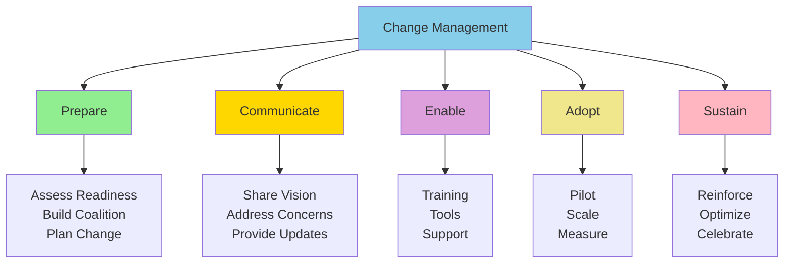

# Organizational Change Management for AI

**Title:** Organizational Change Management for AI  
**Audience:** Leadership, Department Managers, HR  
**Duration:** 60-90 minutes  
**Prerequisites:** `08_ai_leadership_and_strategy/00_ai_as_business_strategy.md` (recommended)

---

## Learning Objectives

By the end of this lesson, you will be able to:

- Understand change management principles for AI adoption
- Recognize common resistance to AI and how to address it
- Develop change management plans for AI initiatives
- Communicate AI changes effectively
- Ensure successful AI adoption across organization

---

## Core Content

### Why Change Management Matters for AI

**AI Adoption Requires Organizational Change:**
- New tools and workflows
- Different ways of working
- Skill development and training
- Process and culture changes

**Without Change Management:**
- Low adoption rates (20-30%)
- Resistance and pushback
- Failed implementations
- Wasted investments

**With Change Management:**
- High adoption rates (80-90%)
- Smooth transitions
- Successful implementations
- Maximum ROI

---

### Change Management Framework



---

### Phase 1: Prepare

**Activities:**
1. **Assess Readiness**
   - Current state assessment
   - Identify barriers and enablers
   - Evaluate change capacity

2. **Build Coalition**
   - Identify champions and advocates
   - Form change team
   - Engage leadership

3. **Plan Change**
   - Define change vision and goals
   - Develop change plan
   - Identify risks and mitigation

**Deliverables:**
- Readiness assessment
- Change team and champions
- Change plan and timeline

---

### Phase 2: Communicate

**Activities:**
1. **Share Vision**
   - Communicate AI strategy and benefits
   - Explain "why" and "what's in it for me"
   - Address concerns and questions

2. **Address Concerns**
   - Listen to feedback
   - Address fears (job loss, complexity)
   - Provide reassurance

3. **Provide Updates**
   - Regular communication
   - Progress updates
   - Success stories

**Communication Channels:**
- All-hands meetings
- Department meetings
- Newsletters and emails
- Internal wiki and documentation
- Office hours and Q&A sessions

---

### Phase 3: Enable

**Activities:**
1. **Training**
   - Comprehensive training program (this curriculum)
   - Role-specific training
   - Hands-on workshops

2. **Tools**
   - Tool access and setup
   - Documentation and guides
   - Support resources

3. **Support**
   - Mentors and champions
   - Help desk and support
   - Community and forums

**Deliverables:**
- Trained team (80%+ completion)
- Tools deployed and accessible
- Support structure in place

---

### Phase 4: Adopt

**Activities:**
1. **Pilot**
   - Start with pilot teams
   - Test and learn
   - Gather feedback

2. **Scale**
   - Expand to more teams
   - Refine based on learnings
   - Address issues

3. **Measure**
   - Track adoption rates
   - Measure productivity gains
   - Calculate ROI

**Success Criteria:**
- 80%+ adoption rate
- 30-50% productivity gains
- 300%+ ROI
- High satisfaction scores

---

### Phase 5: Sustain

**Activities:**
1. **Reinforce**
   - Celebrate successes
   - Share best practices
   - Recognize champions

2. **Optimize**
   - Continuous improvement
   - Process optimization
   - Tool optimization

3. **Celebrate**
   - Success stories
   - Awards and recognition
   - Team celebrations

**Deliverables:**
- Sustained adoption (90%+)
- Continuous improvement culture
- Success stories and recognition

---

### Common Resistance and Solutions

#### Resistance 1: Fear of Job Loss
**Concern:** "AI will replace my job"

**Solution:**
- Communicate: AI augments, not replaces
- Show: 10× productivity means more work, not fewer people
- Examples: Success stories of teams becoming more productive
- Reassurance: Focus on upskilling and new opportunities

---

#### Resistance 2: Complexity and Learning Curve
**Concern:** "AI is too complex, I can't learn it"

**Solution:**
- Training: Comprehensive, role-specific training
- Support: Mentors, champions, help desk
- Gradual: Start simple, build complexity
- Examples: Show others succeeding

---

#### Resistance 3: Quality Concerns
**Concern:** "AI makes mistakes, I don't trust it"

**Solution:**
- Verification: Always review AI outputs
- Examples: Show accuracy rates (95%+)
- Process: Human oversight for critical decisions
- Transparency: Explain how AI works

---

#### Resistance 4: Change Fatigue
**Concern:** "Too many changes, I'm overwhelmed"

**Solution:**
- Phased: Gradual rollout, not all at once
- Support: Extra help during transition
- Communication: Clear timeline and expectations
- Recognition: Acknowledge effort and progress

---

### Change Management Best Practices

#### 1. Start with Champions
- Identify early adopters and advocates
- Empower them to help others
- Recognize and reward champions

#### 2. Communicate Early and Often
- Start communication before deployment
- Regular updates and progress reports
- Address concerns proactively

#### 3. Provide Comprehensive Training
- Role-specific training
- Hands-on practice
- Ongoing support and resources

#### 4. Measure and Adjust
- Track adoption and metrics
- Gather feedback regularly
- Adjust approach based on results

#### 5. Celebrate Success
- Share success stories
- Recognize achievements
- Build momentum

---

## Try It: Exercise

**Scenario:** You're planning AI adoption for your team.

**Task:** Create a change management plan. Include:
1. Readiness assessment
2. Communication plan
3. Training and enablement
4. Adoption strategy
5. Success metrics

**Solution (Example):**
```
Change Management Plan: Engineering Team AI Adoption

1. Readiness Assessment:
   - Current State: 20% using AI tools informally
   - Barriers: Lack of training, tool access, time
   - Enablers: Leadership support, team interest, clear value
   - Readiness: Medium (needs training and tools)

2. Communication Plan:
   - Pre-launch: All-hands (AI strategy, benefits, timeline)
   - Launch: Department meeting (tools, training, support)
   - Ongoing: Weekly updates, success stories, Q&A
   - Channels: Meetings, email, wiki, office hours

3. Training and Enablement:
   - Week 1-2: AI fundamentals training
   - Week 3-4: Tool-specific training (Copilot, Cursor)
   - Week 5-6: Hands-on workshops
   - Ongoing: Office hours, mentors, support

4. Adoption Strategy:
   - Phase 1: Pilot with 10 developers (Month 1)
   - Phase 2: Expand to 25 developers (Month 2)
   - Phase 3: Full team (Month 3)
   - Support: Champions, mentors, help desk

5. Success Metrics:
   - Adoption: 90%+ using tools daily
   - Productivity: 40%+ improvement
   - Satisfaction: 80%+ satisfaction score
   - ROI: 1,200%+
```

---

## Key Takeaways

1. **Change Management Framework:** Prepare → Communicate → Enable → Adopt → Sustain

2. **Common Resistance:** Job loss fears, complexity concerns, quality concerns, change fatigue

3. **Solutions:** Communication, training, support, gradual rollout, examples

4. **Best Practices:** Start with champions, communicate early/often, comprehensive training, measure/adjust, celebrate success

5. **Success Criteria:** 80%+ adoption, 30-50% productivity gains, 300%+ ROI, high satisfaction

---

## 5-Question Quiz

### Question 1 (Multiple Choice)
What is the first phase of change management for AI adoption?

a) Communicate  
b) Enable  
c) Prepare  
d) Adopt

**Answer:** c) Prepare

---

### Question 2 (True/False)
Common resistance to AI includes fear of job loss, complexity concerns, and quality concerns.

**Answer:** True

---

### Question 3 (Short Answer)
Name one best practice for AI change management.

**Answer:** Examples: Start with champions, communicate early/often, comprehensive training, measure/adjust, celebrate success. (Accept any one)

---

### Question 4 (Multiple Choice)
What is the target adoption rate for successful AI implementation?

a) 50%  
b) 70%  
c) 80%+  
d) 100%

**Answer:** c) 80%+

---

### Question 5 (Short Answer)
Give one example of how to address fear of job loss when introducing AI.

**Answer:** Examples: Communicate that AI augments not replaces, show 10× productivity means more work, provide examples of teams becoming more productive, focus on upskilling. (Accept any one)

---

## One-Page Cheat Sheet

### Change Management Framework
1. **Prepare:** Assess readiness, build coalition, plan change
2. **Communicate:** Share vision, address concerns, provide updates
3. **Enable:** Training, tools, support
4. **Adopt:** Pilot, scale, measure
5. **Sustain:** Reinforce, optimize, celebrate

### Common Resistance
- Fear of job loss
- Complexity and learning curve
- Quality concerns
- Change fatigue

### Solutions
- Communication (augment not replace, examples)
- Training (comprehensive, role-specific)
- Support (mentors, champions, help desk)
- Gradual rollout (phased approach)

### Best Practices
- Start with champions
- Communicate early and often
- Comprehensive training
- Measure and adjust
- Celebrate success

### Success Criteria
- 80%+ adoption rate
- 30-50% productivity gains
- 300%+ ROI
- High satisfaction scores

---

## Phrases & Prompts That Work

**When managing change:**
- "Follow the change management framework: Prepare → Communicate → Enable → Adopt → Sustain."
- "Address resistance proactively—listen, communicate, support."

**When communicating:**
- "Communicate early and often—start before deployment, continue throughout."
- "Share vision and benefits—explain 'why' and 'what's in it for me.'"

**When enabling:**
- "Provide comprehensive training and support—make it easy to adopt."
- "Start with champions—empower them to help others."

---

## Security & Compliance Note

⚠️ **Red Flags Checklist:**
- [ ] Change management should include security and compliance training
- [ ] Ensure all team members understand security policies
- [ ] Address security concerns in change communication
- [ ] Include security and compliance in enablement phase

**Reference:** See `04_ai_ethics_and_security_basics/` for detailed security guidelines.

---

**Next Lesson:** `04_ai_talent_and_future_roles.md`

