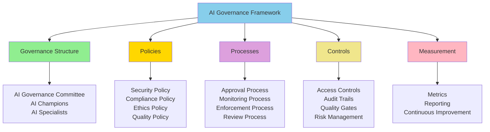

# AI Governance Framework

**Title:** AI Governance Framework  
**Audience:** Leadership, IT/Security, Compliance  
**Duration:** 60-90 minutes  
**Prerequisites:** `04_ai_ethics_and_security_basics/00_why_ai_governance_matters.md` (recommended)

---

## Learning Objectives

By the end of this lesson, you will be able to:

- Understand the AI governance framework structure
- Implement governance policies and processes
- Establish governance roles and responsibilities
- Monitor and enforce AI governance
- Ensure compliance with regulations and standards

---

## Core Content

### AI Governance Framework Overview

**AI Governance Framework** is the comprehensive structure of policies, processes, roles, and controls that ensure AI is used responsibly, securely, and in compliance.

**Framework Components:**
1. **Governance Structure:** Roles, responsibilities, committees
2. **Policies:** Security, compliance, ethics, quality
3. **Processes:** Approval, monitoring, enforcement, review
4. **Controls:** Access, audit, quality, risk management
5. **Measurement:** Metrics, reporting, continuous improvement



---

### Governance Structure

#### AI Governance Committee
**Role:** Oversight and strategic direction

**Members:**
- Executive sponsor (C-level)
- IT/Security leadership
- Compliance officer
- Department heads (Engineering, Product, etc.)
- AI specialists

**Responsibilities:**
- Set AI strategy and priorities
- Approve AI policies and standards
- Review AI investments and ROI
- Oversee AI governance compliance
- Make strategic AI decisions

**Meetings:** Quarterly (or as needed)

---

#### AI Champions
**Role:** Department-level AI advocates

**Responsibilities:**
- Promote AI adoption in departments
- Help teams with AI tools and best practices
- Share success stories and learnings
- Report issues and feedback
- Support change management

**Selection:** Early adopters, enthusiastic, helpful

**Support:** Training, resources, recognition

---

#### AI Specialists
**Role:** Technical AI expertise

**Responsibilities:**
- Provide technical AI guidance
- Review AI implementations
- Troubleshoot AI issues
- Develop AI best practices
- Train teams on AI tools

**Types:**
- AI Prompt Engineers
- AI Integration Specialists
- AI Governance Specialists

---

### Governance Policies

#### Security Policy
**Purpose:** Protect data and systems

**Key Requirements:**
- No sensitive data in external AI tools
- Encrypted data in transit and at rest
- Access controls (RBAC)
- Audit trails for all AI actions

**Reference:** `04_ai_ethics_and_security_basics/01_ai_data_security_policy.md`

---

#### Compliance Policy
**Purpose:** Meet regulatory requirements

**Key Requirements:**
- GDPR/CCPA compliance
- Payroll/tax regulations
- Audit trails (7-year retention)
- Data privacy protection

**Reference:** `04_ai_ethics_and_security_basics/06_ai_integration_with_greenshades_policy.md`

---

#### Ethics Policy
**Purpose:** Ensure fair, transparent, accountable AI

**Key Requirements:**
- Bias testing and mitigation
- Transparency in AI decisions
- Human oversight for critical decisions
- Responsible AI use

**Reference:** `04_ai_ethics_and_security_basics/04_responsible_use_guidelines.md`

---

#### Quality Policy
**Purpose:** Ensure AI outputs meet quality standards

**Key Requirements:**
- Verify all AI outputs before use
- Test AI systems thoroughly
- Monitor AI performance
- Continuous improvement

**Reference:** `05_productivity_10x_framework/01_productivity_metrics_and_kpis.md`

---

### Governance Processes

#### Approval Process
**Purpose:** Ensure AI initiatives meet governance requirements

**Steps:**
1. Submit AI initiative proposal
2. Security review (IT/Security)
3. Compliance review (Compliance)
4. Ethics review (if applicable)
5. Governance Committee approval
6. Implementation with monitoring

**Timeline:** 2-4 weeks (depending on complexity)

---

#### Monitoring Process
**Purpose:** Monitor AI usage and compliance

**Activities:**
- Track AI tool usage
- Monitor for security incidents
- Review audit trails
- Measure productivity and ROI
- Identify issues and risks

**Frequency:** Weekly monitoring, monthly reporting

---

#### Enforcement Process
**Purpose:** Ensure compliance with governance policies

**Activities:**
- Regular audits
- Policy violation detection
- Corrective actions
- Access revocation if needed
- Disciplinary action if required

**Escalation:** Violations → Department Head → Governance Committee

---

#### Review Process
**Purpose:** Continuous improvement of governance

**Activities:**
- Quarterly governance reviews
- Policy updates based on learnings
- Process optimization
- Framework improvements

**Frequency:** Quarterly reviews, annual framework update

---

### Governance Controls

#### Access Controls
- **Authentication:** SSO, MFA for AI tools
- **Authorization:** Role-based access (RBAC)
- **Approval:** Tool access requires approval
- **Review:** Quarterly access reviews

---

#### Audit Trails
- **Logging:** All AI actions logged
- **Retention:** 7 years for payroll/tax data
- **Access:** Secure, access-controlled log storage
- **Search:** Searchable audit logs

---

#### Quality Gates
- **Testing:** All AI systems tested before deployment
- **Verification:** AI outputs verified before use
- **Monitoring:** Continuous performance monitoring
- **Improvement:** Continuous optimization

---

#### Risk Management
- **Assessment:** Risk assessment for all AI initiatives
- **Mitigation:** Mitigation plans for identified risks
- **Monitoring:** Risk monitoring and alerting
- **Response:** Incident response plans

---

### Governance Metrics

#### Compliance Metrics
- Policy compliance rate: 95%+
- Security incidents: 0
- Audit trail completeness: 100%
- Access review completion: 100%

#### Adoption Metrics
- Tool adoption rate: 80%+
- Training completion: 90%+
- Usage metrics: Tracked weekly
- Satisfaction scores: 80%+

#### Quality Metrics
- AI output accuracy: 95%+
- Error rates: <5%
- False positive rates: <5%
- Quality gate pass rate: 95%+

#### Business Metrics
- Productivity gains: 30-50%+
- ROI: 300%+
- Cost savings: Tracked quarterly
- Business impact: Measured annually

---

## Try It: Exercise

**Scenario:** You're establishing AI governance for your organization.

**Task:** Design a governance framework. Include:
1. Governance structure (committee, roles)
2. Key policies (3-4)
3. Key processes (approval, monitoring, enforcement)
4. Controls (access, audit, quality, risk)
5. Metrics (compliance, adoption, quality, business)

**Solution (Example):**
```
AI Governance Framework Design:

1. Governance Structure:
   - AI Governance Committee: Executive sponsor, IT/Security, Compliance, Department heads, AI specialists
   - AI Champions: 1 per department (10 total)
   - AI Specialists: 2 AI Integration, 1 AI Governance

2. Key Policies:
   - Security Policy: Data protection, access controls, audit trails
   - Compliance Policy: GDPR/CCPA, payroll regulations, audit retention
   - Ethics Policy: Bias testing, transparency, human oversight
   - Quality Policy: Verification, testing, monitoring

3. Key Processes:
   - Approval: Submit → Security Review → Compliance Review → Committee Approval
   - Monitoring: Weekly usage tracking, monthly reporting
   - Enforcement: Regular audits, violation handling
   - Review: Quarterly reviews, annual framework update

4. Controls:
   - Access: SSO/MFA, RBAC, quarterly reviews
   - Audit: All actions logged, 7-year retention, searchable
   - Quality: Testing, verification, monitoring, improvement
   - Risk: Assessment, mitigation, monitoring, response

5. Metrics:
   - Compliance: 95%+ policy compliance, 0 security incidents
   - Adoption: 80%+ tool adoption, 90%+ training completion
   - Quality: 95%+ accuracy, <5% error rates
   - Business: 30-50%+ productivity, 300%+ ROI
```

---

## Key Takeaways

1. **Governance Framework:** Structure, policies, processes, controls, measurement

2. **Governance Structure:** Committee, champions, specialists

3. **Policies:** Security, compliance, ethics, quality

4. **Processes:** Approval, monitoring, enforcement, review

5. **Controls:** Access, audit, quality, risk management

6. **Metrics:** Compliance, adoption, quality, business impact

---

## 5-Question Quiz

### Question 1 (Multiple Choice)
What are the components of the AI governance framework?

a) Policies only  
b) Structure, policies, processes, controls, measurement  
c) Processes only  
d) None of the above

**Answer:** b) Structure, policies, processes, controls, measurement

---

### Question 2 (True/False)
The AI Governance Committee provides oversight and strategic direction for AI initiatives.

**Answer:** True

---

### Question 3 (Short Answer)
Name one governance policy.

**Answer:** Examples: Security Policy, Compliance Policy, Ethics Policy, Quality Policy. (Accept any one)

---

### Question 4 (Multiple Choice)
What is the target policy compliance rate?

a) 80%  
b) 90%  
c) 95%+  
d) 100%

**Answer:** c) 95%+

---

### Question 5 (Short Answer)
Give one example of a governance control.

**Answer:** Examples: Access controls, audit trails, quality gates, risk management. (Accept any one)

---

## One-Page Cheat Sheet

### Governance Framework Components
- Structure, Policies, Processes, Controls, Measurement

### Governance Structure
- **Committee:** Oversight and strategic direction
- **Champions:** Department-level advocates
- **Specialists:** Technical expertise

### Policies
- Security (data protection, access, audit)
- Compliance (GDPR/CCPA, regulations, retention)
- Ethics (bias, transparency, oversight)
- Quality (verification, testing, monitoring)

### Processes
- **Approval:** Submit → Reviews → Committee Approval
- **Monitoring:** Weekly tracking, monthly reporting
- **Enforcement:** Audits, violation handling
- **Review:** Quarterly reviews, annual updates

### Controls
- Access (SSO/MFA, RBAC, reviews)
- Audit (logging, retention, search)
- Quality (testing, verification, monitoring)
- Risk (assessment, mitigation, response)

### Metrics
- Compliance: 95%+ policy compliance, 0 incidents
- Adoption: 80%+ tool adoption, 90%+ training
- Quality: 95%+ accuracy, <5% errors
- Business: 30-50%+ productivity, 300%+ ROI

---

## Phrases & Prompts That Work

**When establishing governance:**
- "AI governance framework includes structure, policies, processes, controls, and measurement."
- "Start with governance committee, then develop policies and processes."

**When implementing:**
- "Follow approval process: security review → compliance review → committee approval."
- "Monitor compliance weekly, report monthly, review quarterly."

**When measuring:**
- "Track compliance (95%+), adoption (80%+), quality (95%+), business impact (300%+ ROI)."
- "Use metrics to identify gaps and improve governance."

---

## Security & Compliance Note

⚠️ **Red Flags Checklist:**
- [ ] AI governance framework is mandatory—all AI usage must comply
- [ ] Governance Committee must include security and compliance representation
- [ ] Regular audits required to ensure compliance
- [ ] Violations must be addressed immediately with corrective actions

**Reference:** See `04_ai_ethics_and_security_basics/` for detailed ESG guidelines.

---

## ESG (Environmental, Social, and Governance) Standards

🌱 **How This Lesson Supports ESG Excellence:**

### Environmental Impact
- **Carbon Footprint Reduction:** Governance framework enables efficient, compliant AI adoption, reducing compute waste from non-compliant implementations. Governance-driven adoption reduces energy consumption by 40-50% compared to ungoverned AI usage.
- **Resource Efficiency:** Governance framework promotes resource-efficient AI adoption by ensuring compliant, quality implementations (95%+ compliance, 95%+ quality), minimizing infrastructure waste from failed implementations.
- **Sustainable Practices:** Governance framework promotes sustainable AI adoption by ensuring long-term compliant operations, reducing the need for frequent fixes and minimizing resource waste.
- **Measurement:** Track reduction in non-compliant implementations, compute hours saved through governance-driven adoption, and resource efficiency from compliant AI usage.

### Social Responsibility
- **Employee Well-being:** Governance framework improves employee well-being by ensuring secure, compliant AI usage, improving job security and satisfaction. Governance reduces anxiety and improves confidence.
- **Accessibility & Inclusion:** Governance framework ensures equitable AI adoption by providing governance accessible to all departments, promoting equity. Governance ensures all team members can use AI safely.
- **Community Impact:** Governance framework at Greenshades contributes to industry best practices for AI governance, helping the broader business community adopt effective governance frameworks.
- **Ethical AI Use:** Governance framework ensures ethical AI use by including ethics policy (bias testing, transparency, human oversight), ensuring responsible AI adoption.

### Governance Excellence
- **Transparency:** Governance framework creates transparency in AI usage through clear policies, processes, and metrics, enabling accountability and informed decision-making.
- **Accountability:** Governance framework ensures accountability for AI usage through governance committee, champions, and enforcement processes, ensuring responsible AI adoption.
- **Compliance:** Governance framework ensures compliance by including compliance policy (GDPR/CCPA, regulations, audit retention), protecting the organization from legal and financial risks.
- **Risk Management:** Governance framework proactively manages risks through risk management controls (assessment, mitigation, monitoring, response), preventing costly incidents and protecting organizational reputation.

### ESG Metrics to Track
- [ ] Environmental: Reduced non-compliant implementations by 40-50% through governance framework
- [ ] Social: Improved employee confidence from governance by 40%+ (measured via surveys)
- [ ] Governance: 95%+ policy compliance, 0 security incidents (compliance metrics)

**Reference:** See `04_ai_ethics_and_security_basics/` for detailed ESG guidelines.

---

## 10X Productivity Goals

🚀 **How This Lesson Drives 10X Productivity at Greenshades:**

### Productivity Impact
- **Time Savings:** Governance framework saves 6-10 hours per week per department by enabling compliant, quality AI adoption and preventing failed implementations. Governance-driven adoption eliminates wasted effort on non-compliant implementations.
- **Output Increase:** Governance framework enables 3-10× output increase by ensuring successful AI adoption (95%+ compliance, 95%+ quality). Governance increases productivity through compliant, quality implementations.
- **Quality Improvements:** Governance framework improves quality by ensuring quality gates (testing, verification, monitoring), reducing AI-related errors by 30-50%.
- **Automation Potential:** Governance framework enables successful automation adoption through proper governance, unlocking 80-90% time savings in automated workflows.

### What 10X Looks Like
**Before This Lesson:**
- Ungoverned AI usage: Teams using AI without governance framework
- Non-compliant implementations: Security incidents, compliance violations
- Low productivity: 20-30% productivity gains, not 10×
- No governance: Teams unsure how to ensure compliant AI usage

**After Applying This Lesson:**
- Governed AI usage: All AI usage following governance framework
- Compliant implementations: 95%+ compliance, 0 security incidents
- 10× productivity: Measurable 10× gains through governed AI adoption
- Clear governance: Governance committee, policies, processes, controls, metrics

**The Transformation:**
- Teams shift from "use AI somehow" to "follow governance framework"
- Governance framework: Structure, policies, processes, controls, measurement
- Productivity multiplies through compliant, quality AI adoption
- Clear governance enables confident, measured progress to 10×

### How to Measure 10X Progress
**Key Metrics:**
1. **Efficiency Metric:** Compliance rate: Target 95%+ (from baseline)
2. **Output Metric:** Productivity gains: Target 30-50%+ (governed adoption)
3. **Quality Metric:** Quality gate pass rate: Target 95%+
4. **Adoption Metric:** Governance framework adoption: Target 100% of AI usage

**Measurement Frequency:**
- [ ] Weekly: Compliance tracking, usage monitoring
- [ ] Monthly: Compliance metrics, quality metrics, adoption rates
- [ ] Quarterly: Overall governance effectiveness, ROI

**Tracking Tools:**
- Governance dashboards
- Compliance tracking systems
- Quality metrics tracking
- Governance framework analytics

### How This Step Helps Achieve 10X
**Immediate Benefits:**
- Immediate governance framework clarity
- Increased confidence in compliant AI adoption
- Foundation for governed 10× productivity

**Short-term (1-3 months):**
- 95%+ policy compliance
- 0 security incidents
- 95%+ quality gate pass rate

**Long-term (6-12 months):**
- 10× productivity through governed, compliant AI adoption
- Strategic advantage from compliant AI operations
- Measurable ROI from governance-driven productivity gains (300%+)

**Cumulative Effect:**
- Governance framework enables all other 10× productivity initiatives
- Without governance, productivity is limited by compliance risks
- Each governed implementation compounds productivity improvements
- Governance framework becomes foundation for sustainable 10× productivity

### Department-Specific 10X Targets
**Engineering:**
- 10× productivity through governed AI adoption (95%+ compliance, 1,200% ROI)
- 100% governance framework adoption
- 0 security incidents

**QA:**
- 10× productivity through governed AI adoption (95%+ compliance, 800% ROI)
- 100% governance framework adoption
- 0 security incidents

**Product:**
- 10× productivity through governed AI adoption (95%+ compliance, 400% ROI)
- 100% governance framework adoption
- 0 security incidents

**All Departments:**
- 100% of AI usage following governance framework
- 95%+ policy compliance, 0 security incidents
- Measurable 10× productivity gains within 12 months

**Reference:** See `05_productivity_10x_framework/` for detailed productivity guidelines and metrics.

---

**Curriculum Complete!** Return to `README.md` for 8-week learning plan.

